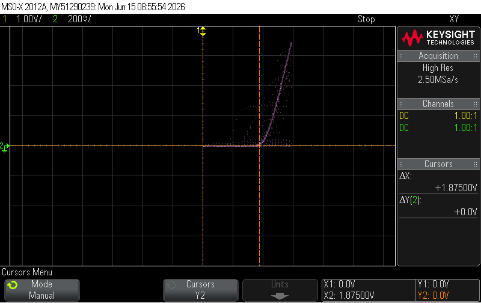
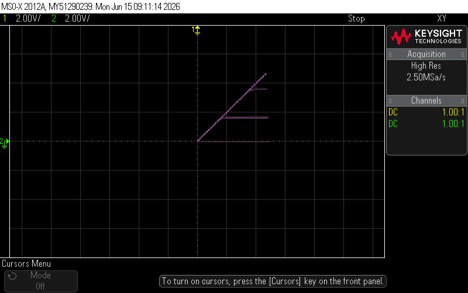
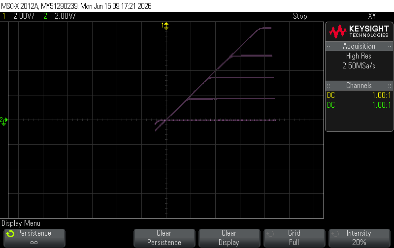
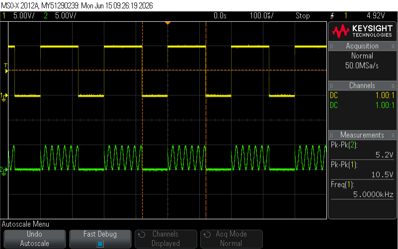
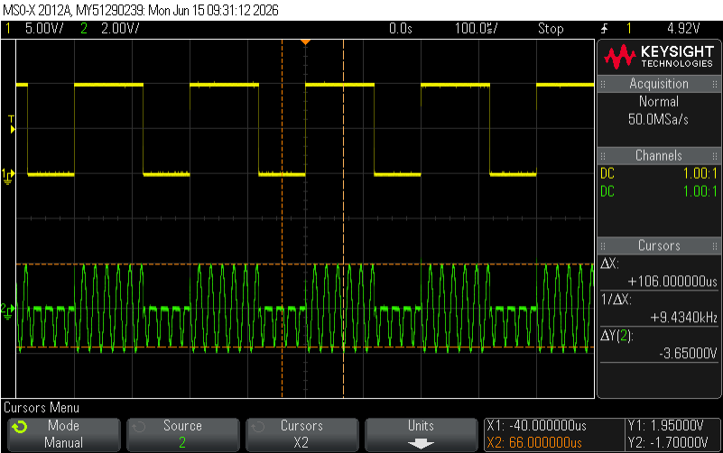
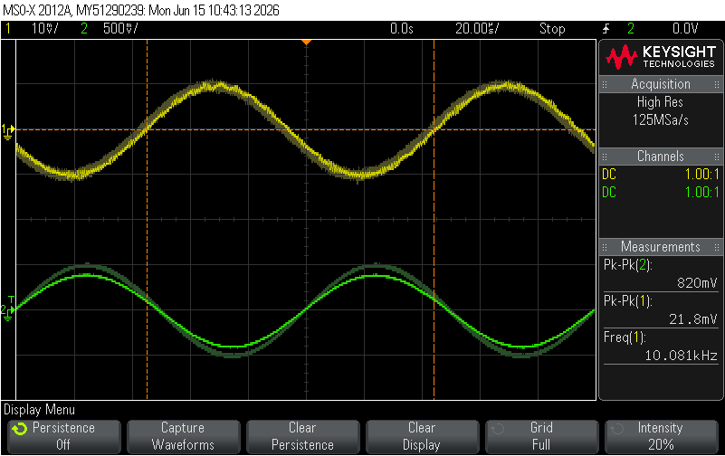
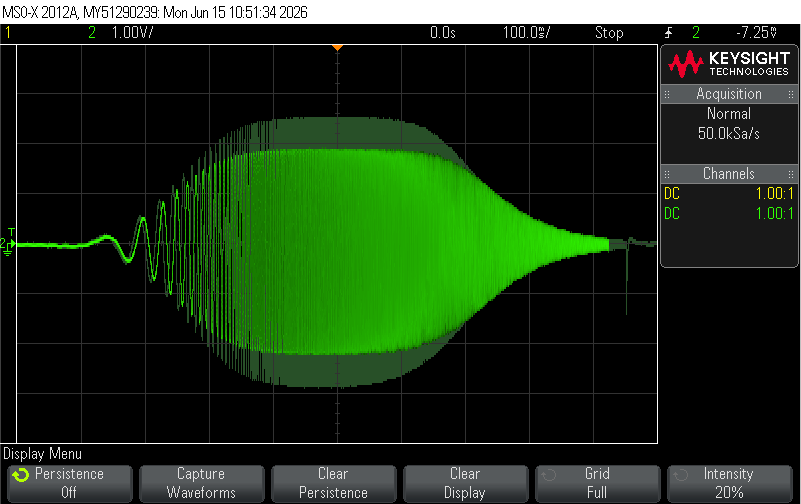

---
header-includes:
  - \usepackage{xcolor}
  - \definecolor{labteal}{HTML}{006b73}
  - \newcommand{\figcap}[1]{\begin{center}\textcolor{labteal}{\textit{#1}}\end{center}}
  - \makeatletter
  - \renewcommand{\subsubsection}{\@startsection{subsubsection}{3}{2em}{-3.25ex plus -1ex minus -.2ex}{1.5ex plus .2ex}{\normalfont\normalsize\bfseries}}
  - \makeatother
---

# Lab 5: MOSFET - Final Report

**Students:** Shai Livshits · 208632216 &nbsp;|&nbsp; Dan Masad · 206505307

---

## 1. MOSFET Characteristics

### 1.1 Circuit Assembly

The circuit of Fig. 1 was assembled on the breadboard with $R_2 = 1\,\text{k}\Omega$ (source resistor) and $V_d = 12\,\text{V}$ DC. The oscilloscope was configured in **X-Y mode**:

- **Ch 1 (X-axis):** $V_g$ - gate voltage (probe referenced to circuit ground).
- **Ch 2 (Y-axis):** Voltage drop across $R_2$, representing $I_d = V_{R_2}/R_2$ in mA (since $R_2 = 1\,\text{k}\Omega$, 1 V on Ch 2 = 1 mA of drain current).

The generator was set to a triangle wave $0$–$3\,\text{V}$ / $1\,\text{kHz}$ on the gate, sweeping $V_{GS}$ to trace the transfer characteristic $I_d = f(V_g,\,V_d)$.

### 1.2 I-VGS Characteristic - Print 1

\nopagebreak[4]

\figcap{Figure 1 - Print 1: Transfer characteristic $I_d = f(V_{GS})$ at $V_d = 12\,\text{V}$; cursor marks $V_t \approx 1.875\,\text{V}$ at the onset of conduction.}

**Explanation:** The curve displays the classic quadratic rise $I_d \propto (V_{GS} - V_t)^2$ of the enhancement NMOS in saturation. Below $V_t$ the drain current is zero (cut-off). Above $V_t$ the current rises steeply and the shape confirms operation in saturation throughout the sweep (since $V_d = 12\,\text{V}$ keeps $V_{DS} \gg V_{GS} - V_t$ for all measured points).

**Threshold voltage extraction:**

The curve lifts off the zero axis at $V_g \approx 1.875\,\text{V}$. At that point $I_d \approx 0$, so there is no voltage drop on $R_2$ and $V_{GS} = V_g$. Therefore:

$$V_t^{\text{meas}} \approx 1.875\,\text{V}$$

| Quantity | Pre-lab (PSpice) | Measured | Abs. error | % error |
|--------|----------------|--------|----------|------|
| $V_t$ | $2.15\,\text{V}$ | $1.875\,\text{V}$ | $0.275\,\text{V}$ | $12.8\,\%$ |

### 1.3 Representative Operating Points

Three points along the transfer characteristic were recorded. The true $V_{GS}$ and $V_{DS}$ are corrected for the source resistor drop:

$$V_{GS} = V_g - I_d \cdot R_2, \qquad V_{DS} = V_d - I_d \cdot R_2$$

| Point | $V_g$ [V] | $I_d$ [$\mu$A] | $V_{GS}$ [V] | $V_{DS}$ [V] | Region |
|-----|---------|---------|---------|---------|---------------------|
| 1 | 1.875 | 0 | 1.875 | 12.000 | Cut-off (near $V_t$) |
| 2 | 2.500 | 312.5 | 2.188 | 11.688 | Saturation |
| 3 | 2.950 | 690 | 2.260 | 11.310 | Saturation |

The triode (linear) region could not be measured because $V_d = 12\,\text{V}$ is far above $V_{GS} - V_t$ for all accessible gate voltages, keeping the device firmly in saturation. All three saturation points satisfy $V_{DS} \gg V_{GS} - V_t$. Point 1 confirms $V_t \approx 1.875\,\text{V}$.

### 1.4 I-VDS Characteristics

The drain and gate connections were swapped:

- **Ch 1 (X-axis):** $V_{DS}$ - triangle wave $0$–$5\,\text{V}$ / $1\,\text{kHz}$ applied to drain.
- **Ch 2 (Y-axis):** $I_d = V_{R_2}/R_2$ (1 V/div = 1 mA/div).
- $V_g$ set to DC values: $0,\,2,\,4,\,6,\,8,\,10\,\text{V}$ (2 V steps).

\newpage

## 1.5

\nopagebreak[4]

\figcap{Figure 2 - Print 2: Output characteristic $I_d = f(V_{DS})$ at fixed $V_{GS}$ values; saturation plateau not fully reached because $V_{DS,max} = 5\,\text{V}$ was insufficient for the higher-$V_{GS}$ curves.}

Since the available $V_{DS}$ sweep ($0$–$5\,\text{V}$) was insufficient to show the full saturation plateau for all $V_{GS}$ values, a supplementary measurement was taken with a higher drain voltage:

\nopagebreak[4]

\figcap{Figure 2b - Extra print (supporting Print 2): Output characteristic at higher $V_{DS}$; flat saturation region and operating-mode boundaries clearly visible.}

**Region identification:**

| Region | Location on graph | Condition |
|----------|------------------------------|-------------------|
| **Cut-off** | $I_d \approx 0$, $V_{GS} \leq V_t \approx 1.875\,\text{V}$ | $V_{GS} < V_t$ |
| **Triode (linear)** | Steep rising slope at low $V_{DS}$ | $V_{DS} < V_{GS} - V_t$ |
| **Saturation** | Flat (or gently sloping) plateau | $V_{DS} \geq V_{GS} - V_t$ |

The shape of the family of curves agrees with the simulation . The saturation current levels and the onset of saturation ($V_{DS} = V_{GS} - V_t$) are consistent. The lower measured $V_t$ means the curves begin at slightly lower gate voltages than predicted.

---

\newpage

## 2. MOSFET as a Switch

### 2.1 Circuit Assembly

The circuit of Fig. 2 was assembled with $R_1 = 51\,\Omega$ (drain side) and $R_S = 1\,\text{k}\Omega$ (source resistor). Two generators were used:

- $V_1$ (gate): square wave $0$–$10\,\text{V}$ / $5\,\text{kHz}$, $60\%$ duty-cycle, offset $+5\,\text{V}$.
- $V_2$ (drain): non-negative sine $0$–$5\,\text{V}$ / $50\,\text{kHz}$, offset $+2.5\,\text{V}$.

### 2.2 Switch Operation - Print 3

Channels: **Ch 1 (yellow) = $V_1$ (gate clock)**, **Ch 2 (green) = $V_{out}$ (drop across $R_S$)**.

\nopagebreak[4]

\figcap{Figure 3 - Print 3: Gate clock $V_1$ ($V_{pk-pk} = 10.5\,\text{V}$, $5\,\text{kHz}$) and output $V_S$ ($V_{pk-pk} = 5.2\,\text{V}$); MOSFET conducts when gate is HIGH and cuts off when LOW.}

| Gate state | $V_{GS}$ | MOSFET region | $V_S$ |
|------------|-------|---------------|------------------------|
| HIGH ($\approx10\,\text{V}$) | $\gg V_t$ | Triode ($V_{DS} < V_{GS} - V_t$) | Follows $V_2$ sine |
| LOW ($0\,\text{V}$) | $< V_t$ | Cut-off | $\approx 0$ (only leakage) |

When the gate is HIGH, $V_{GS} \approx 10\,\text{V}$ while $V_{DS}$ is only a few hundred millivolts (the source tracks the drain through $R_S$), so $V_{DS} \ll V_{GS} - V_t$ and the device operates in the **triode** region - consistent with a low-resistance switch ($R_{DS,\text{on}} = 41.7\,\Omega$). When the gate is LOW, the channel collapses ($I_d \approx 0$) and $V_S$ drops to zero. The result agrees with the pre-lab simulation.

**Operating regime:** Triode (gate HIGH) $\leftrightarrow$ Cut-off (gate LOW). The MOSFET operates as an ideal controlled switch, consistent with the pre-lab analysis.

### 2.3 Symmetric Sine - Print 4

$V_2$ was changed to a **symmetrical sine** $4\,\text{V}_{pp}$ ($\pm 2\,\text{V}$) / $50\,\text{kHz}$.

Channels: **Ch 1 (yellow) = $V_1$ (gate)**, **Ch 2 (green) = $V_S$**.

\nopagebreak[4]

\figcap{Figure 4 - Print 4: Gate clock and $V_S$ with symmetric $\pm2\,\text{V}$ sine on drain; current flows in both half-cycles when gate is HIGH and a weaker reversed current flows during the OFF cycle.}

When the gate is HIGH and $V_2 > 0$, the MOSFET conducts normally (saturation or triode). When the gate is HIGH and $V_2 < 0$, the source and drain roles effectively reverse due to the NMOS geometric symmetry - a weaker current flows S→D with higher resistance (body effect increases $V_t$ in the reverse direction). When the gate is LOW, some residual current still flows via the **body diode** for the negative half-cycle of $V_2$, producing the visible low-amplitude signal on $V_S$ during the OFF period. This matches the pre-lab prediction.

\newpage

### 2.4 On-Resistance $R_{DS}$

$R_{DS}$ is derived from the voltage divider formed by the MOSFET and $R_S = 1\,\text{k}\Omega$:

$$R_{DS} = R_S\left(\frac{V_{D,\text{peak}}}{V_{S,\text{peak}}} - 1\right)$$

**From Print 3 (non-symmetric sine, $V_2 = 0$–$5\,\text{V}$):**

$$R_{DS,\text{on}} = 1\,\text{k}\Omega \times \left(\frac{5.0}{4.8} - 1\right) = 1\,\text{k}\Omega \times 0.04167 = 41.7\,\Omega$$

**From Print 4 (symmetric sine $\pm2\,\text{V}$):**

ON-state (positive half-cycle):

$$R_{DS,\text{on}} = 1\,\text{k}\Omega \times \left(\frac{2.0}{1.95} - 1\right) = 25.6\,\Omega$$

OFF-state (negative half-cycle, body-diode / reverse conduction):

$$R_{DS,\text{off}} = 1\,\text{k}\Omega \times \left(\frac{2.0}{1.7} - 1\right) = 176.5\,\Omega$$

| Quantity | Pre-lab (PSpice) | Measured |
|------------------------|--------------|---------|
| $R_{DS,\text{on}}$ (Print 3) | $5.63\,\Omega$ | $41.7\,\Omega$ |
| $R_{DS,\text{on}}$ (Print 4, fwd) | - | $25.6\,\Omega$ | 
| $R_{DS,\text{off}}$ (Print 4, rev) | $147\,\Omega$ | $176.5\,\Omega$ | 

- $R_{DS,\text{off}}$ agrees well with the pre-lab ($147\,\Omega$ vs $176.5\,\Omega$, $\approx20\,\%$ error). The discrepancy is attributable to the actual $V_t$ being lower than simulated, which allows slightly more reverse leakage current.

- $R_{DS,\text{on}}$ is significantly higher than the simulated value ($41.7\,\Omega$ vs $5.63\,\Omega$). This is expected for the following reasons:
  1. **$R_{DS,\text{on}}$ is strongly voltage-dependent.** The PSpice model extracted $V_{DS} \approx 28\,\text{mV}$ with $I_D \approx 4.97\,\text{mA}$ in simulation. In the real measurement the operating point differs ($V_{DS} = 200\,\text{mV}$, $I_D = 4.8\,\text{mA}$).
  2. The two Print 3/4 measurements give different $R_{DS,\text{on}}$ values ($41.7\,\Omega$ vs $25.6\,\Omega$) because the peak $V_{DS}$ levels are different - confirming the voltage dependence of $R_{DS,\text{on}}$.
  3. $R_{DS,\text{off}} \gg R_{DS,\text{on}}$ in both simulation and measurement: the switch contrast ratio is preserved.

---

\newpage

## 3. Common-Source MOSFET Amplifier

### 3.1 Circuit Assembly

The three-MOSFET common-source amplifier (Fig. 3) was assembled with standard values: $R_d = 8.2\,\text{k}\Omega$, $R_f = 10\,\text{k}\Omega$ (and $16\,\text{k}\Omega$ for comparison), $R_2 = R_3 = 2.2\,\text{k}\Omega$, coupling capacitors $C_1 = C_2 = 10\,\mu\text{F}$, bypass capacitor $C_3 = 22\,\mu\text{F}$, supply rails $V_{DD} = +15\,\text{V}$, $V_{SS} = -15\,\text{V}$.

### 3.2 DC Bias Points

Bias points were measured with a digital multimeter: ampermeter in series for $I_{DS}$, voltmeter across each transistor's drain and source terminals.

| Transistor | $I_{DS}$ [mA] | $V_{GS}$ [V] | $V_{DS}$ [V] | Mode |
|----------|--------|--------|--------|--------------------------------------|
| M1 | 1.040 | 2.36 | 2.36 | **Saturation** (diode-connected: $V_{DS} = V_{GS} \gg V_{GS}-V_t$) |
| M2 | 1.024 | 2.32 | 10.42 | **Saturation** ($V_{DS} \gg V_{GS}-V_t \approx 0.17\,\text{V}$) |
| M3 | 1.060 | 2.35 | 8.80 | **Saturation** ($V_{DS} \gg V_{GS}-V_t \approx 0.20\,\text{V}$) |

**Comparison to pre-lab (Q4b):**

| Transistor | Quantity | Pre-lab | Measured | % error |
|----------|--------|------------|------------|------|
| M1 | $I_{DS}$ | $1.041\,\text{mA}$ | $1.040\,\text{mA}$ | $<0.1\,\%$ |
| M1 | $V_{DS}$ | $2.29\,\text{V}$ | $2.36\,\text{V}$ | $3.1\,\%$ |
| M2 | $I_{DS}$ | $\approx 1.04\,\text{mA}$ | $1.024\,\text{mA}$ | $1.5\,\%$ |
| M2 | $V_{DS}$ | $10.43\,\text{V}$ | $10.42\,\text{V}$ | $0.1\,\%$ |
| M3 | $I_{DS}$ | $1.047\,\text{mA}$ | $1.060\,\text{mA}$ | $1.2\,\%$ |
| M3 | $V_{DS}$ | $8.64\,\text{V}^*$ | $8.80\,\text{V}$ | $1.9\,\%$ |

$^*$ **Correction to pre-lab:** The preliminary report listed $V_{DS,M3} = 4.13\,\text{V}$, which resulted from a sign error: $V_{DS,M3} = V_{D,M3} - V_{S,M3} = 6.31 - (-2.33) = +8.64\,\text{V}$ (not $6.31 - 2.28 = 4.03\,\text{V}$). The source of M3 is at the drain of M2, which sits $2.33\,\text{V}$ below ground. The corrected simulation value of $8.64\,\text{V}$ matches the measurement ($8.80\,\text{V}$, $1.9\,\%$ error) excellently.

The measured DC operating points are in **excellent agreement** with the pre-lab predictions (errors $< 3\,\%$ for all quantities). All three transistors are confirmed to be in saturation, as required for proper amplifier operation.

### 3.3 Mid-Band Voltage Gain

A sine-wave input of $V_{in} = 20\,\text{mV}_{pp}$ / $10\,\text{kHz}$ was applied. Both $V_{in}$ and $V_{out}$ were displayed simultaneously.

\nopagebreak[4]

\figcap{Figure 5 - Print 5: $V_{in}$ ($21.8\,\text{mV}_{pp}$) and $V_{out}$ ($820\,\text{mV}_{pp}$) at $R_f = 16\,\text{k}\Omega$, $f = 10.08\,\text{kHz}$; gain $= 41$ ($32.3\,\text{dB}$).}

| $R_f$ | $V_{in}$ [mV$_{pp}$] | $V_{out}$ [mV$_{pp}$] | $A_V$ (linear) | $A_V$ [dB] |
|------|-----------|-----------|----------|--------|
| $10\,\text{k}\Omega$ | 20 | 1020 | 51 | 34.15 |
| $16\,\text{k}\Omega$ | 20 | 820 | 41 | 32.26 |

**Comparison to pre-lab:**

| $R_f$ | $A_V$ pre-lab [dB] | $A_V$ measured [dB] | Difference |
|------|--------------|--------------|--------|
| $10\,\text{k}\Omega$ | $39.48$ | $34.15$ | $-5.3\,\text{dB}$ |
| $16\,\text{k}\Omega$ | $38.49$ | $32.26$ | $-6.2\,\text{dB}$ |

The measured gain is approximately $5$–$6\,\text{dB}$ lower than simulated. The trend - larger $R_f$ yields lower gain - **agrees** with the pre-lab analysis: increasing $R_f$ shifts the operating point to reduce $I_{D3}$ and hence $g_m$. The quantitative discrepancy is explained by:

1. **Lower actual $g_m$:** From the small-signal model, $A_V = -g_m R_{out}$. Using the measured $R_{out} = 5.9\,\text{k}\Omega$ and $A_V = 51$: $g_{m,\text{meas}} = 51/5.9 \approx 8.6\,\text{mS}$, roughly half the simulated $16.1\,\text{mS}$. This stems from the lower actual $V_t$ (~$1.875\,\text{V}$ vs model $2.15\,\text{V}$) shifting the overdrive $(V_{GS}-V_t)$ - and the real $k_n$ of the BS170 device differing from the SPICE model parameter.
2. **Oscilloscope probe loading** ($10\,\text{M}\Omega$ ‖ $15\,\text{pF}$) adds a shunt at the output, slightly reducing the effective $R_d$ and $A_V$.
3. **Breadboard parasitics** introduce stray capacitance ($\sim 1$–$5\,\text{pF}$ per node) that attenuate the signal at $10\,\text{kHz}$.

### 3.4 Frequency Response - Print 6

A logarithmic frequency sweep (1 Hz → 1 MHz) was applied and the output envelope was captured on the oscilloscope.

\nopagebreak[4]

\figcap{Figure 6 - Print 6: Frequency-response envelope of the CS amplifier; output builds up from low-frequency roll-off, reaches mid-band, then decays at the high-frequency roll-off.}

### 3.5 Bandwidth Extraction - Table 1

The $-3\,\text{dB}$ frequencies were extracted using a **linear** time sweep ($f_\text{start} = 1\,\text{Hz}$, $f_\text{stop} = 1\,\text{MHz}$, $T_\text{sweep} = 1\,\text{s}$). The frequency at timestamp $\Delta t$ is:

$$f(\Delta t) = f_{\text{start}} + f_{\text{stop}}\left(1 - \frac{f_{\text{start}}}{f_{\text{stop}}}\right)\cdot\frac{\Delta t}{T_{\text{sweep}}}$$

The $-3\,\text{dB}$ timestamps ($t_L$, $t_H$) were read at the points where the envelope fell to $1/\sqrt{2}$ of its peak amplitude.

**Table 1 - Frequency response summary:**

| $R_f$ | $f_\text{start}$ [kHz] | $f_\text{stop}$ [kHz] | $T_\text{sweep}$ [s] | $t_{L}$ [s] | $t_{H}$ [s] | $f_{3\text{dB},L}$ [kHz] | $f_{3\text{dB},H}$ [kHz] | BW [kHz] |
|-----|---------|---------|--------|--------|--------|---------|---------|------|
| $10\,\text{k}\Omega$ | 0.001 | 1000 | 1.000 | 0.00086 | 0.027 | 0.861 | 27.0 | 26.14 |
| $16\,\text{k}\Omega$ | 0.001 | 1000 | 1.000 | 0.00072 | 0.037 | 0.721 | 37.0 | 36.28 |

**Comparison to pre-lab:**

| $R_f$ | Quantity | Pre-lab (PSpice) | Measured |
|------|------------------------|--------------|---------|
| $10\,\text{k}\Omega$ | $f_{3\text{dB},L}$ | $0.0924\,\text{kHz}$ | $0.861\,\text{kHz}$ |
| $10\,\text{k}\Omega$ | $f_{3\text{dB},H}$ | $67.4\,\text{kHz}$ | $27.0\,\text{kHz}$ |
| $10\,\text{k}\Omega$ | BW | $67.3\,\text{kHz}$ | $26.1\,\text{kHz}$ | $-61\,\%$ |
| $16\,\text{k}\Omega$ | $f_{3\text{dB},L}$ | $0.0829\,\text{kHz}$ | $0.721\,\text{kHz}$ |
| $16\,\text{k}\Omega$ | $f_{3\text{dB},H}$ | $73.9\,\text{kHz}$ | $37.0\,\text{kHz}$ |
| $16\,\text{k}\Omega$ | BW | $73.8\,\text{kHz}$ | $36.3\,\text{kHz}$ |

**Gain–Bandwidth product verification:**

$$GBW = A_V \times BW$$

| $R_f$ | $A_V$ | BW [kHz] | GBW [MHz] |
|-----|-----|--------|--------|
| $10\,\text{k}\Omega$ | 51 | 26.14 | 1.33 |
| $16\,\text{k}\Omega$ | 41 | 36.28 | 1.49 |

The GBW is approximately constant across both $R_f$ values ($\approx 1.4\,\text{MHz}$), confirming the **gain–bandwidth tradeoff** observed in the pre-lab. Increasing $R_f$ reduces gain but widens bandwidth, as predicted.

- **High-frequency cutoff** ($f_{3\text{dB},H}$) is ~50–60% lower than simulated. This is consistent with the ~6 dB lower gain: both arise from the same root cause - a lower actual $g_m$ - and the GBW product scales accordingly.
- **Low-frequency cutoff** ($f_{3\text{dB},L}$) is ~8–9× higher than simulated. The main cause is the coupling capacitors ($C_1$, $C_2$) and bypass capacitor ($C_3$). In practice, the actual capacitor values may be lower than nominal (electrolytic tolerance ±20%), and stray series resistance (ESR) in the breadboard connections increases the effective RC time constant cutoff frequency. Breadboard contact resistance also adds in series with $C_3$, raising $f_L$.

### 3.6 Output Resistance

The output resistance was measured using the half-voltage method:

$$R_\text{out} = R_L\Big|_{V_L = V_{OC}/2}$$

| Measurement | Value |
|----------------------------------------|--------------|
| Open-circuit output voltage $V_{OC}$ | $1.110\,\text{V}$ |
| Load $R_L$ at which $V_{out} = V_{OC}/2 = 0.555\,\text{V}$ | $5.90\,\text{k}\Omega$ |
| **Measured $R_\text{out}$** | **$5.90\,\text{k}\Omega$** |

**Comparison to pre-lab:**

| Quantity | Pre-lab simulation | Theoretical (small-signal) | Measured | % error (vs sim) |
|---------|-----------------|--------------------------|---------|------------|
| $R_\text{out}$ | $7.40\,\text{k}\Omega$ | $R_d \| r_{ds} \approx 8.19\,\text{k}\Omega$ | $5.90\,\text{k}\Omega$ | $-20.3\,\%$ |

The measured $R_\text{out} = 5.90\,\text{k}\Omega$ is lower than both the simulation ($7.4\,\text{k}\Omega$) and the theoretical estimate ($8.2\,\text{k}\Omega$). This is **consistent** with the lower measured gain:

$$A_V = g_m \cdot R_\text{out} \implies g_{m,\text{meas}} = \frac{A_V}{R_\text{out}} = \frac{51}{5.9\,\text{k}\Omega} \approx 8.6\,\text{mS}$$

This $g_m$ is self-consistent across both the gain and output resistance measurements. A lower $r_{ds}$ in the real device (not modelled accurately by the SPICE simulation) reduces both $R_\text{out}$ and the gain proportionally.

