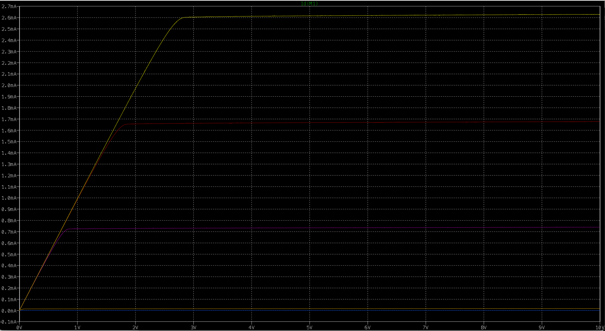
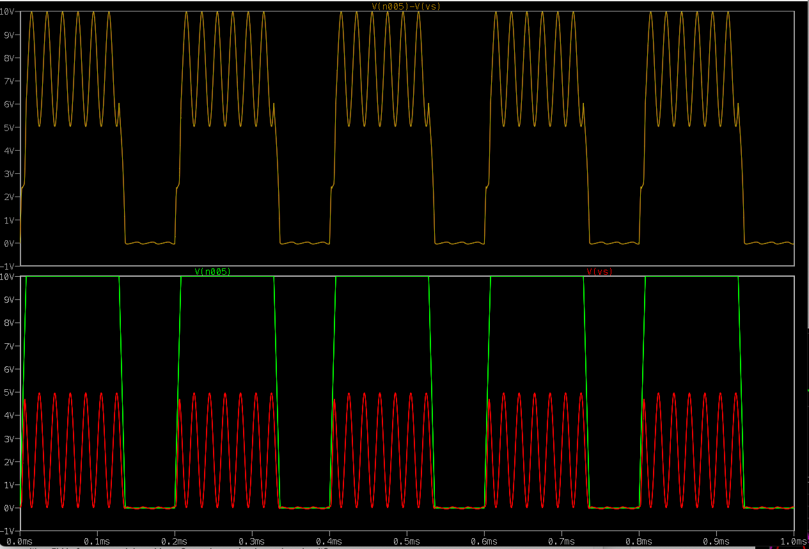
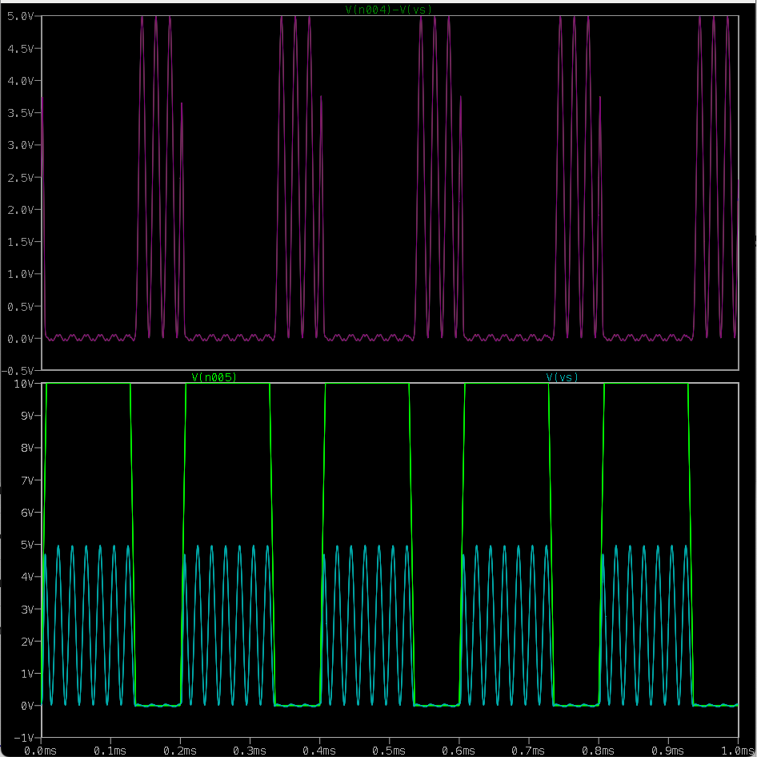
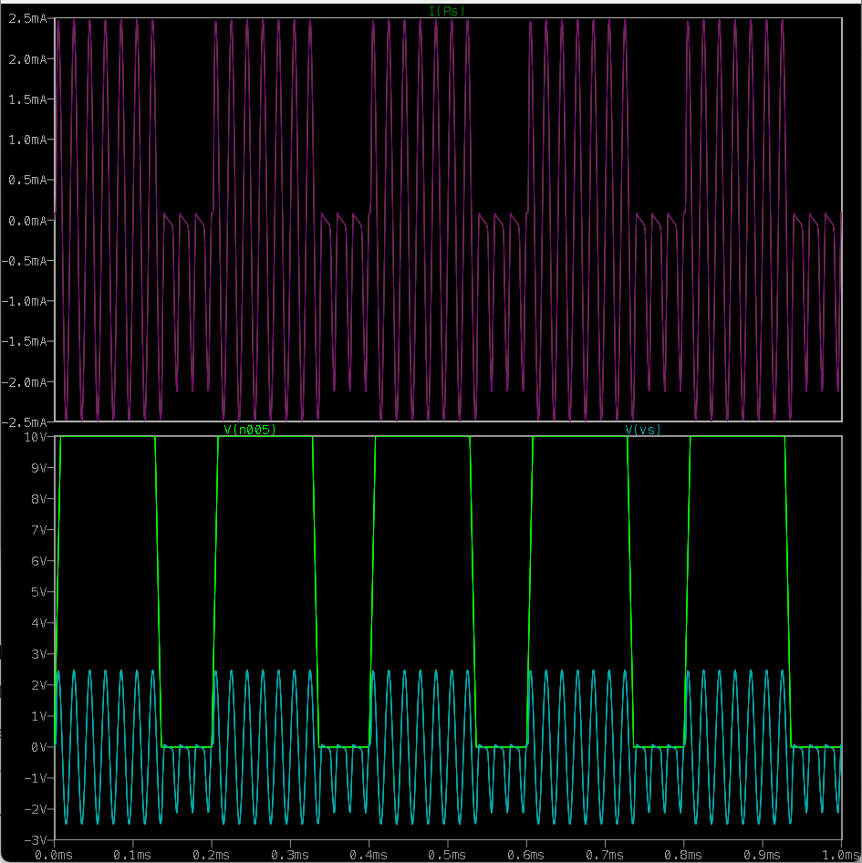
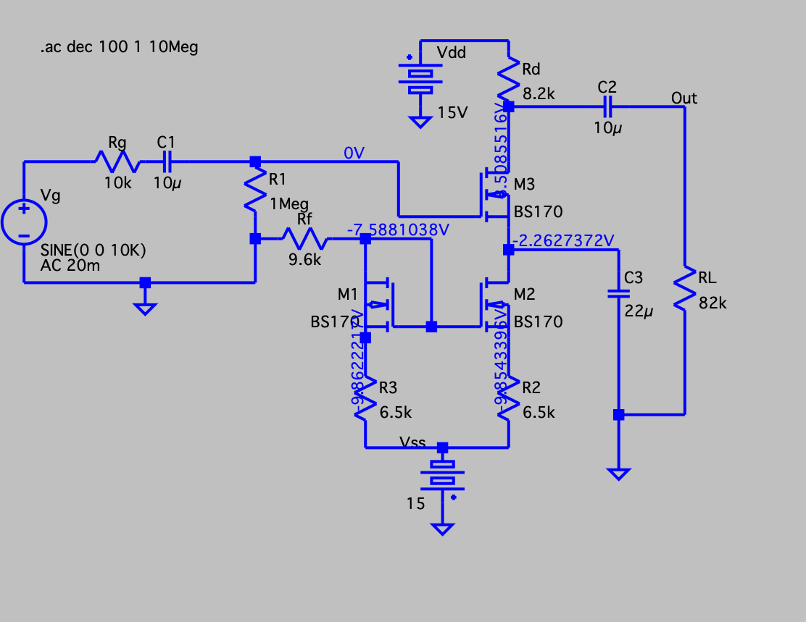
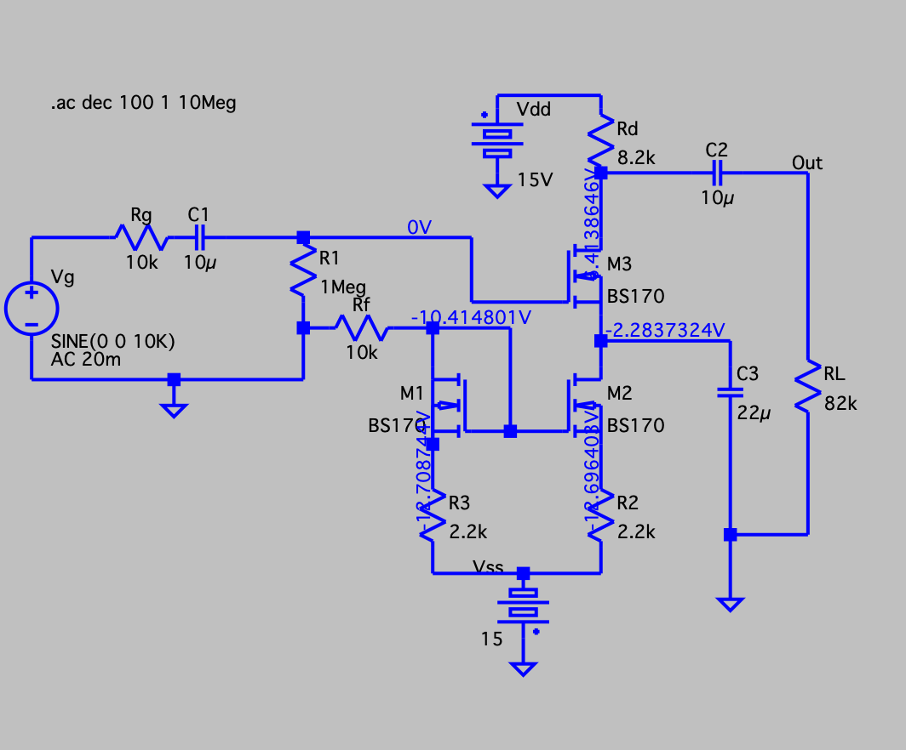
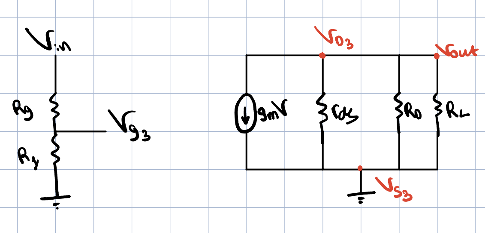
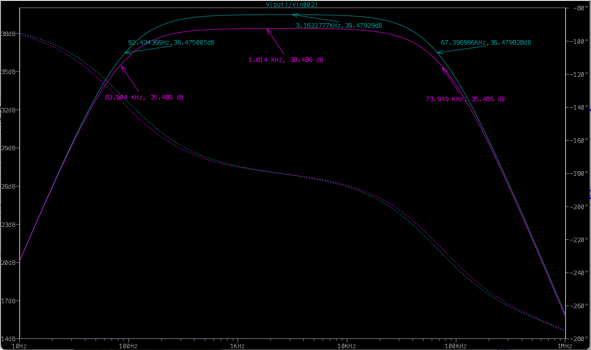
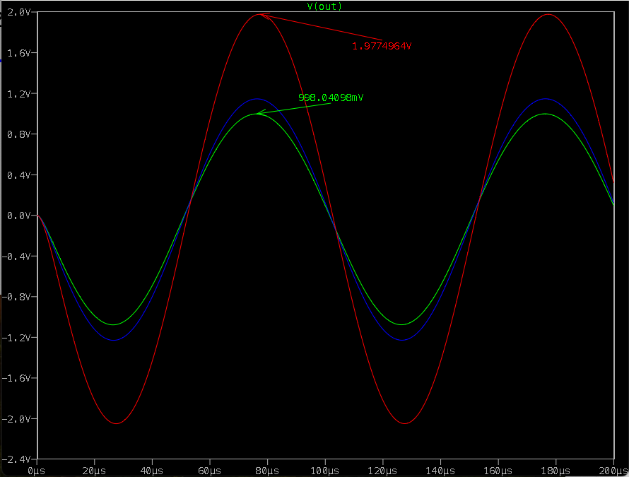

# Lab 5: MOSFET — Preliminary Report

**Students:** Shai Livshits · 208632216 &nbsp;|&nbsp; Dan Masad · 206505307
**Course:** Lab A — Electronics, TAU Faculty of Engineering, Semester B 2025-2026

---

## 1. Background

### 1.1 Enhancement and Depletion MOSFET Types

MOSFETs are voltage-controlled transistors where the gate is isolated from the channel by a thin oxide layer — producing virtually zero DC gate current.

**Enhancement-mode NMOS** (used in this lab — BS170): no channel exists at $V_{GS}=0$. Applying $V_{GS} > V_t$ induces an electron inversion layer (channel). The device is **normally OFF**.

$$
I_D = \frac{k_n}{2}(V_{GS}-V_t)^2 \qquad \text{(saturation)}
$$

**Depletion-mode NMOS**: a built-in channel exists at $V_{GS}=0$ — **normally ON**. A negative $V_{GS}$ depletes the channel. Same square-law applies with $V_t < 0$.

| Property | Enhancement | Depletion |
|----------|------------|-----------|
| Channel at $V_{GS}=0$ | No | Yes |
| Normally | OFF | ON |
| $V_t$ (N-ch) | Positive | Negative |
| Use | Digital, switching, amplifiers | Current sources, analog |

Both types exist in P-channel versions with all polarities reversed.

---

### 1.2 Why the Distinction Between Drain and Source?

Structurally the drain and source are **identical N$^+$ diffusions** — the device is geometrically symmetric. The distinction is purely **by circuit biasing**:

1. **The source is the lower-potential terminal** (NMOS). $V_{GS}$ and $V_{DS}$ are always referenced to it; swapping them changes the operating point entirely.
2. **The body/substrate is tied to the source** to keep the body–source junction reverse biased. Reversing it causes body-diode conduction and loss of gate control.
3. In saturation the channel **pinches off at the drain end** — this rectifying asymmetry enables amplification and switching.

---

### 1.3 MOSFET as Amplifier and Switch

| Region | Condition | Use |
|--------|-----------|-----|
| **Cut-off** | $V_{GS} < V_t$ | Switch OFF — $I_D \approx 0$ |
| **Triode (linear)** | $V_{GS}>V_t,\ V_{DS}<V_{GS}-V_t$ | Switch ON — small $R_{DS,on}$ |
| **Saturation** | $V_{GS}>V_t,\ V_{DS}\geq V_{GS}-V_t$ | Amplifier — $I_D = \frac{k_n}{2}(V_{GS}-V_t)^2$ |

**As an amplifier** (saturation): $i_d = g_m v_{gs}$, $g_m = k_n(V_{GS,Q}-V_t)$, CS gain $A_V = -g_m R_D$.

**As a switch** (cut-off ↔ triode/saturation): gate voltage alone toggles the channel; zero steady-state gate current is the key advantage over the BJT.

---

### 1.4 MOSFET vs. BJT — Unique Properties

| Property          | MOSFET                        | BJT                                  |
| ----------------- | ----------------------------- | ------------------------------------ |
| Gate/base current | $\approx 0$ (oxide insulated) | $I_B = I_C/\beta \neq 0$             |
| Input impedance   | Virtually infinite            | Finite ($r_\pi \sim \text{k}\Omega$) |
| Control           | Voltage ($V_{GS}$)            | Current ($I_B$)                      |
| Static power      | Negligible                    | Base current dissipates power        |
| VLSI scaling      | Excellent (nm gate today)     | Difficult below ~100 nm              |
| CMOS logic        | Zero static power             | No equivalent                        |
| $1/f$ noise       | Higher                        | Lower                                |

**Why MOSFET dominates VLSI:** Zero gate current allows billions of gates; CMOS pairs draw current only during switching; gate oxide scales with lithography; simpler fabrication.

---

## 2. Gate-Drain Characteristics

### (a) Simulation Result

*Figure 1: $I_D$ vs. $V_{DS}$  for $V_{G} = 0$–$5\,\text{V}$*

We can clearly see the saturation behavior of the MOSFET: from some point the $I_{DS}$ is depended only by $V_{GS}$. As it bigger the saturation current is higher. The linear region (triode) region is the linear line, then followed by an horizontal region (saturation) with tiny early affect slope.

### (b) Threshold Voltage Extraction

From the simulation the first conducting curve appears at $V_{GS} = 3\,\text{V}$, therfore:

$$
\begin{aligned}
I_{DS_4}=K(V_{GS_4}-V_t)^2 = 1.65 \space[mA] \\
I_{DS_3}=K(V_{GS_3}-V_t)^2 = 0.73 \space[mA] \\
2.26 = \frac{(V_{GS_4}-V_t)^2}{(V_{GS_3}-V_t)^2} \\
\implies 2.26(V_{GS_3}^2 -2V_{GS_3}V_t+V_t^2)=(V_{GS_4}^2 -2V_{GS_4}V_t+V_t^2)\\
\implies 2.26V_{GS_3}^2-V_{GS_4}^2-2(2.26V_{GS_3}-V_{GS_4})V_t+1.26V_t^2=0 \\
	\text Since: \space V_{GS_4}=2.33 \space [V], V_{GS_3}=2.27 \space [V] \\
\boxed{V_{t_1}= 2.29 \space [V], V_{t_2}=2.15 \space [V]} \\
\text{under the saturation assumption} \implies \boxed{V_t \approx 2.15 \space [V]} 
\end{aligned}
$$
Which aligned to the theoretical value of 2.14V.

### (c) Operating Regions

| Region         | Graph location                        | Condition                |
| -------------- | ------------------------------------- | ------------------------ |
| **Cut-off**    | $I_D \approx 0$, $V_{GS}$ = 0,1,2 [V] | $V_{GS} < V_t$           |
| **Triode**     | Steep rising slope, low $V_{DS}$      | $V_{DS} < V_{GS}-V_t$    |
| **Saturation** | Flat plateau, high $V_{DS}$           | $V_{DS} \geq V_{GS}-V_t$ |

---

## 3. The MOSFET as a Switch

### (a) Transient — Non-Symmetric Sine (0–5 V)

*Figure 2: $V_G \space (Green)$ and $V_S \space (Red)$ ; $V_{GS} \space (Orange)$.*

We can see that on the high peaks of the clock the transistor is 'open' thus there is a voltage drop on the source resistor and $V_S$ is positive sine (low voltage drop over the transistor means its saturated). On the other hand on the low peak of the clock, the transistor is closed, no current flow on the source resistor, thus $V_s$ is only leakage. The AC signal are big enough to change the transistor's operating point.
### (b) Operating Regime

| Gate        |  $V_{GS}$ | Region         | Switch                  |
| ----------- | --------: | -------------- | ----------------------- |
| HIGH (10 V) | $\gg V_t$ | **Saturation** | Open $I_D \gg 0$        |
| LOW (0 V)   |   $< V_t$ | **Cut-off**    | Closed, $I_D \approx 0$ |

The saturation region is the correct since the gate voltage is always bigger then the drain voltage.
### (c) On-Resistance $R_{DS,on}$

*Figure 3: $R_{DS}$ extraction; on-state: $V_{DS} \approx 0\,\text{mV}$, $I_D \approx 5\,\text{mA}$.*

$$
R_{ds} = \frac{V_{DS}}{I_D} = \frac{V_D-V_S}{\frac{V_S}{R_S}}=R_S(\frac{V_D}{V_S}-1)
$$
Since the O.P is changed, we will choose on point peak point from $V_S$ on the graph, Assuming the delay is negligible, so $V_D$ at the peaks is 5V. 
Thus: 
$$
R_{ds}\text{|}_{on}=R_S(\frac{V_D}{V_S}-1)=R_S(\frac{5}{4.972}-1)=5.63\Omega 
$$

### (d) Symmetric Sine $\pm2.5\,\text{V}$ / 50 kHz

*Figure 4: $V_S$ with symmetric $\pm2.5\,\text{V}$ sine; negative half-cycles pass via body diode regardless of gate state.*

**Explanation:** For $V_2 > 0$ and gate HIGH: MOSFET conducts (saturation) since $V_{GS}>>V_{DS}-V_t$. For $V_2 < 0$ (and gate HIGH): It keeps the same, however, the current flow on the resistor flip directions.
For $V_G$ LOW, The transistor is closed. However, since $V_{DS}$ is keep shifting, we can see that there is negative current flow (S to D), so it has some resistance. Since $V_S=V_2 \frac {R_S}{R_S+R_{OFF}}$, $R_{ds}\text{|}_{OFF}=R_S(\frac{V_2}{V_S}-1)=1(\frac{2.5}{2.18}-1))=320\Omega$.
Generally speaking, from the geometric symmetry of an NMOS transistor, we can conduct current in both direction, but it will be less efficient due to high body effect.

---

## 4. Common-Source MOSFET Amplifier

### (a) DC Bias — Personalized Values ($R_f=9.6\,\text{k}\Omega$, $R_2=R_3=6.5\,\text{k}\Omega$)

*Figure 5: DC operating point — personalized values; $I_D \approx 1\,\text{mA}$.*

---

### (b) DC Bias — Standard Values, Operating Points and $gm_{3}$

*Figure 6: DC measurement — $I_D(M_1)=1.041\,\text{mA}$, $I_D(M_3)=1.047\,\text{mA}$*

**Bias verification:**

$$
V_{D3} = V_{DD} - I_{D3}\cdot R_d = 15 - 1.047\times 8.2 = \mathbf{6.41\,\text{V}} 
$$

$$
V_{S1} = V_{SS} + I_{D1}\cdot R_3 = -15 + 1.041\times 2.2 = \mathbf{-12.71\,\text{V}}
$$

**Operating modes:**

| Transistor | $V_{GS}$ [V] | $V_{DS}$ [V] | Mode                                                 |
| ---------- | ------------ | ------------ | ---------------------------------------------------- |
| M1         | 2.29         | 2.29         | **Triode** ($V_{DS}\ll V_{GS}-V_t$), Active resistor |
| M2         | 2.29         | 10.43        | **Saturation** ($V_{DS}\gg V_{GS}-V_t$)              |
| M3         | 2.28         | 4.13         | **Saturation** ($V_{DS}\gg V_{GS}-V_t$)              |

**Transconductance $g_{m,M3}$:**

$$
g_{m,M3} = \frac{2\,I_{D3}}{V_{GS,M3}-V_t} = \frac{2\times 1.047}{2.28-2.15} \approx \mathbf{16.1\,\text{mS}}
$$

---

### (c) Small-Signal Equivalent Circuit

*Figure 7: Small-signal model: $g_m v_{gs}$ source with $r_{ds} \| R_d \| R_L$ at the output*

$$
V_{out} = -g_{m,M3}\cdot v_{gs,M3}\cdot(r_{ds}\|R_d\|R_L)
$$

The current mirror by M1 M2 is grounded by C3 capacitor.

---

### (d) Purpose of Capacitor $C_3$

$C_3$ (22 μF) bypasses the source-degeneration resistor $R_2$ of M2.

- **DC:** $C_3$ open — $R_2$ stabilises the bias point via negative feedback.
- **AC:** $C_3$ shorts $R_2$, restoring full transconductance and preventing gain loss:

$$
A_V\big|_{\text{with }_{C_3}} = -g_m R_d \qquad \text{vs.} \qquad \frac{-g_m R_d}{1+g_m R_2}\bigg|_\text{without}
$$

For $g_m=16.1\,\text{mA/V}$, $R_2=2.2\,\text{k}\Omega$: without $C_3$ the gain drops by factor 36 (−31 dB).
Low-frequency cutoff: $f_{L} = 1/(2\pi C_3 R_2) \approx 3.3\,\text{Hz}$ — well below the signal band.

---

### (e) Frequency Response — $R_f=10\,\text{k}\Omega$ vs. $R_f=16\,\text{k}\Omega$

*Figure 8: Bode plot — $R_f=10\,\text{k}\Omega$: $39.5\,\text{dB}$, BW $\approx 67\,\text{kHz}$; $R_f=16\,\text{k}\Omega$: $38.5\,\text{dB}$, BW $\approx 74\,\text{kHz}$.*

| $R_f$ | Mid-band [dB] | $f_L$ [Hz] | $f_H$ [kHz] | BW [kHz] |
| ----- | ------------- | ---------- | ----------- | -------- |
| 10 kΩ | 39.48         | 92.4       | 67.4        | 67.3     |
| 16 kΩ | 38.49         | 82.9       | 73.9        | 73.8     |

From the results we can see two main things; First, gain-BW tradeoff applied at the circuit, as expected.
Second, as we keep increase $R_f$, We change the OP s.t the current flow through M3 is smaller. If we keep increase it, it will shift out of the saturation state reducing the gain proportionally to $g_{M3}$. 

---

### (f) Output Resistance

$$
R_{out} = R_L\bigg|_{V_{load}=V_{OC}/2}
$$

*Figure 9: $R_{out}$ measurement — $V_{OC}=1.977\,\text{V}$; half-voltage ($998\,\text{mV}$) occurs at $R_L \approx R_{out} \approx 7.4\,\text{k}\Omega$.*

$$
V_{OC} = 1.986\,\text{V},\quad V_{half} = 994\,\text{mV}
\implies \boxed{R_{out} \approx R_L\big|_{V=\frac{V_{OC}}{2}}}
$$

Theoretical estimate from the small-signal model:

$$
R_{out} \approx R_d\,\|\,{r_{ds}} = 8.2\,\text{K}\,\|\,50\,\text{G} \approx 8.19\,\text{K}\Omega
$$
This variation happens because, in the simulation, the source is not 100% grounded, so some resistance 'propagates' with the $gm_{M3}$ factor from the source to the drain.

---

### (g) Purpose and Applications

This self-biased three-MOSFET CS amplifier with $R_f$ feedback delivers:

- High gain (~40 dB), wide bandwidth (~70 kHz), programmable by $R_f$ alone.
- Self-stabilising DC bias — no external reference needed.
- Very high input impedance.

**Applications:** photodiode transimpedance amplifier (TIA), sensor signal conditioning, high-impedance instrumentation front-end, audio pre-amplifier stage.

