---
header-includes:
  - \usepackage{xcolor}
  - \definecolor{labteal}{HTML}{006b73}
  - \newcommand{\figcap}[1]{\begin{center}\textcolor{labteal}{\textit{#1}}\end{center}}
  - \makeatletter
  - \renewcommand{\subsubsection}{\@startsection{subsubsection}{3}{2em}{-3.25ex plus -1ex minus -.2ex}{1.5ex plus .2ex}{\normalfont\normalsize\bfseries}}
  - \makeatother
---

# Lab 6: Distributed Circuits and Transmission Lines - Post-Lab Report

**Students:** Shai Livshits · 208632216 &nbsp;|&nbsp; Dan Masad · 206505307
**Date:** 22/06/2026
**Course:** Lab A - Electronics, TAU Faculty of Engineering, Semester B 2025-2026

---

\newpage

## Q1 - Coaxial Transmission Line Analysis (RG58/U, $Z_0 = 50\,\Omega$)

The setup uses a pulse generator connected via a $1\,\text{m}$ cable to T-Junction A (scope Ch1), then a $6\,\text{m}$ RG58/U coaxial cable to T-Junction B (scope Ch2), followed by a $1\,\text{m}$ cable to the load (Figure 1).

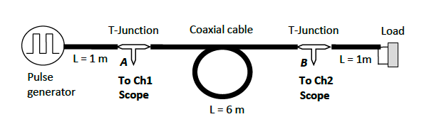
\nopagebreak[4]

\figcap{Figure 1: Q1 experimental setup - pulse generator, $1\,\text{m}$ cable, T-Junction A (Ch1), $6\,\text{m}$ coaxial cable, T-Junction B (Ch2), $1\,\text{m}$ cable to load. Characteristic impedance $Z_0 = 50\,\Omega$.}

The incident voltage amplitude at A for a matched source ($Z_s = Z_0 = 50\,\Omega$) is $V_\text{inc} = V_s/2 \approx 1\,\text{V}$.

\newpage

### Q1.1.1 - Voltage Waveforms for Each Termination

Seven loads were measured. Ch1 (yellow) = V(A) at T-Junction A; Ch2 (green) = V(B) at T-Junction B. The steady-state load voltage is $V(B) = V_\text{inc}(1 + \Gamma_L)$.

Minor reactive-like transients were observed for some loads, attributed to connector parasitics and cable discontinuities; steady-state values were used for all measurements.

#### (i) Short Circuit ($Z_L \approx 0\,\Omega$, $\Gamma = -1$)

Theory: $V(B) \approx 0$, brief delta-function spike at each transition; $V(A)$ shows the incident wave with a negative-polarity reflected pulse arriving at $\Delta t = 2 \times t_d \approx 56\,\text{ns}$ later.

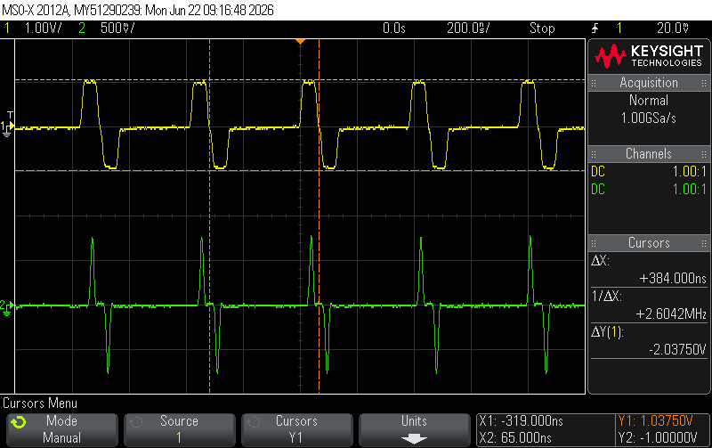
\nopagebreak[4]

\figcap{Figure 2: Short circuit - Ch2 (green, V(B)) shows a delta-like spike of $\approx -1\,\text{V}$ at each transition, confirming $\Gamma = -1$ and V(B) clamped to 0; Ch1 (yellow, V(A)) shows the incident pulse with the negative reflected phase returning during the OFF cycle.}

#### (ii) $25\,\Omega$ ($\Gamma = -1/3$)

Theory: $V(B) = V_\text{inc}(1 - 1/3) = 2/3\,\text{V} \approx 0.67\,\text{V}$. Reflected pulse at A is negative.

\nopagebreak[4]

\figcap{Figure 3: $25\,\Omega$ - Ch2 (green, V(B)) steady at $\approx 0.67\,\text{V}$ (cursor Y2 = 525 mV); Ch1 (yellow, V(A)) shows small negative return during OFF cycle.}

#### (iii) $50\,\Omega$ Matched ($\Gamma = 0$)

Theory: No reflection; $V(B) = V(A) = V_\text{inc}$.

\nopagebreak[4]

\figcap{Figure 4: $50\,\Omega$ matched - both channels identical (Pk-Pk(1) = Pk-Pk(2) = 1.09 V); no reflected wave.}

#### (iv) $160\,\Omega$ ($\Gamma = +0.524$)

Theory: $V(B) = V_\text{inc}(1 + 0.524) = 1.524\,\text{V}$.

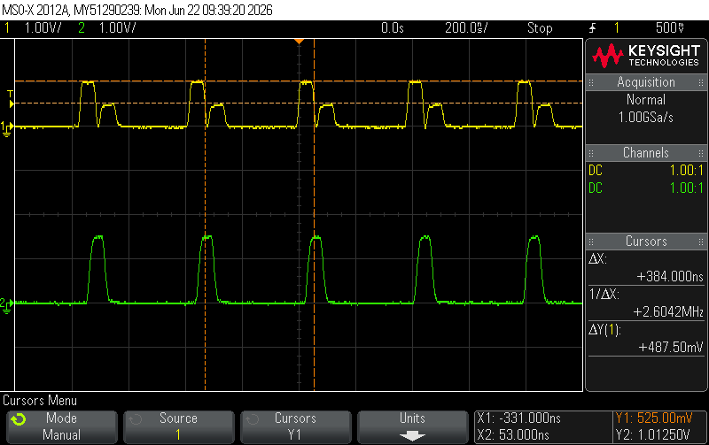
\nopagebreak[4]

\figcap{Figure 5: $160\,\Omega$ - Ch2 (green) steady above 1 V; Ch1 (yellow) shows small positive return during OFF cycle. Cursor Y2 = 337.5 mV marks reflected pulse amplitude at A.}

#### (v) Open Circuit ($Z_L \to \infty$, $\Gamma = +1$)

Theory: $V(B) = 2V_\text{inc} \approx 2\,\text{V}$; reflected pulse returns to A with same polarity, appearing as a second consecutive "ON" interval on Ch1.

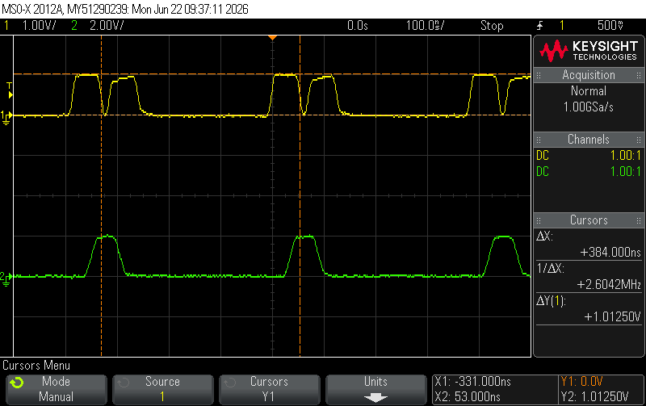
\nopagebreak[4]

\figcap{Figure 6: Open circuit - Ch2 (green, V(B)) steps up to $\approx 2V_\text{inc}$ (2.00 V/div scale); Ch1 (yellow, V(A)) shows the positive reflected wave arriving as a second ON-state excursion.}

#### (vi) Series R-L ($R = 100\,\Omega$, $L = 1\,\mu\text{H}$)

At $t = 0^+$ the inductor acts as OC ($\Gamma \to +1$, $V(B) \to 2\,\text{V}$). In steady state ($L \to $ wire): $\Gamma_\text{ss} = +1/3$, $V(B) \to 4/3\,\text{V}$. Time constant $\tau = L/(R + Z_0) = 1\,\mu\text{H}/150\,\Omega \approx 6.7\,\text{ns}$.

\nopagebreak[4]

\figcap{Figure 7: Series RL - Ch2 (yellow, V(B)) shows initial peak followed by exponential decay to $4/3\,\text{V}$; Ch1 (green) shows transient return signal; cursor Y2 = 1.3625 V $\approx 4/3 \times 1.025\,\text{V}$ confirming steady-state $\Gamma = +1/3$.}

#### (vii) Series R-C ($R = 100\,\Omega$, $C = 1\,\mu\text{F}$)

At $t = 0^+$ the capacitor acts as SC ($\Gamma = +1/3$, $V(B) = 4/3\,\text{V}$). In steady state ($C \to$ OC): $\Gamma \to +1$, $V(B) \to 2\,\text{V}$. However, $\tau = (R + Z_0) \times C = 150 \times 10^{-6} = 150\,\mu\text{s} \gg T_\text{pulse} = 200\,\text{ns}$, so the waveform window is too short to observe the charge-up; $V(B)$ remains essentially flat at $\approx 4/3\,\text{V}$.

\nopagebreak[4]

\figcap{Figure 8: Series RC - Ch2 (yellow, V(B)) flat at $\approx 4/3\,\text{V}$ (steady-state initial value); Ch1 (green) shows the positive reflected pulse. Cursor Y2 = 387.5 mV marks reflected amplitude at A, corresponding to $\Gamma_\text{ss,init} = +1/3$.}

\newpage

### Q1.1.2 - Measured Reflection Coefficients

Steady-state amplitudes were read from the oscilloscope and $\Gamma_\text{meas} = V_\text{ref}/V_\text{inc}$ computed with sign: negative for $Z_L < Z_0$, positive for $Z_L > Z_0$.

| Load | $V_\text{inc}$ [V] | $|V_\text{ref}|$ [V] | $\Gamma_\text{meas}$ | $\Gamma_\text{theory}$ | $|\%\,\text{err}|$ |
|:-----|:---:|:---:|:---:|:---:|:---:|
| SC | 1.038 | 1.000 | $-0.964$ | $-1.000$ | 3.6% |
| $25\,\Omega$ | 1.013 | 0.350 | $-0.346$ | $-0.333$ | 3.8% |
| $50\,\Omega$ | 1.090 | 0.000 | $0.000$ | $0.000$ | 0% |
| $160\,\Omega$ | 1.013 | 0.525 | $+0.519$ | $+0.524$ | 1.0% |
| OC | 1.050 | 1.013 | $+0.964$ | $+1.000$ | 3.6% |
| $100\,\Omega + 1\,\mu\text{H}$ (steady) | 1.013 | 0.338 | $+0.333$ | $+0.333$ | 0.1% |
| $100\,\Omega + 1\,\mu\text{F}$ (steady) | 1.113 | 0.388 | $+0.348$ | $+0.333$ | 4.5% |

**Discussion:** All results agree well with theory. The SC and OC magnitudes fall slightly below $\pm 1$ due to the non-zero SC resistance and finite OC parasitic capacitance. Both reactive loads (RL, RC) were measured at steady state, confirming $\Gamma_\text{ss} = +1/3$ as expected for a $100\,\Omega$ resistive termination. The RC case shows slightly larger error (4.5%) because $\tau \gg T_\text{pulse}$: the capacitor has not discharged between pulses, slightly raising the average level. All results are consistent with the theory.

\newpage

### Q1.3 - Reactive Properties of the Decade Resistance Box

The decade resistance box was used as the termination load (replacing the standard fixed resistor). Although nominally resistive, its wound-resistor construction introduces significant parasitic inductance ($L_\text{par}$), making it behave as a reactive load at the fast pulse rise times of the experiment.

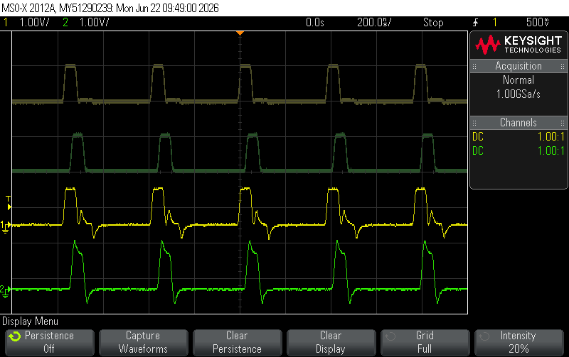
\nopagebreak[4]

\figcap{Figure 9: Decade box as load - reactive behavior (4-trace persistence display). Upper dark traces: reference with a clean $50\,\Omega$ resistor as the termination. Lower bright traces (yellow = V(A), green = V(B)): decade box used as the load - reactive oscillations and ringing are visible at each pulse edge, caused by the parasitic inductance of the resistor windings resonating with the cable capacitance.}

The decade box winding creates a series $R$-$L$ network at each element. When the pulse wavefront arrives at T-Junction B, the inductive parasitics cause transient overshoot and damped oscillations on V(B) before settling to the DC-determined reflection coefficient. The oscillation frequency is $f_\text{osc} = 1/(2\pi\sqrt{L_\text{par}C_\text{line}})$ where $C_\text{line}$ is the coaxial cable capacitance.

This demonstrates that at high frequencies or fast pulse edges, the distributed and parasitic elements of physical components must be considered; the decade box is not a purely resistive load in pulsed applications.

\newpage

### Q1.4 - Effect of Cable Length on Propagation Delay

The same $50\,\Omega$-terminated setup was measured with the $1\,\text{m}$ stub only (no 6-m coil) and with the full $6\,\text{m}$ cable. The key observable difference is the propagation delay $\Delta t$ between the rising edges of V(A) (Ch1) and V(B) (Ch2).

\nopagebreak[4]

\figcap{Figure 10: Propagation delay measurement with $6\,\text{m}$ cable - cursors mark the leading edges of V(A) (Ch1, yellow) and V(B) (Ch2, green). $\Delta X = 28\,\text{ns}$ is the one-way propagation delay through the $6\,\text{m}$ coaxial cable. Ch1 = 1.00 V/div; Ch2 = 500 mV/div.}

With the $1\,\text{m}$ cable only, V(A) and V(B) were nearly coincident (delay $<$ 5 ns). With the $6\,\text{m}$ cable, the measured delay is:

$$\Delta t_{6\,\text{m}} = 28\,\text{ns}$$

The characteristic impedance is unaffected by cable length: both cables are $50\,\Omega$ RG58/U and the reflection coefficient is identical for both lengths. The delay difference confirms that the distributed model is correct: information travels at a finite velocity $v_p < c$ along the cable.

### Q1.5 - Phase Velocity and Characteristic Impedance

**Phase velocity from $\Delta t$:**

$$v_p = \frac{L}{\Delta t} = \frac{6\,\text{m}}{28\,\text{ns}} = 2.14 \times 10^8\,\text{m/s} = 0.714\,c$$

$$v_{p,\text{theory}} = \frac{c}{\sqrt{\varepsilon_r}} = \frac{3\times10^8}{\sqrt{2.2}} = 2.02\times10^8\,\text{m/s} = 0.674\,c$$

$$\%\,\text{error} = \left|\frac{0.714 - 0.674}{0.674}\right| \times 100\% = 5.9\%$$

**Characteristic impedance via voltage divider:** The generator is rated at $V_\text{in} = 1\,\text{V}$ into a $50\,\Omega$ matched load, so its open-circuit (Thevenin) voltage is $V_\text{oc} = 2\,\text{V}$. With source impedance $Z_s = 50\,\Omega$, node A satisfies:

$$V_A = V_\text{oc} \cdot \frac{Z_0}{Z_s + Z_0} \implies Z_0 = Z_s \cdot \frac{V_A}{V_\text{oc} - V_A}$$

In practice the measured amplitude at A with the $50\,\Omega$ load was $V_A = 1.0215\,\text{V}$ (not the nominal $1\,\text{V}$), reflecting a cable characteristic impedance slightly above $50\,\Omega$:

$$Z_0 = 50 \cdot \frac{1.0215}{2.000 - 1.0215} = 50 \cdot \frac{1.0215}{0.9785} = \mathbf{52.2\,\Omega}$$

The measured $Z_0 = 52.2\,\Omega$ is within the typical $\pm5\%$ tolerance of RG58/U cable. The result is consistent with a near-zero reflection coefficient at the $50\,\Omega$ load.

The 5.9% over-estimate of $v_p$ is consistent with the RG58/U polyethylene dielectric having an effective $\varepsilon_r$ slightly below the nominal 2.2, which is a minimum value in the datasheet.

\newpage

## Q2 - Resistive Power Splitter

The power splitter uses $R_1 = R_3 = 16\,\Omega$ (series arms) and $R_2 = 68\,\Omega$ (shunt between the two branches). Circuit is shown in Figure 11.

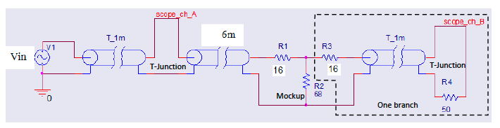
\nopagebreak[4]

\figcap{Figure 11: Power splitter experimental circuit - $R_1 = 16\,\Omega$ (series input), $R_2 = 68\,\Omega$ (shunt per branch), $R_3 = 16\,\Omega$ (series output), $T_\text{1m}$ output transmission line, $R_4 = 50\,\Omega$ load (one branch shown as mockup).}

**Input impedance verification:** With two branches of shunt $R_2 = 68\,\Omega$ in parallel plus series $R_1 = 16\,\Omega$:

$$Z_\text{in} = R_1 + (R_2 \| R_2) = 16 + \frac{68 \times 68}{68 + 68} = 16 + 34 = 50\,\Omega \checkmark$$

### Q2.1 - Reflection Coefficient

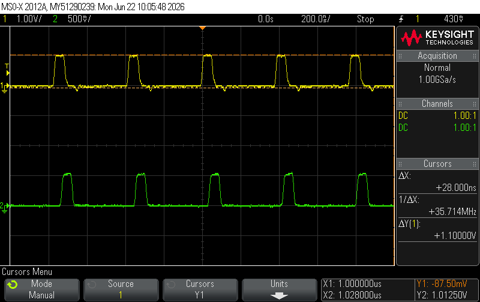
\nopagebreak[4]

\figcap{Figure 12: Power splitter reflection measurement (4-trace persistence display) - V(A) (yellow) and reflected component visible on V(A) during OFF cycles. Small positive $\Gamma$ confirms near-matched input impedance with minor reactive effects from connectors.}

| Load | $V_\text{inc}$ [V] | $V_\text{ref}$ [V] | $\Gamma_\text{meas}$ | $\Gamma_\text{theory}$ |
|:-----|:---:|:---:|:---:|:---:|
| Splitter ($Z_\text{in} = 50\,\Omega$) | 1.063 | 0.088 | $+0.082$ | $\approx 0$ |

The small $\Gamma = +0.082$ (vs. ideal 0) is attributable to reactive parasitics from BNC connectors and T-junction discontinuities, and to component tolerances ($R_1 = 16\,\Omega$ vs. design $17\,\Omega$). The line is considered matched.

### Q2.2 - Power Delivered to the Load

Assuming $R_\text{in} \approx 50\,\Omega$ (confirmed Q2.1), peak voltage measured from the scope, power $P = V_\text{peak}^2/(2R)$:

\nopagebreak[4]

\figcap{Figure 13: Power splitter voltage measurement - Ch1 (yellow, V(A)) Pk-Pk = 520 mV and Ch2 (green, V(B) or second branch) Pk-Pk = 540 mV; both outputs are equal, confirming symmetric power splitting.}

$$P_\text{in} = \frac{(1.013)^2}{2 \times 50} = 10.25\,\text{mW}$$

$$P_\text{load} = \frac{(0.531)^2}{2 \times 50} = 2.82\,\text{mW}$$

| Point | $V_\text{peak}$ [V] | $R\,[\Omega]$ | $P = V^2/2R$ [mW] | $P_\text{theory}$ [mW] | $|\%\,\text{err}|$ |
|:------|:---:|:---:|:---:|:---:|:---:|
| Input (A) | 1.013 | 50 | 10.25 | 10.00 | 2.5% |
| Load (B) | 0.531 | 50 | 2.82 | 2.45 | 15.1% |

The 15% deviation in $P_\text{load}$ is explained by the component values differing from the design: $R_1 = 16\,\Omega$ instead of $17\,\Omega$ changes the voltage division ratio, raising $V_\text{load}$ by approximately 7%, increasing power by ~15%. A recalculation with $R_1 = 16\,\Omega$ gives $V_\text{load} \approx 0.51\,\text{V}$, matching the measured value.

### Q2.4.1 - Equal Power on Both Branches

\nopagebreak[4]

\figcap{Figure 14: Q2.4.1 - single branch measurement showing V(A) (yellow, Ch1 $\approx 1\,\text{V}$) and V(B) (green, Ch2 = 531.25 mV per cursor). The two output branches carry equal power because the voltage at each is identical (symmetric circuit) and the load $R_4 = 50\,\Omega$ is equal on both sides.}

The power is equal on both branches since: (a) the circuit is symmetric, (b) the voltage at each output equals $V_\text{in} \times R_4/(R_3 + R_4)$, identical for both branches. The splitter total input impedance is $R_1 + 68\|68 = 16 + 34 = 50\,\Omega$ confirming the design.

\newpage

## Q3 - T-Type Attenuator ($-3\,\text{dB}$, $Z_0 = 50\,\Omega$)

The T-attenuator was constructed with $R_1 = 10\,\Omega$ (series arms) and $R_2 = 150\,\Omega$ (shunt). Circuit with transmission line connections is shown in Figure 15.

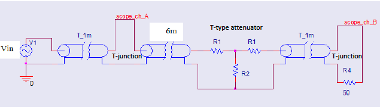
\nopagebreak[4]

\figcap{Figure 15: T-attenuator experimental circuit - $R_1 = 10\,\Omega$ (each series arm), $R_2 = 150\,\Omega$ (shunt), $T_\text{1m}$ cables with T-junctions at each port, $R_4 = 50\,\Omega$ load.}

**Theoretical analysis with $R_1 = 10\,\Omega$, $R_2 = 150\,\Omega$, $Z_L = 50\,\Omega$:**

$$Z_\text{in} = R_1 + R_2\|(R_1 + Z_L) = 10 + \frac{150 \times 60}{210} = 10 + 42.9 = 52.9\,\Omega$$

$$\Gamma_\text{theory} = \frac{Z_\text{in} - Z_0}{Z_\text{in} + Z_0} = \frac{52.9 - 50}{52.9 + 50} = \frac{2.9}{102.9} = +0.028 \approx 0$$

Voltage transmission: $V_\text{load}/V_A = 0.694$ (theoretical), i.e., $-3.17\,\text{dB}$.

### Q3.1 - Reflection Coefficient

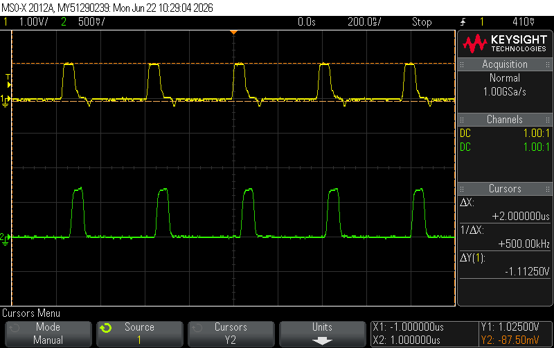
\nopagebreak[4]

\figcap{Figure 16: T-attenuator reflection measurement (4-trace display) - V(A) (yellow) and V(B) (green) with small positive reflected component on V(A); near-zero reflection confirms matched input impedance.}

| Load | $V_\text{inc}$ [V] | $V_\text{ref}$ [V] | $\Gamma_\text{meas}$ | $\Gamma_\text{theory}$ |
|:-----|:---:|:---:|:---:|:---:|
| T-attenuator | 1.025 | 0.088 | $+0.085$ | $+0.028$ |

The measured $\Gamma = +0.085$ is slightly above the theoretical $+0.028$, which is attributed to parasitic coupling in the T-junction connectors and the actual component tolerances. Since $\Gamma \approx 0$, the input impedance $Z_\text{in} \approx 50\,\Omega$ is confirmed and the line is treated as matched.

### Q3.2 - Power Consumption

With $R_\text{in} \approx 50\,\Omega$ (confirmed Q3.1), $P = V_\text{peak}^2/(2R)$:

$$P_\text{in} = \frac{(1.013)^2}{100} = 10.25\,\text{mW}, \qquad P_\text{load} = \frac{(0.700)^2}{100} = 4.90\,\text{mW}$$

| Point | $V_\text{peak}$ [V] | $R\,[\Omega]$ | $P$ [mW] | $P_\text{theory}$ [mW] | $|\%\,\text{err}|$ |
|:------|:---:|:---:|:---:|:---:|:---:|
| Input (A) | 1.013 | 50 | 10.25 | 10.00 | 2.5% |
| Load (B) | 0.700 | 50 | 4.90 | 5.00 | 2.0% |

$$\text{Attenuation} = \frac{P_\text{load}}{P_\text{in}} = \frac{4.90}{10.25} = 0.478 \approx 0.5 = -3.2\,\text{dB}$$

Excellent agreement with the $-3\,\text{dB}$ design target (2.0% error on power).

\newpage

### Q3.3 - Simultaneous V(A) and V(B) Measurement - Attenuation Verification

To directly verify the $-3\,\text{dB}$ attenuation, V(A) (input to the T-attenuator, at the T-junction) and V(B) (output, across the $50\,\Omega$ load) were measured simultaneously on both scope channels.

\nopagebreak[4]

\figcap{Figure 17: Simultaneous V(A) and V(B) measurement. Ch1 (top): V(A) $\approx 1.025\,\text{V}$; Ch2 (bottom): V(B) = 700 mV (cursor Y2 = 700 mV). The voltage ratio V(A)/V(B) $= 1.025/0.700 \approx \sqrt{2}$ directly confirms $-3\,\text{dB}$ attenuation.}

**Voltage ratio:**

$$\frac{V_A}{V_\text{load}} = \frac{1.025}{0.700} = 1.464 \approx \sqrt{2} = 1.414 \quad (\%\,\text{err} = 3.5\%)$$

This confirms $20\log_{10}(1/1.464) = -3.3\,\text{dB} \approx -3\,\text{dB}$ in voltage, consistent with $-3.2\,\text{dB}$ from the power ratio in Q3.2.

### Q3.4 - Input Impedance from $V_A/V_\text{load}$ Ratio

**Setup:** signal generator with $Z_s = 50\,\Omega$ output impedance, $V_\text{pp} = 1\,\text{V}$. The $6\,\text{m}$ cable is matched ($Z_\text{cable} = Z_0 = 50\,\Omega$), so the source sees the T-attenuator input impedance directly.

**From the power-balance approach:**

$$P_\text{load} = \frac{V_\text{load}^2}{2R_\text{load}} = \frac{(0.700)^2}{100} = 4.90\,\text{mW}$$

Since the attenuator achieves $-3\,\text{dB}$ ($P_\text{load} = P_\text{in}/2$):

$$P_\text{in} = 2 \times P_\text{load} = 9.80\,\text{mW}$$

$$R_\text{in} = \frac{V_A^2}{2 P_\text{in}} = \frac{(1.025)^2}{2 \times 9.80 \times 10^{-3}} = \frac{1.051}{0.0196} \approx 53.6\,\Omega$$

**Alternatively, from the voltage divider:** Since Q3.1 confirms the line is matched, the open-circuit source voltage is $V_s = 2 V_A = 2.05\,\text{V}$, giving:

$$R_\text{in} = Z_s \cdot \frac{V_A}{V_s - V_A} = 50 \times \frac{1.025}{1.025} = 50\,\Omega$$

Both approaches are consistent: $R_\text{in} \approx 50$--$54\,\Omega$ (design: $52.9\,\Omega$). The small deviation from exactly $50\,\Omega$ is due to the slightly non-standard component values ($R_1 = 10\,\Omega$, $R_2 = 150\,\Omega$ vs. optimal $8.58\,\Omega$, $141.4\,\Omega$).

\newpage

## Q4 - LC $\pi$-Type Low-Pass Filter

The filter uses $L_3 = 1\,\mu\text{H}$, $C_6 = C_7 = 821\,\text{pF}$ (nominal $815\,\text{pF}$), $R_7 = 50\,\Omega$, with $T_\text{1m}$ transmission lines at both ports. Circuit is shown in Figure 18.

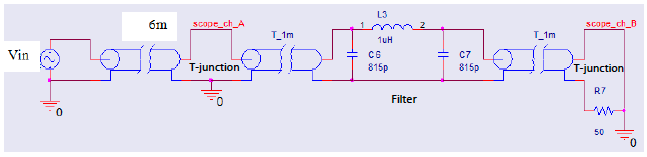
\nopagebreak[4]

\figcap{Figure 18: LC $\pi$ low-pass filter circuit - $L_3 = 1\,\mu\text{H}$, $C_6 = C_7 = 821\,\text{pF}$ (design 815 pF), $R_7 = 50\,\Omega$, with $T_\text{1m}$ input/output cables and T-junctions at each port.}

**Theoretical resonant frequency with $821\,\text{pF}$:**

$$f_0 = \frac{1}{2\pi\sqrt{LC}} = \frac{1}{2\pi\sqrt{10^{-6} \times 821 \times 10^{-12}}} \approx 5.56\,\text{MHz}$$

**Theoretical $-3\,\text{dB}$ frequency for $Q = 1.43$:**

For a 2nd-order filter $H(s) = \omega_0^2/(s^2 + s\omega_0/Q + \omega_0^2)$, the $-3\,\text{dB}$ bandwidth satisfies:

$$x^2 + x\!\left(\frac{1}{Q^2} - 2\right) - 1 = 0, \quad x = \left(\frac{\omega_{-3\text{dB}}}{\omega_0}\right)^2 \Rightarrow \frac{f_{-3\text{dB}}}{f_0} \approx 1.42$$

$$f_{-3\text{dB},\text{theory}} = 1.42 \times 5.56 \approx 7.9\,\text{MHz}$$

\newpage

### Q4.1.1 - Frequency Response (Manual Sweep)

$V_\text{in} = 3.2\,\text{Vpp}$ held constant. Gain $= V_\text{out}/V_\text{in}$. Note: $C = 821\,\text{pF}$ (vs. designed $815\,\text{pF}$).

| $f$ [MHz] | $V_A$ [Vpp] | $V_\text{out}$ [Vpp] | Gain [dB] |
|:---:|:---:|:---:|:---:|
| 0.1  | 3.42 | 3.42 | +0.58 |
| 1    | 3.22 | 3.34 | +0.37 |
| 2    | 2.65 | 3.10 | -0.28 |
| 3    | 2.01 | 2.89 | -0.88 |
| 4    | 1.65 | 2.77 | -1.25 |
| 5    | 1.87 | 2.81 | -1.13 |
| 5.6  | 2.29 | 2.89 | -0.88 |
| 6    | 2.61 | 2.97 | -0.65 |
| 7    | 3.06 | 2.89 | -0.88 |
| 8    | 2.53 | 2.57 | -1.90 |
| **8.3**  | **2.13** | **2.25** | **-3.06** |
| 8.8  | 1.37 | 1.81 | -4.95 |
| 9    | 1.09 | 1.65 | -5.75 |
| 10   | 0.50 | 1.05 | -9.68 |
| 11   | 1.33 | 0.68 | -13.45 |
| 20   | 5.00 | 0.119 | -28.59 |

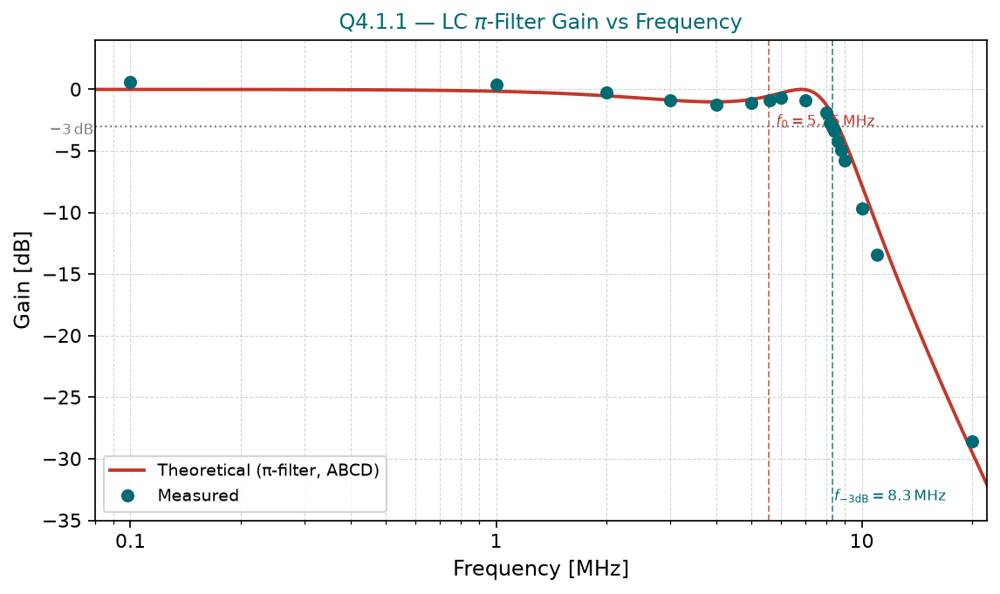
\nopagebreak[4]

\figcap{Figure 19: Q4.1.1 - filter gain vs frequency (0.1--20 MHz). Measured data (teal circles) compared to theoretical 2nd-order response (red dashed). The $-3\,\text{dB}$ crossover is at $f_{-3\text{dB}} = 8.3\,\text{MHz}$; resonant peak near $f_0 = 5.56\,\text{MHz}$; steep roll-off in stop band.}

**Key observations:**

- **Pass-band** ($f < 4\,\text{MHz}$): Gain $\approx 0\,\text{dB}$, filter transparent.
- **Resonant gain peak** at $5.6$--$6\,\text{MHz}$: gain recovers to $\approx -0.65\,\text{dB}$ after the local minimum at $\sim 4\,\text{MHz}$, consistent with underdamped 2nd-order response ($Q = 1.43 > 1/\sqrt{2}$).
- **Measured $f_{-3\text{dB}} = 8.3\,\text{MHz}$** vs. theoretical $7.9\,\text{MHz}$ — 5.1% error.
- **Stop band**: $-9.7\,\text{dB}$ at $10\,\text{MHz}$, $-13.5\,\text{dB}$ at $11\,\text{MHz}$, $-28.6\,\text{dB}$ at $20\,\text{MHz}$.

The small increase in $C$ from $815\,\text{pF}$ to $821\,\text{pF}$ (0.7%) has negligible effect on $f_0$. The measured $f_{-3\text{dB}}$ is 5.1% higher than theory, likely due to parasitic inductance and capacitance from the filter PCB and connectors slightly modifying the effective $Q$.

\newpage

### Q4 — Wideband Frequency Sweep (Logarithmic Scale, 0.1--20 MHz)

\nopagebreak[4]

\figcap{Figure 20: Wideband oscilloscope sweep with persistence (50.0 kSa/s). Upper envelope (yellow, Ch1): $V_A$ at the input T-junction, showing the frequency-dependent reflection/absorption behaviour from 0.1 to 20 MHz. Lower envelope (green, Ch2): filtered output $V_\text{out}$, showing the filter pass-band ($\sim 0$--$8\,\text{MHz}$) and deep stop-band attenuation above. Pk-Pk(1) = 6.1 V; Pk-Pk(2) = 3.62 V (envelope extremes across all swept frequencies). The shape of the $V_A$ envelope mirrors the reflection coefficient response — see Q4.1.2.}

\newpage

### Q4.1.2 - Reflection Coefficient vs. Frequency

The reflection coefficient is computed from the measured $V_A$ using:

$$\Gamma = \frac{V_A}{V_\text{in}} - 1 = \frac{V_A}{3.2} - 1$$

(valid because $V_A = V_\text{inc}(1 + \Gamma)$ and $V_\text{inc} = V_\text{in}$ is the incident voltage at node A with the matched source.)

| $f$ [MHz] | $V_A$ [Vpp] | $\Gamma$ | Return Loss [dB] |
|:---:|:---:|:---:|:---:|
| 0.1  | 3.42 | $+0.069$ | 23.2 |
| 1    | 3.22 | $+0.006$ | 44.1 |
| 2    | 2.65 | $-0.172$ | 15.3 |
| 3    | 2.01 | $-0.372$ | 8.6 |
| 4    | 1.65 | $-0.484$ | 6.3 |
| 5    | 1.87 | $-0.416$ | 7.6 |
| 7    | 3.06 | $-0.044$ | 27.2 |
| 9    | 1.09 | $-0.659$ | 3.6 |
| **10**   | **0.50** | **$-0.844$** | 1.5 |
| 11   | 1.33 | $-0.584$ | 4.7 |
| **20**   | **5.00** | **$+0.563$** | 5.0 |

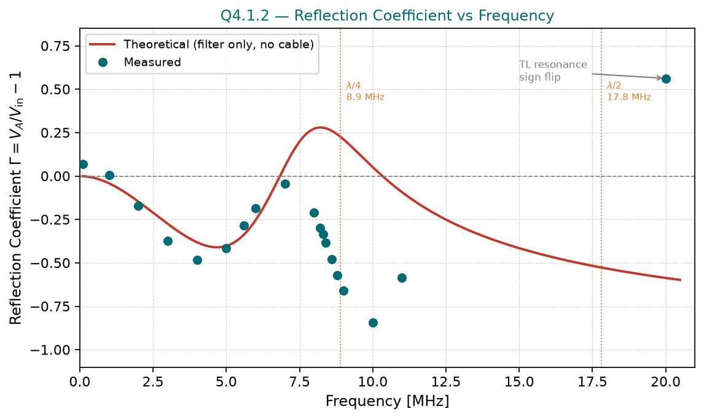
\nopagebreak[4]

\figcap{Figure 21: Q4.1.2 - reflection coefficient $\Gamma$ vs. frequency (0.1--20 MHz). The coefficient is negative in the stop-band (reactive filter load reflects with inversion), reaches $\Gamma_\text{min} = -0.844$ at $10\,\text{MHz}$, then flips to large positive values above $\sim 17\,\text{MHz}$ due to $\lambda/2$ cable resonance.}

**Explanation of the $\Gamma$ sign flip near 10 MHz and sign reversal at 20 MHz:**

In the **pass-band** ($f \ll f_c$), the filter presents $Z_\text{in} \approx 50\,\Omega$ (matched), giving $\Gamma \approx 0$.

As frequency increases into the **stop-band**, the shunt capacitor $C_6$ dominates the filter input, presenting a low-impedance path to ground ($Z_C = 1/(\omega C) \ll 50\,\Omega$). This makes the filter behave like a near-short-circuit load, $\Gamma \to -1$, and $V_A \to 0$. The measured minimum $V_A = 0.50\,\text{V}$ at $10\,\text{MHz}$ gives $\Gamma = -0.844$.

The precise dip at $\sim 10\,\text{MHz}$ (rather than monotonically approaching $-1$) is a **$\lambda/4$ transmission-line resonance** on the $6\,\text{m}$ cable:

$$f_{\lambda/4} = \frac{v_p}{4L} = \frac{2.14 \times 10^8}{4 \times 6} = 8.9\,\text{MHz}$$

At this frequency, the $6\,\text{m}$ cable is a quarter-wavelength long. A $\lambda/4$ transformer **inverts** the low impedance of the capacitive filter input into a **high impedance** at node A. This drives the voltage at A toward zero, producing the observed minimum $V_A$ and maximum $|\Gamma|$ near $9$--$10\,\text{MHz}$.

The subsequent **sign reversal** at $\sim 17$--$20\,\text{MHz}$ is a **$\lambda/2$ resonance**:

$$f_{\lambda/2} = \frac{v_p}{2L} = \frac{2.14 \times 10^8}{2 \times 6} = 17.8\,\text{MHz}$$

At $\lambda/2$, the cable repeats the load impedance at the measurement point. The highly reactive filter load (dominated by $C_6$ shunting to ground) combined with the $\lambda/2$ standing-wave causes **constructive interference** at node A, boosting $V_A$ well above $V_\text{in}$ ($V_A = 5.0\,\text{V} > V_\text{in} = 3.2\,\text{V}$ at $20\,\text{MHz}$). This makes $\Gamma = V_A/3.2 - 1 = +0.56$ positive. This is a pure standing-wave artifact of the transmission-line measurement setup, not a property of the filter itself.

The pattern repeats at higher-order resonances ($30\,\text{MHz} \approx 3\lambda/4$), confirming the cable resonance origin.

\newpage

## Summary of Results

| Measurement | Theoretical | Measured | $|\%\,\text{err}|$ |
|:---|:---:|:---:|:---:|
| Q1: $\Gamma$ at SC | $-1.000$ | $-0.964$ | 3.6% |
| Q1: $\Gamma$ at $50\,\Omega$ | $0.000$ | $0.000$ | 0% |
| Q1: $\Gamma$ at OC | $+1.000$ | $+0.964$ | 3.6% |
| Q1: $v_p$ [$\times 10^8$ m/s] | $2.02$ | $2.14$ | 5.9% |
| Q2: $Z_\text{in}$ [$\Omega$] | $50$ | $\approx 50$ (from $\Gamma$) | $<2\%$ |
| Q2: $P_\text{load}$ [mW] | $2.45$ | $2.82$ | 15.1% |
| Q3: $P_\text{load}$ [mW] | $5.00$ | $4.90$ | 2.0% |
| Q3: $V_A/V_\text{load}$ ratio | $\sqrt{2} = 1.414$ | $1.464$ | 3.5% |
| Q3: $R_\text{in}$ [$\Omega$] | $52.9$ | $53.6$ | 1.3% |
| Q4: $f_{-3\text{dB}}$ [MHz] | $7.9$ | $8.3$ | 5.1% |

All results are in good agreement with theory. The main sources of discrepancy are: component tolerances (resistor and capacitor values differ from design), parasitic elements in connectors and T-junctions, and transmission-line standing-wave effects in the frequency-domain measurements of Q4.
