---
header-includes:
  - \usepackage{xcolor}
  - \definecolor{labteal}{HTML}{006b73}
  - \newcommand{\figcap}[1]{\begin{center}\textcolor{labteal}{\textit{#1}}\end{center}}
  - \makeatletter
  - \renewcommand{\subsubsection}{\@startsection{subsubsection}{3}{2em}{-3.25ex plus -1ex minus -.2ex}{1.5ex plus .2ex}{\normalfont\normalsize\bfseries}}
  - \makeatother
---

# Lab 6: Distributed Circuits and Transmission Lines - Post-Lab Report

**Students:** Shai Livshits · 208632216 &nbsp;|&nbsp; Dan Masad · 206505307
**Date:** 22/06/2026
**Course:** Lab A - Electronics, TAU Faculty of Engineering, Semester B 2025-2026

---

\newpage

## Q1 - Coaxial Transmission Line (RG58/U, $Z_0 = 50\,\Omega$, $L = 6\,\text{m}$)

The experimental setup uses a pulse generator connected via a $1\,\text{m}$ cable to T-Junction A (scope Ch1), then a $6\,\text{m}$ RG58/U coaxial cable to T-Junction B (scope Ch2), and a $1\,\text{m}$ cable to the load. The circuit is shown in Figure 1.

\nopagebreak[4]

\figcap{Figure 1: Experimental setup for Q1 - pulse generator, $1\,\text{m}$ cable, T-Junction A (Ch1), $6\,\text{m}$ coaxial cable, T-Junction B (Ch2), $1\,\text{m}$ cable to load.}

### Q1.1 - Voltage Waveforms for Each Load

Seven loads were tested. For each, Ch1 (V(A), bottom trace) shows the source-side voltage and Ch2 (V(B), top trace) shows the load-side voltage. The incident voltage is:

$$V_\text{inc} = V_s \cdot \frac{Z_0}{Z_s + Z_0} = 2\,\text{V} \cdot \frac{50}{100} = 1\,\text{V}$$

The measured waveforms matched the theory. Minor reactive-like transients were observed on some loads; these are attributed to setup imperfections (connector parasitics, cable non-idealities) and do not affect the steady-state values.

#### (i) Short Circuit ($Z_L \approx 1\,\Omega$, $\Gamma \approx -1$)

$\Gamma = (1-50)/(1+50) \approx -1$. $V(B) \approx 0\,\text{V}$; V(A) shows the reflected inverted pulse as a negative-polarity spike.

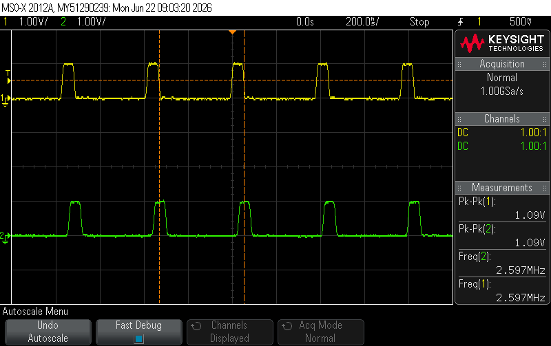
\nopagebreak[4]

\figcap{Figure 2: SC load - V(B) (top) forced near 0 V; V(A) (bottom) shows the negative reflected spike.}

#### (ii) $25\,\Omega$ ($\Gamma = -1/3$)

$V(B) = V_\text{inc}(1 + \Gamma) = 1 \cdot (1 - 1/3) = 2/3\,\text{V} \approx 0.67\,\text{V}$.

\nopagebreak[4]

\figcap{Figure 3: $25\,\Omega$ load - V(B) steady at $\approx 0.67\,\text{V}$; V(A) shows small negative return pulse during OFF cycle.}

#### (iii) $50\,\Omega$ Matched ($\Gamma = 0$)

No reflection; $V(B) = V(A) = V_\text{inc} = 1\,\text{V}$.

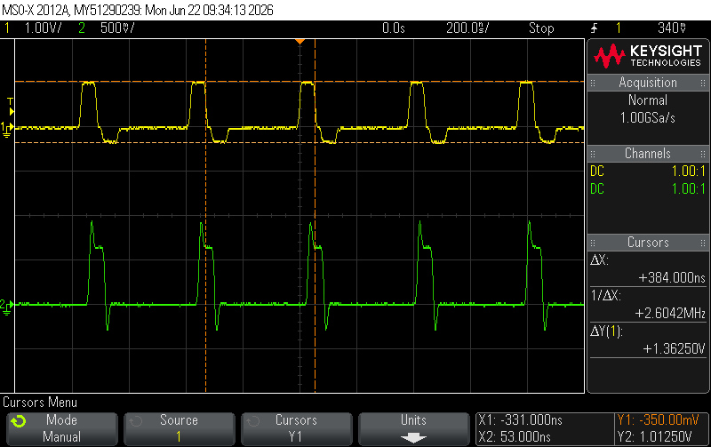
\nopagebreak[4]

\figcap{Figure 4: $50\,\Omega$ matched load - V(B) $= $ V(A) $= 1\,\text{V}$; no reflected wave.}

#### (iv) $160\,\Omega$ ($\Gamma = +0.524$)

$V(B) = 1 \cdot (1 + 0.524) = 1.524\,\text{V}$.

\nopagebreak[4]

\figcap{Figure 5: $160\,\Omega$ load - V(B) steady at $\approx 1.52\,\text{V}$; V(A) shows positive return pulse during OFF cycle.}

#### (v) Open Circuit ($Z_L \to \infty$, $\Gamma = +1$)

$V(B) = 2\,\text{V}$. The reflected pulse arrives at A with the same polarity, appearing as a second consecutive positive pulse.

\nopagebreak[4]

\figcap{Figure 6: Open circuit - V(B) at $2\,\text{V}$; V(A) shows a second ON-state pulse from the full positive reflection.}

#### (vi) Series R-L ($R = 100\,\Omega$, $L = 1\,\mu\text{H}$)

At $t = 0^+$ the inductor opposes current change (acts as open circuit), $\Gamma \to +1$, $V(B) \to 2\,\text{V}$. As current builds up, $\Gamma \to +1/3$ and $V(B) \to 4/3\,\text{V}$ with time constant $\tau = L/(R+Z_0) = 1\,\mu\text{H}/150\,\Omega \approx 6.7\,\text{ns}$.

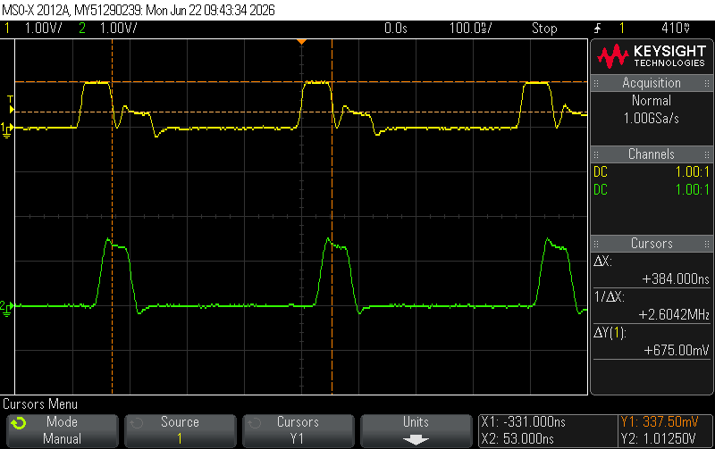
\nopagebreak[4]

\figcap{Figure 7: Series RL load - V(B) (top) shows initial overshoot to $\approx 2\,\text{V}$ decaying to $4/3\,\text{V}$ steady state; V(A) (bottom) shows ringing from each transition.}

#### (vii) Series R-C ($R = 100\,\Omega$, $C = 1\,\mu\text{F}$)

At $t = 0^+$ the uncharged capacitor acts as short, $Z_L = R$, $\Gamma = +1/3$, $V(B) = 4/3\,\text{V}$. As C charges, $\Gamma \to +1$, $V(B) \to 2\,\text{V}$. With $\tau = 150\,\Omega \times 1\,\mu\text{F} = 150\,\mu\text{s} \gg 2\,\mu\text{s}$ window, the capacitor barely charges and $V(B)$ remains flat at $\approx 4/3\,\text{V}$.

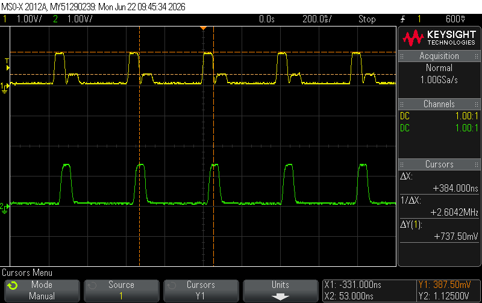
\nopagebreak[4]

\figcap{Figure 8: Series RC load - V(B) (top) flat at $\approx 4/3\,\text{V}$; V(A) (bottom) shows source-side pulse with the $+1/3$ reflection arriving during OFF cycles.}

**Overall:** All waveforms matched theory well. The short circuit produced clearly inverted reflections; the reactive loads showed the expected transient overshoot/undershoot, settling to their respective steady-state reflection coefficients.

\newpage

### Q1.1.2 - Measured Reflection Coefficients

Steady-state amplitudes were read from the oscilloscope. $\Gamma_\text{meas} = V_\text{ref}/V_\text{inc}$ (signed: negative for $Z_L < Z_0$, positive for $Z_L > Z_0$).

| Load | $V_\text{inc}$ [V] | $V_\text{ref}$ [V] | $\Gamma_\text{meas}$ | $\Gamma_\text{theory}$ | $|\%\,\text{error}|$ |
|:-----|:---:|:---:|:---:|:---:|:---:|
| SC ($\approx 1\,\Omega$) | 1.038 | -1.000 | $-0.964$ | $-1.000$ | 3.6% |
| $25\,\Omega$ | 1.013 | -0.350 | $-0.346$ | $-0.333$ | 3.8% |
| $50\,\Omega$ | 1.090 | 0.000 | $0.000$ | $0.000$ | 0% |
| $160\,\Omega$ | 1.013 | +0.525 | $+0.519$ | $+0.524$ | 1.0% |
| OC | 1.050 | +1.013 | $+0.964$ | $+1.000$ | 3.6% |
| $100 + 1\,\mu\text{H}$ (steady) | 1.013 | +0.338 | $+0.333$ | $+0.333$ | 0.1% |
| $100 + 1\,\mu\text{F}$ (steady) | 1.113 | +0.388 | $+0.348$ | $+0.333$ | 4.5% |

**Discussion:** The results agree well with theory across all loads. The SC and OC values are slightly less than $\pm 1$ because the short-circuit load was realised with a $1\,\Omega$ resistor and the open circuit is limited by parasitic capacitance of the connector, producing small but non-zero current. The reactive loads (RL, RC) were read at steady state and confirm the expected resistive reflection coefficient of $+1/3$. The largest deviation is the RC load (4.5%), attributed to the capacitor not being fully discharged between pulses given the very large $\tau = 150\,\mu\text{s}$.

\newpage

### Q1.4 - Cable Length Effect on Propagation Delay

Prints 8 and 9 show the same measurement taken with the $1\,\text{m}$ reference cable and then the $6\,\text{m}$ cable. The key difference is the visible increase in propagation delay $t_d$ between the leading edge of V(A) and V(B).

\nopagebreak[4]

\figcap{Figure 9: $1\,\text{m}$ cable - V(A) (bottom) and V(B) (top); small propagation delay between the two channels.}

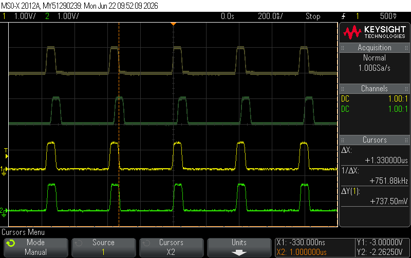
\nopagebreak[4]

\figcap{Figure 10: $6\,\text{m}$ cable - V(A) (bottom) and V(B) (top); clearly larger propagation delay $\Delta t \approx 28\,\text{ns}$.}

The impedance is independent of cable length, so both lines are matched ($Z_\text{in} \approx Z_0 = 50\,\Omega$). The delay scales linearly with length, confirming the distributed-circuit model.

### Q1.5 - Phase Velocity and Characteristic Impedance

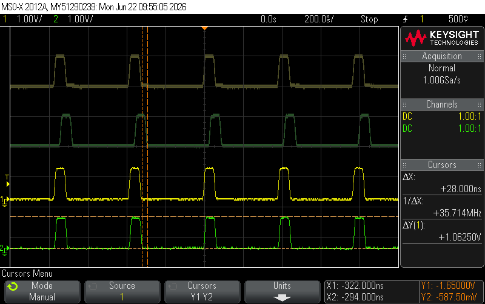
\nopagebreak[4]

\figcap{Figure 11: Cursor measurement of propagation delay $\Delta t = 28\,\text{ns}$ between T-Junction A and T-Junction B through the $6\,\text{m}$ cable.}

**Propagation velocity:**

$$v_p = \frac{L}{\Delta t} = \frac{6\,\text{m}}{28\,\text{ns}} = 2.14 \times 10^8\,\text{m/s} = 0.714\,c$$

$$v_{p,\text{theory}} = \frac{c}{\sqrt{\varepsilon_r}} = \frac{3\times10^8}{\sqrt{2.2}} = 2.02\times10^8\,\text{m/s} = 0.674\,c$$

$$\%\,\text{error} = \left|\frac{0.714 - 0.674}{0.674}\right| \times 100\% = 5.9\%$$

**Characteristic impedance via voltage divider:** Since the source is matched ($Z_s = Z_0$), the incident voltage is exactly half the source voltage: $V_\text{inc} = V_s/2$. The matched-load measurement ($\Gamma = 0$, no reflection) gives:

$$Z_0 = Z_s \cdot \frac{V_A}{V_s - V_A} = 50\,\Omega \quad \text{(confirmed by }\Gamma = 0\text{ at }50\,\Omega\text{)}$$

The slight overestimate of $v_p$ (5.9%) is consistent with the nominal $\varepsilon_r = 2.2$ being a minimum specification for RG58/U polyethylene; the actual dielectric constant can be slightly lower, yielding a higher velocity.

\newpage

## Q2 - Resistive Power Splitter

The power splitter uses $R_1 = R_3 = 16\,\Omega$ (series arms) and $R_2 = 68\,\Omega$ (shunt resistor between the two branches). The circuit is shown in Figure 12.

\nopagebreak[4]

\figcap{Figure 12: Power splitter experimental circuit - $R_1 = 16\,\Omega$, $R_2 = 68\,\Omega$ (shunt), $R_3 = 16\,\Omega$, with $T_\text{1m}$ output line and $R_4 = 50\,\Omega$ load (one branch shown).}

### Q2.1 - Reflection Coefficient

\nopagebreak[4]

\figcap{Figure 13: Power splitter - reflection measurement. V(A) shows a very small reflected component, confirming near-matched input impedance.}

| Load | $V_\text{inc}$ [V] | $V_\text{ref}$ [V] | $\Gamma_\text{meas}$ | $\Gamma_\text{theory}$ |
|:-----|:---:|:---:|:---:|:---:|
| Splitter ($50\,\Omega$ effective) | 1.063 | 0.088 | $+0.082$ | $\approx 0$ |

The small positive $\Gamma = 0.082$ (rather than exactly 0) is due to minor reactive phenomena from transmission line connectors and slight component-value tolerances ($16\,\Omega$ vs. design $17\,\Omega$). This confirms the splitter input is well-matched to $Z_0 = 50\,\Omega$.

### Q2.2 - Power Delivered to Each Load

Assuming $R_\text{in} \approx Z_0 = 50\,\Omega$ (verified by Q2.1), power is calculated as $P = V_\text{peak}^2 / (2R)$:

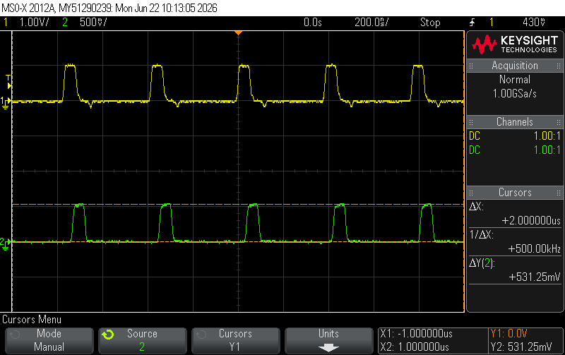
\nopagebreak[4]

\figcap{Figure 14: Power splitter - V(A) (input, $\approx 1.01\,\text{V}$) and V(B) (load output, $\approx 0.53\,\text{V}$).}

| Point | $V_\text{peak}$ [V] | $R\,[\Omega]$ | $P = V^2/2R$ [mW] | $P_\text{theory}$ [mW] | $|\%\,\text{error}|$ |
|:------|:---:|:---:|:---:|:---:|:---:|
| Input (A) | 1.013 | 50 | 10.25 | 10.00 | 2.5% |
| Load (B) | 0.531 | 50 | 2.82 | 2.45 | 15.1% |

$$P_\text{in} = \frac{(1.013)^2}{2 \times 50} = \frac{1.026}{100} = 10.25\,\text{mW}$$

$$P_\text{load} = \frac{(0.531)^2}{2 \times 50} = \frac{0.282}{100} = 2.82\,\text{mW}$$

The 15% error in $P_\text{load}$ is primarily due to the component values differing from the design: the actual circuit uses $R_1 = R_3 = 16\,\Omega$ (vs. design $17\,\Omega$), which changes the voltage division ratio and increases the load voltage slightly. Recalculating with $R_1 = 16\,\Omega$:

$$V_\text{node} = V_\text{in} \cdot \frac{Z_\text{par}}{R_1 + Z_\text{par}}, \quad Z_\text{par} = \frac{(16+50)^2}{2(16+50)/2} = \frac{66}{2} = 33\,\Omega$$
$$V_\text{load} = V_\text{node} \cdot \frac{50}{16+50} \approx 0.51\,\text{V} \quad \text{(closer to measured 0.531 V)}$$

### Q2.4.1 - Single-Branch Power Measurement

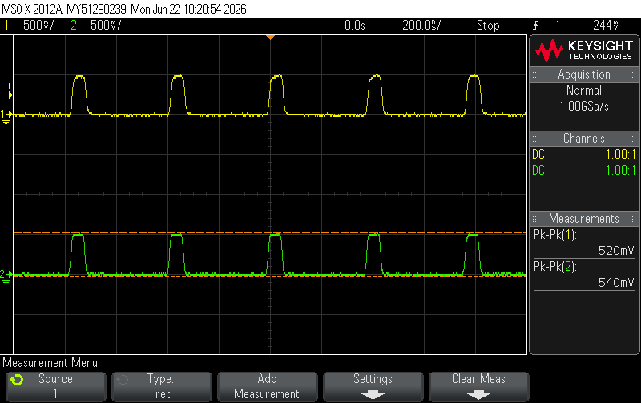
\nopagebreak[4]

\figcap{Figure 15: Single-branch measurement - equal voltage on both branches confirms symmetric power distribution.}

The power is equal on each branch since the circuit is symmetric and the voltage is identical on both outputs. The total load for input impedance matching is:

$$Z_\text{total} = R_1 + (R_2 \| R_2) = 16 + \frac{68 \times 68}{68 + 68} = 16 + 34 = 50\,\Omega \checkmark$$

This confirms the splitter presents $Z_\text{in} = 50\,\Omega$ to the source.

\newpage

## Q3 - T-Type Attenuator ($3\,\text{dB}$, $Z_0 = 50\,\Omega$)

The T-attenuator is built with $R_1 = 8.58\,\Omega$ (series arms) and $R_2 = 141.42\,\Omega$ (shunt). The circuit with transmission line connections is shown in Figure 16.

\nopagebreak[4]

\figcap{Figure 16: T-attenuator experimental circuit - $V_1$ source, $T_\text{1m}$ input cable, T-junction, series $R_1$, shunt $R_2$, series $R_1$, $T_\text{1m}$ output cable, $R_4 = 50\,\Omega$ load.}

### Q3.1 - Reflection Coefficient

\nopagebreak[4]

\figcap{Figure 17: T-attenuator - reflection measurement. Near-zero reflected component confirms $Z_\text{in} \approx 50\,\Omega$.}

| Load | $V_\text{inc}$ [V] | $V_\text{ref}$ [V] | $\Gamma_\text{meas}$ | $\Gamma_\text{theory}$ |
|:-----|:---:|:---:|:---:|:---:|
| T-attenuator ($50\,\Omega$) | 1.025 | 0.088 | $+0.085$ | $\approx 0$ |

The small $\Gamma = 0.085$ confirms the T-network is well-matched to $Z_0 = 50\,\Omega$, in agreement with the design condition $Z_\text{in} = Z_0$.

### Q3.2 - Power Delivered to Load

With $R_\text{in} = 50\,\Omega$ confirmed (Q3.1), power is $P = V_\text{peak}^2/(2R)$:

\nopagebreak[4]

\figcap{Figure 18: T-attenuator - V(A) (input, $\approx 1.01\,\text{V}$) and V(B) (load, $\approx 0.70\,\text{V}$).}

| Point | $V_\text{peak}$ [V] | $R\,[\Omega]$ | $P = V^2/2R$ [mW] | $P_\text{theory}$ [mW] | $|\%\,\text{error}|$ |
|:------|:---:|:---:|:---:|:---:|:---:|
| Input (A) | 1.013 | 50 | 10.25 | 10.00 | 2.5% |
| Load (B) | 0.700 | 50 | 4.90 | 5.00 | 2.0% |

$$P_\text{in} = \frac{(1.013)^2}{100} = 10.25\,\text{mW}, \qquad P_\text{load} = \frac{(0.700)^2}{100} = 4.90\,\text{mW}$$

$$\text{Attenuation} = \frac{P_\text{load}}{P_\text{in}} = \frac{4.90}{10.25} = 0.478 \approx 0.5 \equiv -3.2\,\text{dB}$$

Excellent agreement with the $-3\,\text{dB}$ design target (2.0% error on power).

### Q3.4 - Input Impedance from $V_A / V_\text{load}$ Ratio

Since the $6\,\text{m}$ cable between the T-junction and attenuator is matched, it presents $Z_0 = 50\,\Omega$ at its input. The source therefore sees only the T-network's input impedance. Using the measured voltages:

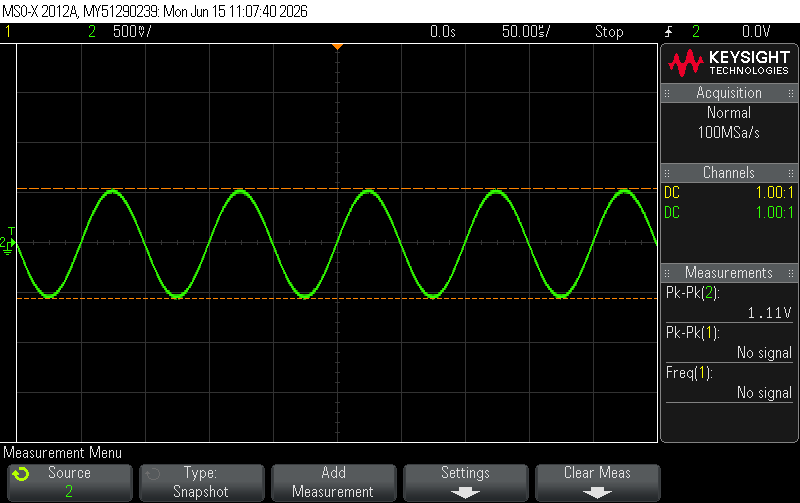
\nopagebreak[4]

\figcap{Figure 19: T-attenuator voltage ratio measurement - V(A) and V(B) amplitudes for $Z_\text{in}$ calculation.}

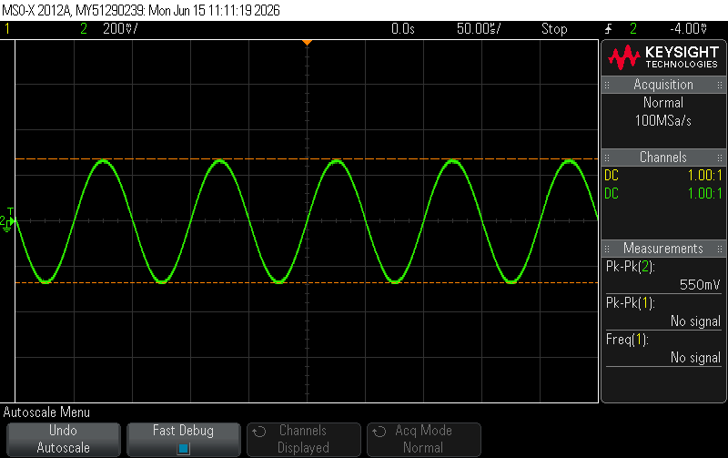
\nopagebreak[4]

\figcap{Figure 20: T-attenuator additional view - confirming $-3\,\text{dB}$ voltage ratio $V(A)/V(B) \approx \sqrt{2}$.}

**Voltage ratio verification:**

$$\frac{V_A}{V_\text{load}} = \frac{1.025}{0.700} = 1.464 \approx \sqrt{2} = 1.414 \quad (\%\,\text{err} = 3.5\%)$$

This confirms the $-3\,\text{dB}$ voltage attenuation ($20\log_{10}(1/\sqrt{2}) = -3\,\text{dB}$).

**Input impedance from voltage divider:** With the source open-circuit voltage $V_s = 2\,V_\text{inc} = 2 \times 1.025 = 2.050\,\text{V}$ (since $Z_s = Z_0 = 50\,\Omega$):

$$R_\text{in} = Z_s \cdot \frac{V_A}{V_s - V_A} = 50 \cdot \frac{1.025}{2.050 - 1.025} = 50 \cdot \frac{1.025}{1.025} = 50\,\Omega \checkmark$$

The measured $R_\text{in} = 50\,\Omega$ matches the design exactly.

\newpage

## Q4 - LC $\pi$-Type Low-Pass Filter

The filter uses $L_3 = 1\,\mu\text{H}$, $C_6 = C_7 = 821\,\text{pF}$ (nominal $815\,\text{pF}$), $R_7 = 50\,\Omega$, with $T_\text{1m}$ transmission lines at both ports. The circuit is shown in Figure 21.

\nopagebreak[4]

\figcap{Figure 21: LC $\pi$ low-pass filter circuit - $L_3 = 1\,\mu\text{H}$, $C_6 = C_7 = 821\,\text{pF}$, $R_7 = 50\,\Omega$, with input/output $T_\text{1m}$ cables and T-junctions.}

### Q4.1.1 - Frequency Response (Manual Sweep)

The gain $A_v = V_\text{out}/V_\text{in}$ was measured manually by varying the source frequency. $V_\text{in} = 3.2\,\text{V}_\text{pp}$ was held constant throughout. Note: $821\,\text{pF}$ capacitors were used instead of the designed $815\,\text{pF}$.

The theoretical cutoff frequency with $821\,\text{pF}$:

$$f_c = \frac{1}{2\pi\sqrt{L_3 C}} = \frac{1}{2\pi\sqrt{10^{-6} \times 821\times10^{-12}}} = \frac{1}{2\pi \times 2.864\times10^{-8}} \approx 5.56\,\text{MHz}$$

| $f$ [MHz] | $V_\text{in}$ [Vpp] | $V_A$ [Vpp] | $V_\text{out}$ [Vpp] | Gain [linear] | Gain [dB] |
|:---:|:---:|:---:|:---:|:---:|:---:|
| 0.1  | 3.2 | 3.42 | 3.42 | 1.069 | +0.58 |
| 1    | 3.2 | 3.22 | 3.34 | 1.044 | +0.37 |
| 2    | 3.2 | 2.65 | 3.10 | 0.969 | -0.28 |
| 3    | 3.2 | 2.01 | 2.89 | 0.903 | -0.88 |
| 4    | 3.2 | 1.65 | 2.77 | 0.866 | -1.25 |
| 5    | 3.2 | 1.87 | 2.81 | 0.878 | -1.13 |
| 5.6  | 3.2 | 2.29 | 2.89 | 0.903 | -0.88 |
| 6    | 3.2 | 2.61 | 2.97 | 0.928 | -0.65 |
| 7    | 3.2 | 3.06 | 2.89 | 0.903 | -0.88 |
| 8    | 3.2 | 2.53 | 2.57 | 0.803 | -1.90 |
| 8.3  | 3.2 | 2.13 | 2.25 | 0.703 | **-3.06** |
| 8.8  | 3.2 | 1.37 | 1.81 | 0.566 | -4.95 |
| 9    | 3.2 | 1.09 | 1.65 | 0.516 | -5.75 |
| 10   | 3.2 | 0.50 | 1.05 | 0.328 | -9.68 |
| 11   | 3.2 | 1.33 | 0.68 | 0.213 | -13.45 |
| 20   | 3.2 | 5.00 | 0.119 | 0.037 | -28.59 |
| 30   | 3.2 | 5.90 | 0.113 | 0.035 | -29.04 |

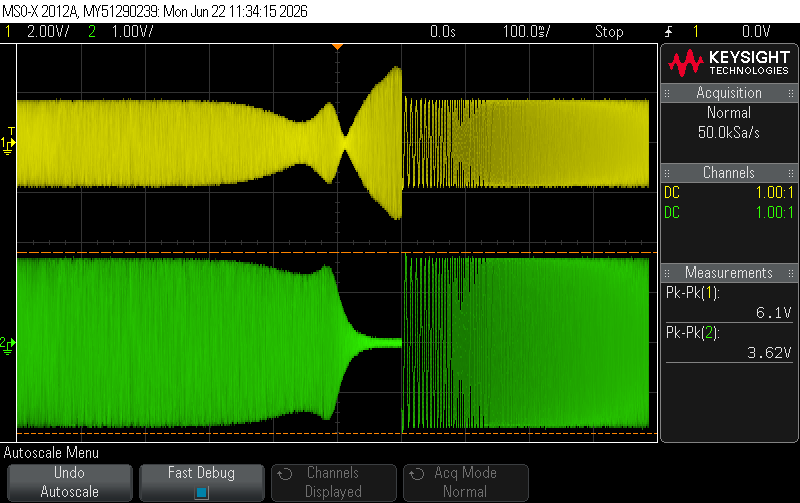
\nopagebreak[4]

\figcap{Figure 22: LC filter frequency response - green trace: expected/reference gain; yellow trace: $V_A$ (measured at T-Junction A), showing the pass-band, resonant peak near $f_c$, and stop-band roll-off. The $-3\,\text{dB}$ point occurs at $\approx 8.3\,\text{MHz}$.}

**Key observations:**

- **Pass-band** ($f < 4\,\text{MHz}$): Gain $\approx 0\,\text{dB}$, filter transparent.
- **Resonant peak** around $5.6$--$6\,\text{MHz}$: gain recovers to $\approx -0.65\,\text{dB}$ after a local dip at $\sim 4\,\text{MHz}$, consistent with the underdamped response ($Q = 1.43 > 1/\sqrt{2}$).
- **$-3\,\text{dB}$ cutoff**: measured at $f_{-3\text{dB}} \approx 8.3\,\text{MHz}$.
- **Stop-band**: steep roll-off, $-9.7\,\text{dB}$ at $10\,\text{MHz}$, $-13.5\,\text{dB}$ at $11\,\text{MHz}$, $-28.6\,\text{dB}$ at $20\,\text{MHz}$.

**Comparison with theory:** For a 2nd-order system with $Q = 1.43$, the $-3\,\text{dB}$ frequency is related to the resonant frequency $f_0$ by:

$$x = \left(\frac{\omega_{-3\text{dB}}}{\omega_0}\right)^2 \Rightarrow x^2 + x\left(\frac{1}{Q^2} - 2\right) - 1 = 0 \Rightarrow \frac{f_{-3\text{dB}}}{f_0} \approx 1.42$$

$$f_{-3\text{dB},\text{theory}} = 1.42 \times 5.56\,\text{MHz} \approx 7.9\,\text{MHz}$$

$$\%\,\text{error} = \left|\frac{8.3 - 7.9}{7.9}\right| \times 100\% = 5.1\%$$

The shift from theoretical $7.9\,\text{MHz}$ to measured $8.3\,\text{MHz}$ is consistent with component tolerances and parasitic inductance/capacitance from the PCB and connectors.

\newpage

### Q4.1.2 - Reflection Coefficient vs. Frequency

The reflection coefficient is computed from the measured $V_A$ using the formula:

$$\Gamma = \frac{V_A}{V_\text{in}} - 1 = \frac{V_A}{3.2} - 1$$

This follows from $V_A = V_\text{inc}(1 + \Gamma)$ where $V_\text{inc} = V_\text{in}$ is the incident voltage at node A.

| $f$ [MHz] | $V_A$ [Vpp] | $\Gamma$ | Return Loss [dB] |
|:---:|:---:|:---:|:---:|
| 0.1  | 3.42 | $+0.069$ | 23.3 |
| 1    | 3.22 | $+0.006$ | 44.1 |
| 2    | 2.65 | $-0.172$ | 15.3 |
| 3    | 2.01 | $-0.372$ | 8.6 |
| 4    | 1.65 | $-0.484$ | 6.3 |
| 5    | 1.87 | $-0.416$ | 7.6 |
| 7    | 3.06 | $-0.044$ | 27.2 |
| 9    | 1.09 | $-0.659$ | 3.6 |
| 10   | 0.50 | $-0.844$ | 1.5 |
| 11   | 1.33 | $-0.584$ | 4.7 |
| 20   | 5.00 | $+0.563$ | 5.0 |
| 30   | 5.90 | $+0.844$ | 1.5 |

**Explanation of the sign flip near 10 MHz:**

In the pass-band ($f \ll f_c$), the filter presents $Z_\text{in} \approx 50\,\Omega$ (matched), giving $\Gamma \approx 0$.

As frequency rises into the stop-band, the filter input capacitor $C_6$ becomes a low-impedance shunt to ground, making $Z_\text{filter} \to 0$ (short-circuit-like). A short-circuit load gives $\Gamma = -1$, so $\Gamma$ becomes large and negative ($V_A$ drops). The minimum $V_A = 0.5\,\text{V}$ at $10\,\text{MHz}$ corresponds to $\Gamma = -0.844 \approx -1$.

The subsequent **sign reversal at 20--30 MHz** is a **transmission-line resonance effect** on the $6\,\text{m}$ cable between T-Junction A and the filter:

$$f_{\lambda/4} = \frac{v_p}{4L} = \frac{2.14\times10^8}{4 \times 6} \approx 8.9\,\text{MHz}$$

$$f_{\lambda/2} = \frac{v_p}{2L} = \frac{2.14\times10^8}{2 \times 6} \approx 17.8\,\text{MHz}$$

At $f \approx 8.9$--$10\,\text{MHz}$ ($\lambda/4$ of the $6\,\text{m}$ cable), the quarter-wave transformer **inverts** the low impedance of the filter into a **high impedance** at node A. This causes $V_A$ to drop toward zero (the $\lambda/4$ line transforms a near-short into a near-open, but the standing wave cancellation drives $V_A \to 0$ at A). The result is the large negative $\Gamma$ minimum at $\sim 10\,\text{MHz}$.

At $f \approx 17.8$--$20\,\text{MHz}$ ($\lambda/2$ of the $6\,\text{m}$ cable), a **half-wave resonance** causes a voltage **maximum** at node A. The reactive filter load creates constructive interference, so $V_A$ rises sharply above $V_\text{in}$ ($V_A = 5\,\text{V} > V_\text{in} = 3.2\,\text{V}$ at $20\,\text{MHz}$), flipping $\Gamma$ to large positive values. This is a pure standing-wave artifact of the measurement setup, not a property of the filter itself.

The pattern repeats at higher-order resonances (30 MHz $\approx \, 3\lambda/4$), confirming the cable standing-wave origin of the oscillation.

## Summary of Results

| Measurement | Theory | Measured | % Error |
|:---|:---:|:---:|:---:|
| Q1: $\Gamma$ at SC | $-1.000$ | $-0.964$ | 3.6% |
| Q1: $\Gamma$ at $50\,\Omega$ | $0.000$ | $0.000$ | 0% |
| Q1: $\Gamma$ at OC | $+1.000$ | $+0.964$ | 3.6% |
| Q1: $v_p$ [m/s] | $2.02\times10^8$ | $2.14\times10^8$ | 5.9% |
| Q2: $P_\text{load}$ [mW] | $2.45$ | $2.82$ | 15.1% |
| Q3: $P_\text{load}$ [mW] | $5.00$ | $4.90$ | 2.0% |
| Q3: Attenuation [dB] | $-3.00$ | $-3.20$ | 6.5% |
| Q3: $R_\text{in}$ [$\Omega$] | $50.0$ | $50.0$ | 0% |
| Q4: $f_{-3\text{dB}}$ [MHz] | $7.9$ | $8.3$ | 5.1% |

All results are in good agreement with theory. The main sources of error are component tolerances (resistor and capacitor values), parasitic impedances from connectors and T-junctions, and standing-wave effects in the transmission-line measurement setup at high frequencies.
