---
header-includes:
  - \usepackage{xcolor}
  - \definecolor{labteal}{HTML}{006b73}
  - \newcommand{\figcap}[1]{\begin{center}\textcolor{labteal}{\textit{#1}}\end{center}}
  - \makeatletter
  - \renewcommand{\subsubsection}{\@startsection{subsubsection}{3}{2em}{-3.25ex plus -1ex minus -.2ex}{1.5ex plus .2ex}{\normalfont\normalsize\bfseries}}
  - \makeatother
---

# Lab 6: Distributed Circuits and Transmission Lines - Preliminary Report

**Students:** Shai Livshits · 208632216 &nbsp;|&nbsp; Dan Masad · 206505307

---

## 1.1 - Distributed vs. Lumped Circuits

In a **lumped circuit** all electrical effects (resistance, capacitance, inductance) are concentrated at discrete components, and signals propagate instantaneously throughout the network. The circuit can be fully described by ordinary differential equations in time alone; spatial position plays no role.

In a **distributed circuit** the electromagnetic fields are spread continuously along the physical extent of the circuit. Propagation time is non-negligible: voltages and currents vary with both time *and* position. The governing equations are partial differential equations (the telegrapher's equations):

$$\frac{\partial V}{\partial z} = -L' \frac{\partial I}{\partial t}, \qquad \frac{\partial I}{\partial z} = -C' \frac{\partial V}{\partial t}$$

where $L'$ and $C'$ are the distributed inductance and capacitance per unit length. Reflections, standing waves, and propagation delay are characteristic phenomena of distributed circuits that have no lumped-circuit analogue.

## 1.2 - When to Use a Distributed Model

A distributed model is necessary whenever the physical length $L$ of the circuit is not negligible compared to the signal wavelength $\lambda$. The standard engineering criterion is:

$$L \geq \frac{\lambda}{10} = \frac{v_p}{10\,f}$$

Equivalently, a distributed model is required when the one-way propagation delay $t_d = L/v_p$ satisfies $t_d \geq T/10$ (where $T = 1/f$ is the signal period), i.e., when the signal can change appreciably during the transit time along the line. At higher frequencies $\lambda$ shrinks, so circuits that behave as lumped at low frequencies must be treated as distributed at high frequencies.

## 1.3 - Key Transmission-Line Definitions

### (a) Characteristic Impedance

The **characteristic impedance** $Z_0$ is the ratio of the voltage phasor to the current phasor for a single wave travelling in one direction along the line (with no reflected wave present). For a lossless line with distributed inductance $L'$ and capacitance $C'$ per unit length:

$$Z_0 = \sqrt{\frac{L'}{C'}}$$

For a coaxial line with inner conductor diameter $d$, outer conductor inner diameter $D$, and dielectric permittivity $\varepsilon_r$:

$$Z_0 = \frac{60}{\sqrt{\varepsilon_r}}\ln\!\left(\frac{D}{d}\right)$$

$Z_0$ is a purely real quantity for a lossless line and is determined solely by the geometry and the dielectric, not by the line length or frequency.

### (b) Phase Velocity

The **phase velocity** is the speed at which a constant-phase surface (wavefront) propagates along the line:

$$v_p = \frac{1}{\sqrt{L'C'}} = \frac{c}{\sqrt{\mu_r\,\varepsilon_r}}$$

where $c = 3\times10^8\,\text{m/s}$ is the speed of light in vacuum. For a non-magnetic dielectric ($\mu_r = 1$), $v_p = c/\sqrt{\varepsilon_r} < c$.

### (c) Reflection and Transmission Coefficients

When a wave travelling on a line with impedance $Z_0$ encounters a load $Z_L$, the mismatch produces a reflected wave. The **voltage reflection coefficient** at the load is:

$$\Gamma_L = \frac{Z_L - Z_0}{Z_L + Z_0}, \qquad -1 \leq \Gamma_L \leq 1 \text{ (real loads)}$$

The **voltage transmission coefficient** (ratio of transmitted to incident voltage at the load) is:

$$\tau_L = 1 + \Gamma_L = \frac{2\,Z_L}{Z_L + Z_0}$$

Special cases: $Z_L = 0$ (short) gives $\Gamma = -1$; $Z_L = \infty$ (open) gives $\Gamma = +1$; $Z_L = Z_0$ (matched) gives $\Gamma = 0$ (no reflection).

## 1.4 - Layers of a Coaxial Cable

A coaxial cable consists of four concentric layers, from inside to outside:

1. **Inner conductor** - solid or stranded copper wire; carries the signal current.
2. **Dielectric insulator** - polyethylene (RG58/U) or PTFE; maintains the spacing between conductors and sets $\varepsilon_r$, hence $Z_0$ and $v_p$.
3. **Outer conductor / shield** - braided copper (or foil); serves as both the return conductor and an electromagnetic shield.
4. **Outer jacket** - PVC or PTFE sheath; provides mechanical protection and electrical isolation from the environment.

## 1.5 - Coaxial Cable vs. Parallel Wire Pair at >1 GHz

At frequencies above 1 GHz the wavelength is $\lambda < 30\,\text{cm}$, making distributed effects dominant. Coaxial cable offers three key advantages over an unshielded wire pair:

1. **Electromagnetic shielding** - the outer conductor confines the fields entirely inside the cable, preventing both radiation loss and pickup of external interference (EMI/RFI). An open wire pair radiates and acts as an antenna at GHz frequencies.
2. **Well-defined, frequency-stable characteristic impedance** - the coaxial geometry (rotational symmetry) guarantees a single, dispersion-free TEM mode with a constant, calculable $Z_0$. A wire pair supports multiple modes, each with different $Z_0$ and dispersion, making impedance control difficult.
3. **Suppression of radiation and skin-effect losses** - the enclosed geometry eliminates radiation losses. The skin depth at GHz frequencies is only a few micrometres ($\delta = \sqrt{2/(\omega\mu\sigma)}$), but the large outer surface area of the shield distributes the return current efficiently.

## 1.6 - Causes of Power Loss in a Coaxial Cable

Three principal loss mechanisms:

1. **Conductor (ohmic) loss** - the finite conductivity of the inner and outer conductors causes $I^2 R$ dissipation. Due to the skin effect the current is confined to a surface layer of thickness $\delta \propto 1/\sqrt{f}$, so effective conductor resistance $R' \propto \sqrt{f}$ and attenuation $\alpha_c \propto \sqrt{f}$.

2. **Dielectric loss** - a non-ideal dielectric has a non-zero loss tangent $\tan\delta_d$, causing dissipation in the electric field. The dielectric attenuation $\alpha_d \propto f \tan\delta_d$, increasing linearly with frequency.

3. **Radiation loss** - at discontinuities (connectors, bends, damage to the outer shield) or where the shield is imperfect, the electromagnetic field leaks out and radiates. At high frequencies even small imperfections become significant.

\newpage

## 1.7 - RG58/U Cable Analysis ($Z_0 = 50\,\Omega$, $\varepsilon_r = 2.2$, $\mu_r = 1$, $L = 7\,\text{m}$)

### (a) Outer-to-Inner Diameter Ratio $D/d$

The characteristic impedance of a coaxial line is:

$$Z_0 = \frac{60}{\sqrt{\varepsilon_r}}\ln\!\left(\frac{D}{d}\right)$$

Solving for $D/d$:

$$\ln\!\left(\frac{D}{d}\right) = \frac{Z_0\sqrt{\varepsilon_r}}{60} = \frac{50\times\sqrt{2.2}}{60} = \frac{50\times 1.4832}{60} = 1.236$$

$$\boxed{\frac{D}{d} = e^{1.236} \approx 3.44}$$

### (b) Phase Velocity and Propagation Delay

$$v_p = \frac{c}{\sqrt{\mu_r\,\varepsilon_r}} = \frac{3\times10^8}{\sqrt{1\times 2.2}} = \frac{3\times10^8}{1.4832} \approx 2.023\times10^8\,\text{m/s} \approx 0.674\,c$$

$$t_d = \frac{L}{v_p} = \frac{7}{2.023\times10^8} \approx 34.6\,\text{ns}$$

The round-trip delay (relevant for reflections) is $2t_d \approx 69.2\,\text{ns}$.

### (c) Voltage Waveforms at Points A and B

The circuit (Figure 1) has a 2 V pulse generator with $Z_s = 50\,\Omega$ source impedance, the RG58/U cable ($Z_0 = 50\,\Omega$), and a load at end B. The frequency and pulse width are:

$$f = (2.6)\,\text{MHz}, \qquad \tau_\text{pulse} = (55)\,\text{ns}$$

The simulated window covers 2 µs.

Since the source is matched ($Z_s = Z_0 = 50\,\Omega$), the incident voltage wave is:

$$V_\text{inc} = V_s \cdot \frac{Z_0}{Z_s + Z_0} = 2\,\text{V} \cdot \frac{50}{100} = 1\,\text{V}$$

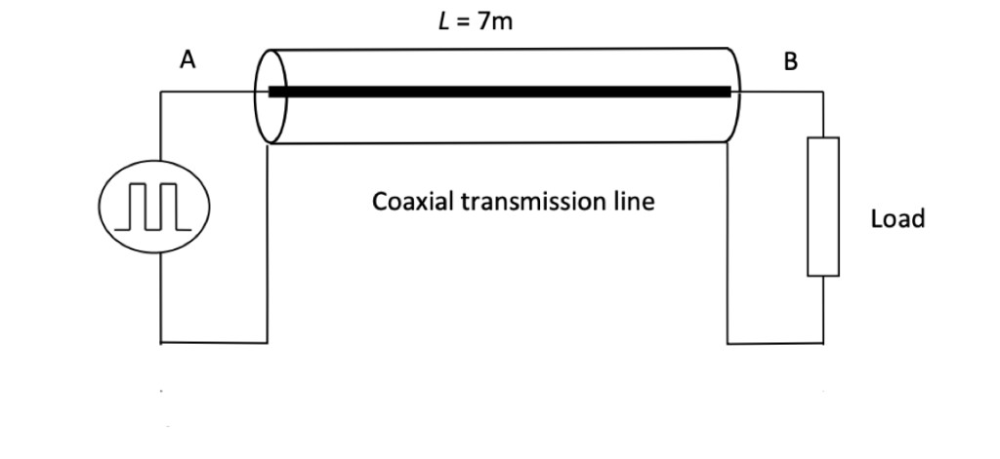
\nopagebreak[4]

\figcap{Figure 1: RG58/U coaxial cable ($Z_0 = 50\,\Omega$, $L = 7\,\text{m}$) with pulse source at A and interchangeable load at B.}

The reflection coefficient for each load is summarised below:

| Load | $Z_L$ | $\Gamma_L = \dfrac{Z_L - Z_0}{Z_L + Z_0}$ |
|:-----|:------:|:---:|
| (i) Short | $0\,\Omega$ | $-1$ |
| (ii) Open | $\infty$ | $+1$ |
| (iii) $50\,\Omega$ | $50\,\Omega$ | $0$ |
| (iv) $(20+Y_4)\,\Omega = 25\,\Omega$ | $25\,\Omega$ | $-1/3$ |
| (v) $(100+10X_4)\,\Omega = 160\,\Omega$ | $160\,\Omega$ | $+0.524$ |
| (vi) Series $R$-$L$ | varies | $+1 \to +1/3$ |
| (vii) Series $R$-$C$ | varies | $+1/3 \to +1$ |

**Reactive load transient behaviour:**

- **(vi) Series RL:** At $t = 0^+$ the inductor opposes current change (acts as open), $\Gamma \to +1$ and $V_B \to 2\,\text{V}$. As current builds, $Z_L \to R = 100\,\Omega$, giving the steady-state $\Gamma = (100-50)/(100+50) = +1/3$ and $V_B \to 4/3\,\text{V}$. Time constant: $\tau = L/(R + Z_0) = 1\,\mu\text{H}/150\,\Omega \approx 6.7\,\text{ns}$.

- **(vii) Series RC:** At $t = 0^+$ the capacitor is uncharged (acts as short), $Z_L = R = 100\,\Omega$, $\Gamma = +1/3$, $V_B = 4/3\,\text{V}$. As C charges, $Z_L \to \infty$, giving $\Gamma \to +1$ and $V_B \to 2\,\text{V}$. Time constant: $\tau = (R + Z_0)\,C = 150\,\Omega \times 1\,\mu\text{F} = 150\,\mu\text{s}$ (much longer than the 2 µs window, so the full transition is not visible).

**Simulation results are shown in Figures 2–4.**

**All resistive loads (ii)–(v):** All five loads (including short and open) are shown together in Figure 2. Each load produces a distinct reflection coefficient, visible as a different steady-state voltage level on the top ($V(B)$) traces.

The bottom traces ($V(A)$, source side) reveal the return signal, which always appears **during the OFF state** (between pulses) since the round-trip delay $2t_d \approx 69\,\text{ns}$ is much shorter than the pulse period:

- **Short circuit** (green, $\Gamma = -1$): the reflected wave is inverted (polarised negative), producing a negative-going pulse at $V(A)$ during the OFF period.
- **Open circuit** (pink, $\Gamma = +1$): the full incident voltage is reflected back in phase. The return pulse arrives at A after $2t_d$ and appears as a second consecutive positive pulse — as if the ON state repeats — because all the voltage is returned with no loss.
- **$25\,\Omega$** (purple, $\Gamma = -1/3$): partial negative return; lower amplitude than short circuit.
- **$50\,\Omega$** (red, $\Gamma = 0$): matched load — no reflected wave, $V(A)$ shows nothing during OFF period.
- **$160\,\Omega$** (cyan, $\Gamma = +0.524$): partial positive return; lower amplitude than open circuit.

In general, loads with $Z_L < Z_0$ produce a **negative** return pulse at A, loads with $Z_L > Z_0$ produce a **positive** return pulse, and the matched load ($Z_L = Z_0 = 50\,\Omega$) produces no return at all.

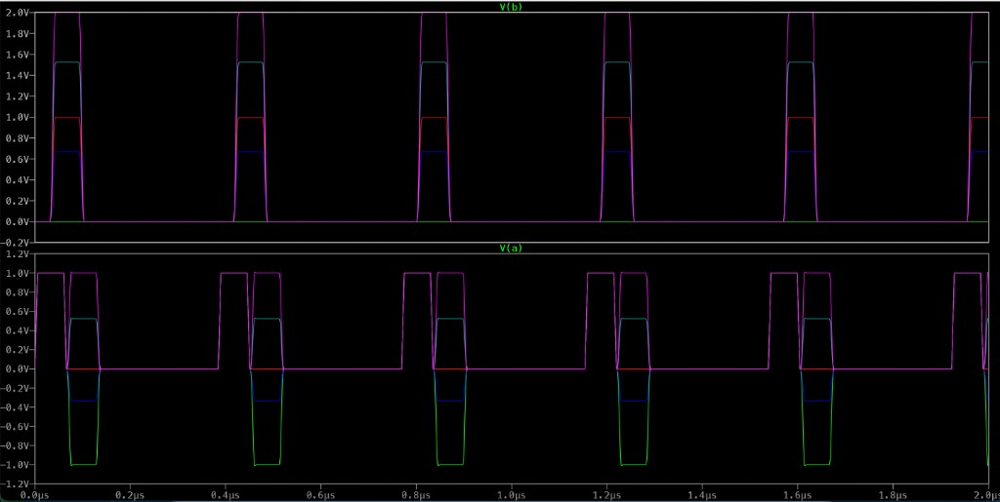
\nopagebreak[4]

\figcap{Figure 2: All resistive terminations overlaid - top: $V(B)$: short ($\Gamma=-1$, green), $25\,\Omega$ ($\Gamma=-1/3$, purple), $50\,\Omega$ ($\Gamma=0$, red), $160\,\Omega$ ($\Gamma=+0.524$, cyan), open ($\Gamma=+1$, pink); bottom: $V(A)$ source side - return pulses appear during OFF cycles, negative for $Z_L < Z_0$, positive for $Z_L > Z_0$, absent for matched load.}

\newpage
**Series R-L (vi):** The inductor produces an initial voltage overshoot at B ($V_B \to 2\,\text{V}$, top trace) followed by exponential decay toward the resistive steady state ($V_B \to 4/3\,\text{V}$, $\tau \approx 6.7\,\text{ns}$). Strong ringing is also visible at A (bottom trace) from each pulse transition.

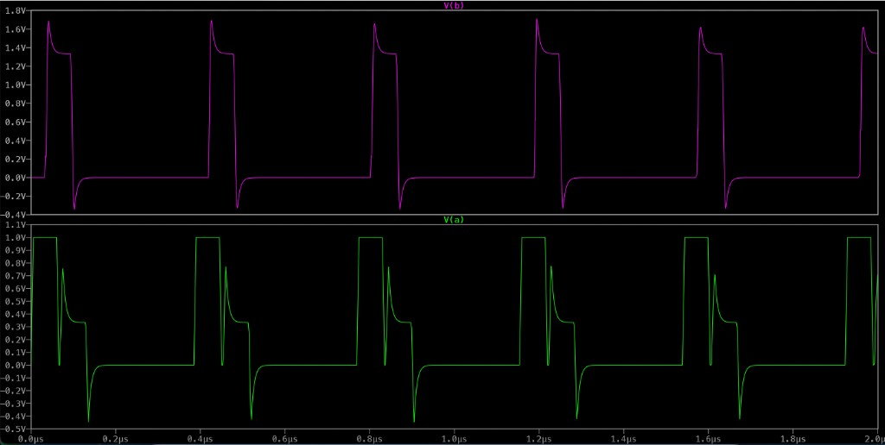
\nopagebreak[4]

\figcap{Figure 3: Series RL termination ($R=100\,\Omega$, $L=1\,\mu\text{H}$) - top: $V(B)$ shows inductive overshoot to $\approx 1.7\,\text{V}$ then undershoot below $0\,\text{V}$ on each edge; bottom: $V(A)$ shows corresponding ringing at the source.}

\newpage
**Series R-C (vii):** At $t = 0^+$ the capacitor acts as a short, giving $Z_L = R = 100\,\Omega$, $\Gamma = +1/3$, and $V_B = 4/3\,\text{V} \approx 1.33\,\text{V}$. With $\tau = 150\,\mu\text{s} \gg 2\,\mu\text{s}$ window, the capacitor barely charges and $V(B)$ (top trace) remains nearly flat at $\approx 1.33\,\text{V}$.

The $V(A)$ (bottom trace) shows the effect of the $100\,\Omega$ resistor alone — a positive return pulse ($\Gamma = +1/3 > 0$) appearing during the OFF cycle — without any capacitive contribution, since the capacitor is effectively transparent (uncharged, acting as a short) throughout the observation window.

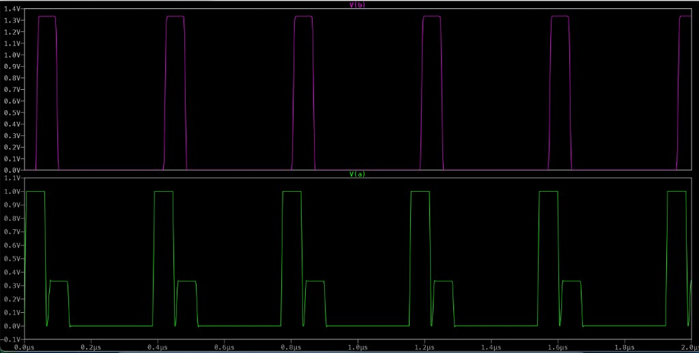
\nopagebreak[4]

\figcap{Figure 4: Series RC termination ($R=100\,\Omega$, $C=1\,\mu\text{F}$) - top: $V(B) \approx 4/3\,\text{V} \approx 1.33\,\text{V}$ flat ($\tau = 150\,\mu\text{s} \gg$ window, capacitor barely charges); bottom: $V(A)$ source reference.}

\newpage

## 1.8 - Power Splitter Analysis

The circuit (Figure 5) splits the signal from input line $T_1$ ($Z_0 = 50\,\Omega$) into two equal branches through a symmetric resistive network: a series input resistor $R_1 = 17\,\Omega$, followed by two branches each containing $R_2 = R_3 = 17\,\Omega$ in series with matched output lines $T_2$, $T_3$ ($Z_0 = 50\,\Omega$) loaded by $R_4 = R_5 = 50\,\Omega$.

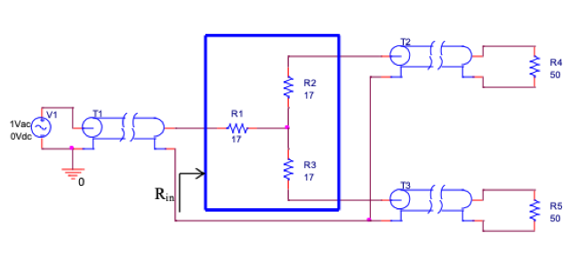
\nopagebreak[4]

\figcap{Figure 5: Resistive power splitter - $V_1$ (1\,V$_\text{ac}$) drives matched input line $T_1$ into symmetric resistive splitter ($R_1 = R_2 = R_3 = 17\,\Omega$) with two $50\,\Omega$ output loads.}

### (a) Input Resistance $R_\text{in}$

Each output branch, looking into the output transmission line terminated in its matched load, presents:

$$Z_\text{branch} = R_2 + Z_0 = 17\,\Omega + 50\,\Omega = 67\,\Omega$$

The two symmetric branches combine in parallel at the common node:

$$Z_\text{par} = Z_\text{branch} \| Z_\text{branch} = \frac{67 \times 67}{67 + 67} = 33.5\,\Omega$$

Adding the series input resistor $R_1$:

$$\boxed{R_\text{in} = R_1 + Z_\text{par} = 17\,\Omega + 33.5\,\Omega = 50.5\,\Omega \approx 50\,\Omega}$$

The AC sweep simulation (Figure 6) confirms $R_\text{in} = 50.5\,\Omega$ flat across the entire band, verifying the impedance-matched design.

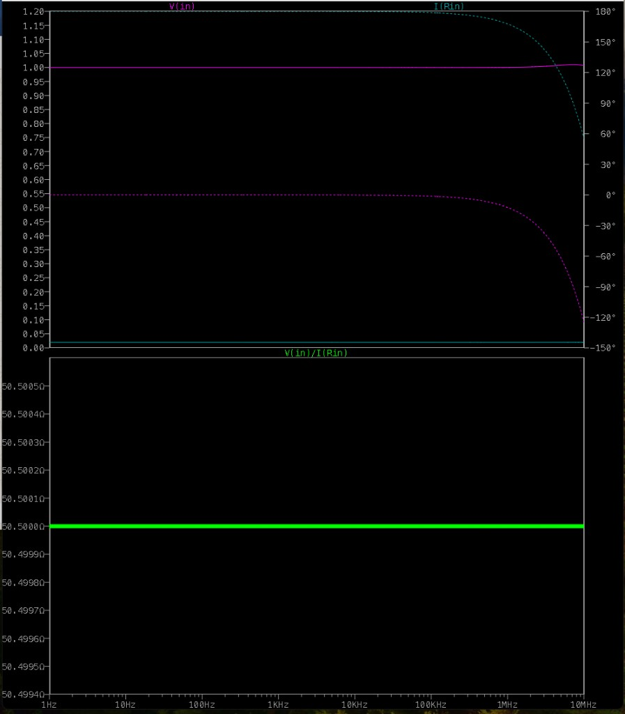
\nopagebreak[4]

\figcap{Figure 6: Power splitter AC sweep - bottom panel: $V(\text{in})/I(R_\text{in}) = 50.5\,\Omega$ perfectly flat from 1\,Hz to 10\,MHz, confirming $R_\text{in} \approx Z_0 = 50\,\Omega$.}

### (b) Power Delivered to Each Load ($R_4$ or $R_5$)

The source $V_1 = 1\,\text{V}$ (peak) drives line $T_1$; since $R_\text{in} \approx Z_0$ the line is well-matched and $V_\text{in} = 1\,\text{V}$ peak appears at the splitter input.

**Step 1** - Voltage at the common node (voltage divider $R_1$ / $Z_\text{par}$):

$$V_\text{node} = V_\text{in} \cdot \frac{Z_\text{par}}{R_1 + Z_\text{par}} = 1\,\text{V}\cdot\frac{33.5}{17 + 33.5} \approx 0.663\,\text{V}$$

**Step 2** - Voltage across each load (voltage divider $R_2$ / $Z_0$):

$$V_{R_4} = V_{R_5} = V_\text{node} \cdot \frac{Z_0}{R_2 + Z_0} = 0.663\cdot\frac{50}{17 + 50} \approx 0.495\,\text{V}$$

**Step 3** - Average power per load (using peak voltage formula $P = V_\text{peak}^2 / 2R$):

$$\boxed{P_\text{load} = \frac{V_{R_4}^2}{2\,R_\text{load}} = \frac{(0.495)^2}{2 \times 50} = \frac{0.245}{100} \approx 2.45\,\text{mW}}$$

The total available input power is $P_\text{in} = V_\text{in}^2/(2Z_0) = 1/(100) = 10\,\text{mW}$; each load receives 2.45 mW and the matching resistors $R_1, R_2, R_3$ dissipate the remainder.

The simulation (Figure 7) plots $I(R_5)\cdot V(5)$ and $I(R_4)\cdot V(4)$ - the products of **peak** current and **peak** voltage at each load. These are **not RMS quantities**: the average (absorbed) power is obtained by dividing the displayed product by 2:

$$P_\text{load} = \frac{I(R_4)\cdot V(4)}{2} = \frac{4.90\,\text{mW}}{2} = 2.45\,\text{mW} \quad \text{(confirmed)}$$

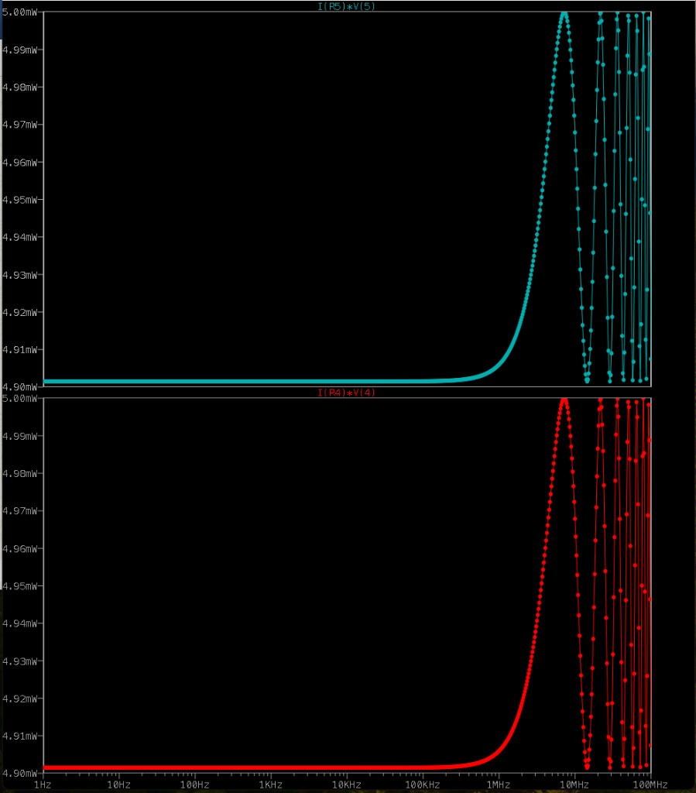
\nopagebreak[4]

\figcap{Figure 7: Power splitter simulation - peak-power products $I(R_5)\cdot V(5)$ and $I(R_4)\cdot V(4)$ each $\approx 4.90\,\text{mW}$; dividing by 2 gives average power $\approx 2.45\,\text{mW}$ per load.}

\newpage

## 1.9 - T-Attenuator Design (3 dB, $Z_0 = 50\,\Omega$)

A symmetric T-attenuator (Figure 8) uses two equal series resistors $R_1$ (one in each arm) and a shunt resistor $R_2$. For a 3 dB power attenuation, half the input power reaches the load, giving a voltage attenuation ratio:

$$k = \frac{V_\text{in}}{V_\text{out}} = \sqrt{\frac{P_\text{in}}{P_\text{out}}} = \sqrt{2} \approx 1.4142$$

The standard design equations for a matched symmetric T-attenuator are:

$$R_1 = Z_0 \cdot \frac{k - 1}{k + 1}, \qquad R_2 = Z_0 \cdot \frac{2k}{k^2 - 1}$$

**Calculating $R_1$:**

$$R_1 = 50 \cdot \frac{\sqrt{2} - 1}{\sqrt{2} + 1} = 50 \cdot \frac{0.4142}{2.4142} = 50 \times 0.17157 \approx 8.58\,\Omega$$

**Calculating $R_2$:**

$$R_2 = 50 \cdot \frac{2\sqrt{2}}{(\sqrt{2})^2 - 1} = 50 \cdot \frac{2.8284}{1} = 50 \times 2.8284 \approx 141.42\,\Omega$$

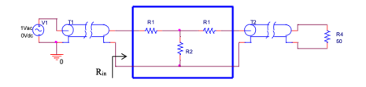
\nopagebreak[4]

\figcap{Figure 8: T-type power attenuator - series arms $R_1 = 8.58\,\Omega$ and shunt $R_2 = 141.42\,\Omega$ design for 3\,dB attenuation with $Z_0 = 50\,\Omega$.}

### Simulation Verification

**Input impedance** (Figure 9): $V(\text{in})/I(R_1) = 50.0019\,\Omega$ flat from 1 Hz to 100 MHz, confirming the T-network presents $Z_\text{in} = Z_0 = 50\,\Omega$.

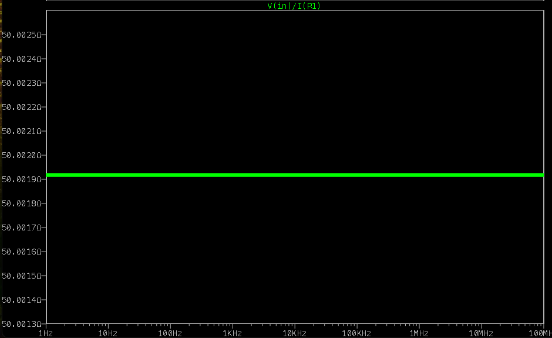
\nopagebreak[4]

\figcap{Figure 9: T-attenuator input impedance - $50.0019\,\Omega$ flat over all frequencies, confirming $Z_\text{in} = Z_0 = 50\,\Omega$.}

**Power attenuation** (Figure 10): The simulation plots $(V(4)\cdot I(R_4))/2$ and $V(\text{in})\cdot I(R_1)/2$. These are peak-power products; average power is half the displayed value (non-RMS):

$$P_{R_4} = \frac{4.9995\,\text{mW}}{2} \approx 2.5\,\text{mW}$$

$$P_\text{in} = \frac{9.9996\,\text{mW}}{2} \approx 5.0\,\text{mW}$$

$$\frac{P_{R_4}}{P_\text{in}} = \frac{2.5}{5.0} = 0.5 \equiv -3\,\text{dB}$$

For power, $\text{dBW} = 10\log_{10}(P_\text{out}/P_\text{in})$, so $-3\,\text{dB}$ corresponds to half the input power.

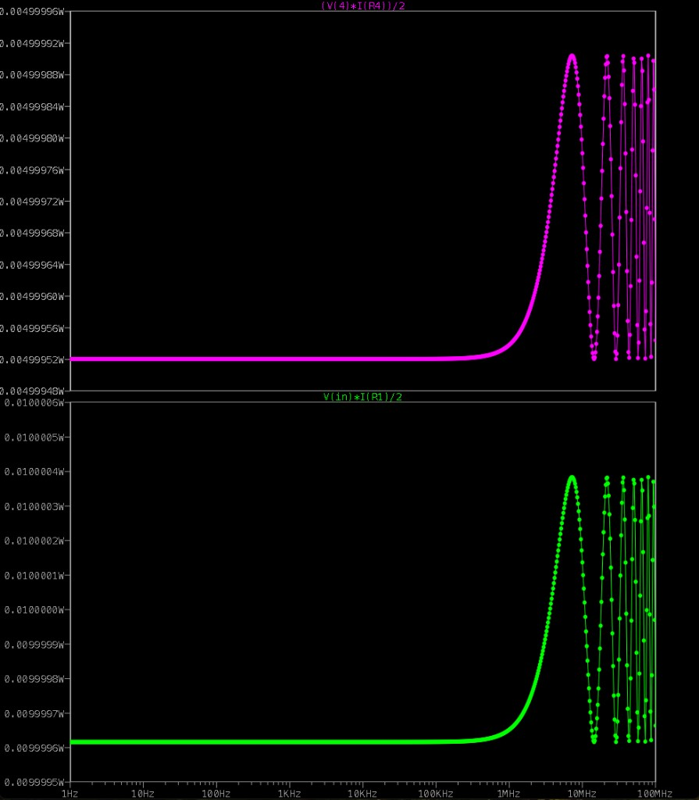
\nopagebreak[4]

\figcap{Figure 10: T-attenuator power - top: $(V(4)\cdot I(R_4))/2 \approx 5.0\,\text{mW}$ (peak product); bottom: $V(\text{in})\cdot I(R_1)/2 \approx 10.0\,\text{mW}$. Average powers are half: $P_{R_4} \approx 2.5\,\text{mW}$, $P_\text{in} \approx 5.0\,\text{mW}$, confirming $-3\,\text{dB}$ attenuation.}

\newpage

## 1.10 - Filter Type Identification

The circuit in Figure 11 is a **2nd-order LC $\pi$-type low-pass filter** (also called a $\pi$-section LC filter or ladder network). It consists of two shunt capacitors ($C_4$ and $C_5$) and one series inductor ($L_2$), arranged in the $\pi$ topology: shunt–series–shunt. A similar structure was encountered in earlier labs as part of impedance matching and filter design. The $\pi$ topology is specifically chosen because it presents a low series impedance path at low frequencies (inductor is near-short) and high shunt impedance paths (capacitors are near-open), allowing low-frequency signals to pass while blocking high-frequency signals.

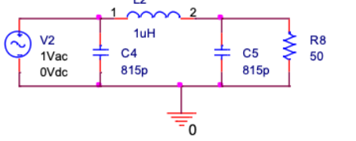
\nopagebreak[4]

\figcap{Figure 11: Matched LC $\pi$ low-pass filter ($L_2 = 1\,\mu\text{H}$, $C_4 = C_5 = 815\,\text{pF}$, $R_8 = 50\,\Omega$).}

## 1.11 - Number of Poles

Since the source $V_2$ is an ideal voltage source (zero internal impedance), the input shunt capacitor $C_4$ is directly shunted by the voltage source and does not contribute to the poles of the transfer function $V_\text{out}/V_\text{in}$. The effective signal path is $V_\text{in} \to L_2 \to (C_5 \| R_8) \to V_\text{out}$, which is a second-order system.

$$\boxed{N_\text{poles} = 2}$$

The transfer function denominator is quadratic in $s$:

$$H(s) = \frac{\omega_0^2}{s^2 + (\omega_0/Q)\,s + \omega_0^2}, \qquad \omega_0 = \frac{1}{\sqrt{L_2 C_5}},\quad Q = R_8\sqrt{\frac{C_5}{L_2}}$$

giving a pair of complex-conjugate poles at $s = -\omega_0/(2Q) \pm j\,\omega_0\sqrt{1-1/(4Q^2)}$.

\newpage

## 1.12 - LPF Frequency Response (Gain and Phase)

The cutoff frequency of the LC $\pi$-filter is determined by the $L_2$–$C_5$ resonance:

$$\omega_c = \frac{1}{\sqrt{L_2\,C_5}} = \frac{1}{\sqrt{1\times10^{-6} \times 815\times10^{-12}}} = \frac{1}{2.856\times10^{-8}} \approx 3.50\times10^7\,\text{rad/s}$$

$$f_c = \frac{\omega_c}{2\pi} \approx 5.57\,\text{MHz}$$

The quality factor of the resonant circuit is:

$$Q = R_8\sqrt{\frac{C_5}{L_2}} = 50\sqrt{\frac{815\,\text{pF}}{1\,\mu\text{H}}} = 50 \times 0.0286 \approx 1.43$$

Since $Q > 1/\sqrt{2} \approx 0.707$, the second-order filter exhibits a slight gain peak just below $f_c$ (underdamped response).

The AC frequency sweep (Figure 12) confirms:

- **Pass-band** ($f \ll f_c$): gain $\approx 0\,\text{dB}$, phase $\approx 0°$ - the filter is transparent.
- **Transition region** (~1–10 MHz): gain rolls off steeply at $-40\,\text{dB/decade}$ (2 poles), phase shifts toward $-180°$.
- **Stop-band** ($f \gg f_c$): gain $< -50\,\text{dB}$ at 100 MHz, strong attenuation confirmed.
- **Peaking** visible just below $f_c$: consistent with underdamped 2nd-order response ($Q > 1/\sqrt{2}$).

These results align with the 2-pole answer in Q1.11: the steep roll-off rate ($-40\,\text{dB/dec}$) and the single resonant peak confirm a second-order system.

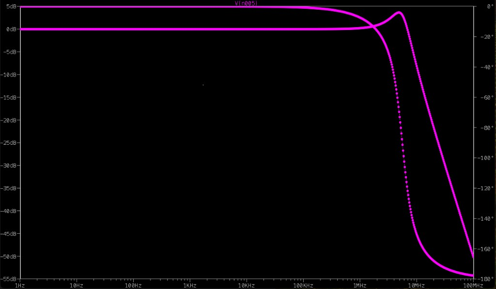
\nopagebreak[4]

\figcap{Figure 12: LPF Bode plot - flat 0 dB pass-band up to approximately 1 MHz, gain peak near cutoff at 5.6 MHz, then steep stop-band roll-off exceeding 50 dB at 100 MHz.}

\newpage

## 1.13 - LPF Input Impedance vs. Frequency

The input impedance $Z_\text{in}(f) = V(n_{004})/I(V_2)$ of the $\pi$-filter (measured from the source) is plotted in Figure 13. Three frequency regimes are visible:

**Low frequencies ($f \ll f_c \approx 5.6\,\text{MHz}$):** The simulation shows $Z_\text{in} \approx 49.5\,\Omega \approx Z_0 = 50\,\Omega$. At low frequencies the shunt capacitors $C_4$ and $C_5$ are nearly open and $L_2$ is nearly short, so the filter is transparent and the source sees only the matched load $R_8 = 50\,\Omega$ - giving the expected near-perfect match.

**Near cutoff (~1–5 MHz):** $Z_\text{in}$ drops to a minimum as the series $L_2$–$C_5$ branch approaches resonance, drawing maximum current and reducing the apparent source impedance. A sharp resonant peak follows immediately above this dip, where the parallel LC combination presents a high impedance.

**High frequencies ($f \gg f_c$):** $C_4$ becomes a low-impedance shunt to ground, effectively disconnecting the load from the source. $Z_\text{in}$ collapses toward zero as frequency increases beyond 10 MHz.

This behaviour confirms that the filter is well-matched ($Z_\text{in} \approx 50\,\Omega$) only in the pass-band; at and above $f_c$ the impedance deviates significantly, leading to reflections in a practical 50 Ω system.

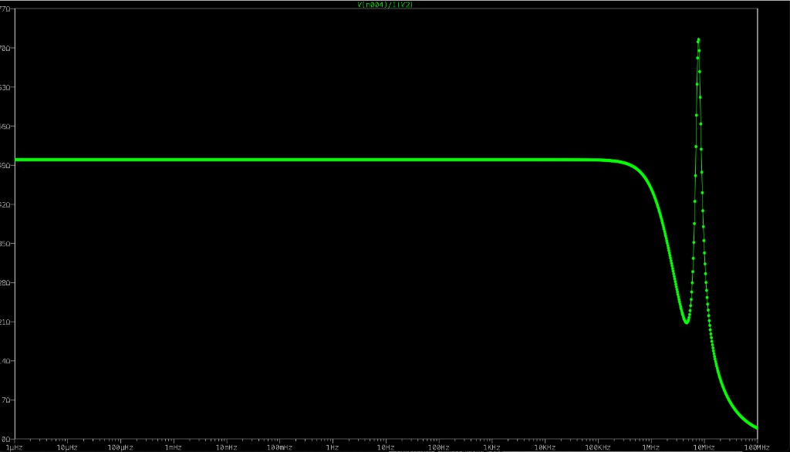
\nopagebreak[4]

\figcap{Figure 13: LPF input impedance $\frac{V_{in}}{I_{in}}$ flat at $\approx 49.5\,\Omega$ in the pass-band, dipping to a minimum and exhibiting a resonant peak near $f_c \approx 5\,\text{MHz}$, then collapsing at higher frequencies.}
