---
header-includes:
- \usepackage{xcolor}
- \definecolor{labteal}{HTML}{006b73}
- \newcommand{\figcap}[1]{\begin{center}\textcolor{labteal}{\textit{#1}}\end{center}}
- \makeatletter
- \newcount\figscalelevel
- \figscalelevel=0
- \newcommand{\figscalexlarge}{\figscalelevel=2\relax}
- \newcommand{\figscalelarge}{\figscalelevel=1\relax}
- \newcommand{\figscalenormal}{\figscalelevel=0\relax}
- \renewcommand*\pandocbounded[1]{\begin{center}\sbox\pandoc@box{#1}\ifcase\figscalelevel\relax\Gscale@div\@tempa{0.38\textheight}{\dimexpr\ht\pandoc@box+\dp\pandoc@box\relax}\Gscale@div\@tempb{0.55\linewidth}{\wd\pandoc@box}\or\Gscale@div\@tempa{0.57\textheight}{\dimexpr\ht\pandoc@box+\dp\pandoc@box\relax}\Gscale@div\@tempb{0.825\linewidth}{\wd\pandoc@box}\or\Gscale@div\@tempa{0.855\textheight}{\dimexpr\ht\pandoc@box+\dp\pandoc@box\relax}\Gscale@div\@tempb{1.2375\linewidth}{\wd\pandoc@box}\fi\ifdim\@tempb\p@<\@tempa\p@\let\@tempa\@tempb\fi\ifdim\@tempa\p@<\p@\scalebox{\@tempa}{\usebox\pandoc@box}\else\usebox{\pandoc@box}\fi\end{center}}
- \renewcommand{\subsubsection}{\@startsection{subsubsection}{3}{2em}{-3.25ex plus -1ex minus -.2ex}{1.5ex plus .2ex}{\normalfont\normalsize\bfseries}}
- \makeatother
---

# Lab 7: Operational Amplifiers — Preliminary Report

**Students:** Shai Livshits · 208632216 &nbsp;|&nbsp; Dan Masad · 206505307
**Date:** June 26, 2026
**Course:** Lab A — Electronics, TAU Faculty of Engineering, Semester B 2025-2026

---

\newpage

## 1. Op-Amp Properties Table (Datasheet Summary)

| Parameter | TL071M | TL061M | LM741 | LM741A |
|:---|:---:|:---:|:---:|:---:|
| Manufacturer | Texas Instruments | Texas Instruments | Texas Instruments | Texas Instruments |
| Input offset voltage $V_{io}$ | 3 mV (typ), 6 mV (max) | 3 mV (typ), 6 mV (max) | 1 mV (typ), 5 mV (max) | 0.8 mV (typ), 3 mV (max) |
| Large-signal voltage gain $A_{OL}$ | 200 V/mV (typ), 35 V/mV (min) | 6 V/mV (typ), 4 V/mV (min) | 50 V/mV (typ), 85 V/mV (max) | 50 V/mV (min) |
| CMRR | 86 dB (typ), 80 dB (min) | 86 dB (typ), 80 dB (min) | 95 dB (typ), 80 dB (min) | 95 dB (typ), 80 dB (min) |
| Slew rate $SR$ (unity-gain) | 13 V/us (typ), 5 V/us (min) | 3.5 V/us (typ), 1.5 V/us (min) | 0.5 V/us (typ) | 0.7 V/us (typ), 0.3 V/us (min) |
| Unity-gain bandwidth $f_t$ / GBW | 3 MHz (typ) | 1 MHz (typ) | — | 1.5 MHz (typ), 0.437 MHz (min) |

\newpage

## 2. Explanation of Op-Amp Properties

### 2.1 Definition of Each Property

- **Input offset voltage $V_{io}$:** The differential DC voltage that must be applied between the inputs to force $V_{out}=0$; arises from transistor mismatches in the input stage.
- **Large-signal voltage gain $A_{OL}$:** Ratio of output to differential input voltage in open loop, measured at DC with a large (but unsaturated) output swing.
- **CMRR:** Ratio of differential gain to common-mode gain; indicates the op-amp's ability to reject signals common to both inputs. A high CMRR means the output responds only to the differential signal.
- **Slew rate $SR$:** Maximum rate of change of the output voltage ($\mathrm{d}V_{out}/\mathrm{d}t\big|_{\max}$). Caused by a current-limited internal capacitor that must charge/discharge at a finite rate.
- **Unity-gain bandwidth / GBW:** $f_t$ is the frequency at which open-loop gain falls to 1 (0 dB). GBW is the product of closed-loop gain and 3 dB bandwidth; in a single-pole model, $f_t = \mathrm{GBW}$.

### 2.2 Differences in Bandwidth-Related Specifications

All three quantities ($f_t$, GBW, $f_{-3\mathrm{dB}}$) describe frequency limitations but represent different things:

- $f_t$ (unity-gain bandwidth) is the frequency where $|A_{OL}|=1$; it is an **open-loop** property.
- GBW (gain-bandwidth product) is $|A_{CL}| \times f_{-3\mathrm{dB}}$ for the **closed-loop** circuit; for a single-pole op-amp, GBW $= f_t$.
- $f_{-3\mathrm{dB}}$ is the **closed-loop** bandwidth at a specific gain; it depends on the circuit.

The datasheets may label these differently (e.g. TL071/TL061 quote "unity-gain bandwidth" directly; LM741 quotes a "gain-bandwidth product"). In the single-pole model they are identical, but multi-pole op-amps can have $f_t < \mathrm{GBW}$.

\newpage

## 3. Voltage Definitions

We use our assigned numerical values $A = \dfrac{\mathrm{DEF}}{100} = \dfrac{307}{100} = 3.07\,\mathrm{V}$ and $B = 10\,\mathrm{V}$ (both positive), with $V(t) = A\sin(\omega t)$ unless noted.

### 3.1 $V(t) = A\sin(\omega t)$

| Quantity | Expression | Value ($A=3.07\,\mathrm{V}$) |
|:---|:---|:---:|
| $V_\text{amplitude}$ | $A$ | $3.07\,\mathrm{V}$ |
| $V_\text{max}$ | $A$ | $3.07\,\mathrm{V}$ |
| $V_\text{mean}$ | $0$ | $0\,\mathrm{V}$ |
| $V_{pp}$ | $2A$ | $6.14\,\mathrm{V}$ |
| $V_\text{RMS}$ | $\dfrac{A}{\sqrt{2}}=\sqrt{\frac{1}{T}\int_0^T A^2\sin^2(\omega t)\,\mathrm{d}t}$ | $2.171\,\mathrm{V}$ |

### 3.2 $V(t) = A\sin(\omega t) + B$, $B > 0$

| Quantity | Expression | Value ($A=3.07\,\mathrm{V}$, $B=10\,\mathrm{V}$) |
|:---|:---|:---:|
| $V_\text{amplitude}$ | $A$ | $3.07\,\mathrm{V}$ |
| $V_\text{max}$ | $A + B$ | $13.07\,\mathrm{V}$ |
| $V_\text{mean}$ | $B$ | $10\,\mathrm{V}$ |
| $V_{pp}$ | $2A$ | $6.14\,\mathrm{V}$ |
| $V_\text{RMS}$ | $\sqrt{\dfrac{A^2}{2} + B^2}$ | $10.233\,\mathrm{V}$ |

### 3.3 $V(t) = A\sin(\omega t) - B$, $B > 0$

| Quantity | Expression | Value ($A=3.07\,\mathrm{V}$, $B=10\,\mathrm{V}$) |
|:---|:---|:---:|
| $V_\text{amplitude}$ | $A$ | $3.07\,\mathrm{V}$ |
| $V_\text{max}$ | $A - B$ | $-6.93\,\mathrm{V}$ |
| $V_\text{mean}$ | $-B$ | $-10\,\mathrm{V}$ |
| $V_{pp}$ | $2A$ | $6.14\,\mathrm{V}$ |
| $V_\text{RMS}$ | $\sqrt{\dfrac{A^2}{2} + B^2}$ | $10.233\,\mathrm{V}$ |

Note: $V_\text{RMS}$ is always non-negative ($V_\text{RMS} \geq 0$) even when $V_\text{mean} < 0$, because it is the root of the mean-square. The sign of $V_\text{mean}$ does not affect $V_\text{RMS}$ — both §3.2 and §3.3 give the same $V_\text{RMS}=10.233\,\mathrm{V}$.

\newpage

## 4. Input Offset Voltage

### 4.1 Non-Ideal Model of Figure 2 (Assume $V_{out} = 216\,\mathrm{mV}$)

The input offset voltage $V_{io}$ is the same quantity the datasheets label $V_{os}$ — we use the course notation $V_{io}$. If we assume the op-amp is ideal in the offset sense ($V_{io}=0$), the output would be $V_{out}=0$; a real op-amp has $V_{io}\neq 0$ and therefore a non-zero output. The non-ideal op-amp is modelled by inserting a DC source $V_{io}$ in series with the non-inverting ($+$) input of an otherwise ideal op-amp.

We are told to assume the (measured) output is $V_{out} = \mathrm{ABC}\,\mathrm{mV} = 216\,\mathrm{mV}$. In the redrawn circuit, $V_{io}$ sits in series with the $+$ terminal and is amplified by the non-inverting gain to produce the observed $V_{out}$.

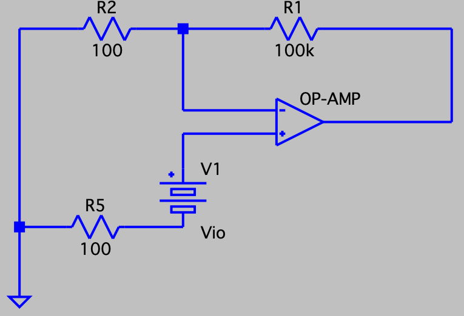
\nopagebreak[4]

\figcap{Figure 1: Non-ideal op-amp model with input offset voltage $V_{io}$ at the $+$ input ($R_f=100\,\mathrm{k}\Omega$, $R_{in}=100\,\Omega$).}

### 4.2 Calculation of $V_{io}$ and Its Measurability

With $V_{in}=0$, the offset is amplified by the non-inverting gain $\left(1+R_f/R_{in}\right)$, so inverting the relation gives $V_{io}$ from the assumed output:

$$V_{out} = V_{io}\left(1 + \frac{R_f}{R_{in}}\right) \;\Rightarrow\; V_{io} = \frac{V_{out}}{1 + R_f/R_{in}}$$

$$V_{io} = \frac{216\,\mathrm{mV}}{1 + \dfrac{100\,\mathrm{k}\Omega}{100\,\Omega}} = \frac{216\,\mathrm{mV}}{1001} \approx 216\,\mu\mathrm{V}$$

This is in the **microvolt** range — physically reasonable for a real op-amp (datasheet $V_{io}$ is typically 1–6 mV).

**Is it measurable?** Not directly: $V_{io}\approx 216\,\mu\mathrm{V}$ is far below the $\approx 50\,\mathrm{mV}$ lab noise floor, so it cannot be read at the input terminals.

**How to find $V_{io}$:** keep the circuit in its linear operating region (output not saturated) and determine the closed-loop gain $G = 1 + R_f/R_{in}$. Then, for any output $V_{out}$ measured within the operating region, recover the offset as $V_{io} = V_{out}/G$.

### 4.3 BJT Differential Pair — Bias Point Simulation

Figure 3 shows the first-stage differential pair that emulates the asymmetry causing offset:

- $R_7 = 500 + \mathrm{ABC} = 500 + 216 = 716\,\Omega$
- $R_8 = 500 + \mathrm{DEF} = 500 + 307 = 807\,\Omega$
- $I_1 = 1\,\mathrm{mA}$, $V_4 = 15\,\mathrm{V}$, $R_4 = R_6 = 3\,\mathrm{k}\Omega$

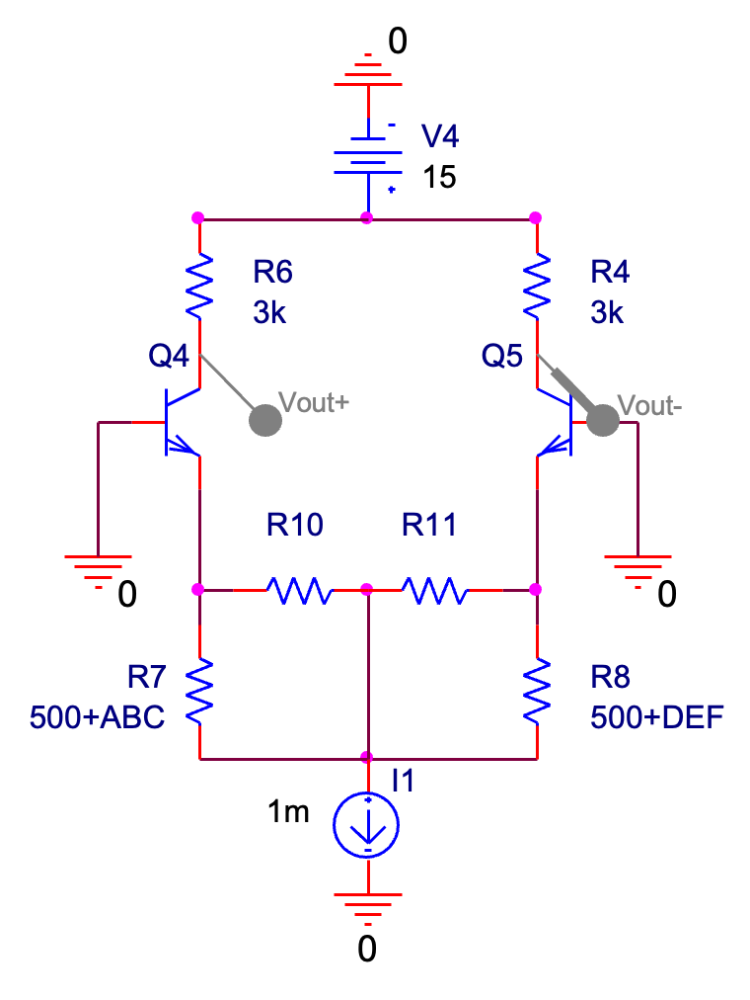
\nopagebreak[4]

\figcap{Figure 2: BJT differential pair with potentiometer $R_{10}$–$R_{11}$ for offset null.}

**Analytical estimate** (with $R_{10}, R_{11}$ disconnected, $V_{BE}$ equal for both transistors):

$$\frac{I_{E4}}{I_{E5}} = \frac{R_8}{R_7} = \frac{807}{716} \approx 1.127$$

$$I_{E4} = \frac{R_8}{R_7+R_8}\times I_1 = \frac{807}{1523}\times 1\,\mathrm{mA} \approx 0.530\,\mathrm{mA}, \quad I_{E5} \approx 0.470\,\mathrm{mA}$$

$$V_{out+} = 15 - 0.530\times 3 = 13.41\,\mathrm{V}, \quad V_{out-} = 15 - 0.470\times 3 = 13.59\,\mathrm{V}$$

**Simulation (verification).** The PSpice bias-point simulation of Figure 3 (with $R_{10}, R_{11}$ disconnected) confirms the analytical estimate:

\figscalelarge

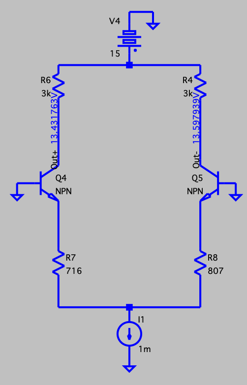

\figscalenormal
\nopagebreak[4]

\figcap{Figure 3: Bias-point node voltages, $V_{out+}=13.43\,\mathrm{V}$, $V_{out-}=13.60\,\mathrm{V}$.}

\figscalelarge

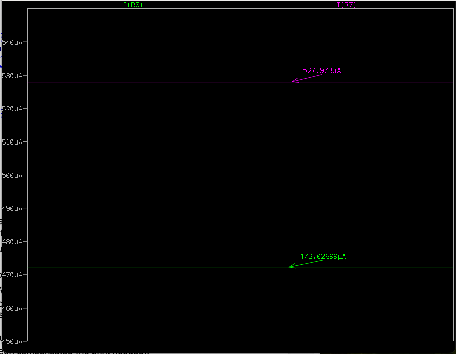

\figscalenormal
\nopagebreak[4]

\figcap{Figure 4: Branch currents, $I(R_7)=528\,\mu\mathrm{A}$ (Q4 branch), $I(R_8)=472\,\mu\mathrm{A}$ (Q5 branch).}

| Quantity | Analytical | Simulated |
|:---|:---:|:---:|
| $I_{E4}$ ($R_7$ branch) | $0.530\,\mathrm{mA}$ | $0.528\,\mathrm{mA}$ |
| $I_{E5}$ ($R_8$ branch) | $0.470\,\mathrm{mA}$ | $0.472\,\mathrm{mA}$ |
| $V_{out+}$ | $13.41\,\mathrm{V}$ | $13.43\,\mathrm{V}$ |
| $V_{out-}$ | $13.59\,\mathrm{V}$ | $13.60\,\mathrm{V}$ |

The agreement is excellent; the small residual differences arise from finite base currents (the analytical estimate assumes $I_C\approx I_E$).

#### 4.3.1 Potentiometer Ratio for Zero Output

To null the output offset the two branches must carry **equal collector currents**, which requires the effective emitter resistance of each branch to be equal. The potentiometer ($R_{10}+R_{11}=10\,\mathrm{k}\Omega$) is wired so that $R_{10}$ is in parallel with $R_7$ and $R_{11}$ in parallel with $R_8$, so equalizing the two branch resistances gives the system:

$$R_{10} + R_{11} = 10\,\mathrm{k}\Omega$$
$$R_{10}\,\|\,R_7 = R_{11}\,\|\,R_8$$

Solving (with $R_7=716\,\Omega$, $R_8=807\,\Omega$):

$$\boxed{R_{10} = 6732.33\,\Omega, \qquad R_{11} = 10\,\mathrm{k}\Omega - R_{10} = 3267.67\,\Omega}$$

$$\frac{R_{11}}{R_{10}} = \frac{3267.67}{6732.33} \approx 0.485 \quad (48.5\%)$$

Making the parallel emitter resistances equal forces the same current through both branches, which equalizes the two collector voltages and nulls the output offset. The simulation below verifies this balance.

#### 4.3.2 Simulation with Chosen Ratio

No print needed. The bias-point simulation with $R_{10}=6732.33\,\Omega$, $R_{11}=3267.67\,\Omega$ confirms the branches are balanced: the residual difference between the two collector currents (and hence between $V_{out+}$ and $V_{out-}$) is below the nV level. This vanishingly small offset is only a floating-point/rounding artifact — we entered $R_{10}=6732.33\,\Omega$ rather than its exact, non-terminating value ($6732.33\ldots\,\Omega$) — and would be exactly zero for the ideal ratio.

#### 4.3.3 10% Change in Potentiometer Ratio

If the ratio $R_{11}/R_{10}$ changes by 10% from the balanced point, e.g.

$$\frac{R_{11}}{R_{10}} = 0.485 \times 1.1 \approx 0.534$$

then, with $R_{10}+R_{11}=10\,\mathrm{k}\Omega$,

$$R_{10} = \frac{10\,\mathrm{k}\Omega}{1 + R_{11}/R_{10}} = \frac{10\,\mathrm{k}\Omega}{1.534} \approx 6.52\,\mathrm{k}\Omega, \qquad R_{11} = 10\,\mathrm{k}\Omega - R_{10} \approx 3.48\,\mathrm{k}\Omega$$

The two effective emitter resistances are no longer equal, so a small offset reappears.

\figscalelarge

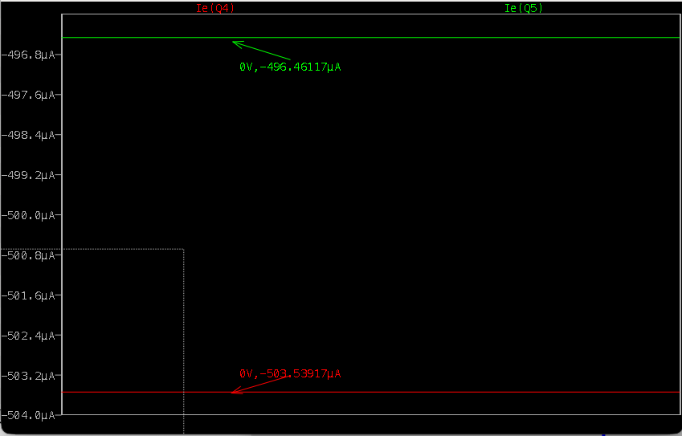

\figscalenormal
\nopagebreak[4]

\figcap{Figure 5: Branch currents with the 10\% perturbation, $I_E(Q4)=503.54\,\mu\mathrm{A}$, $I_E(Q5)=496.46\,\mu\mathrm{A}$.}

\figscalelarge

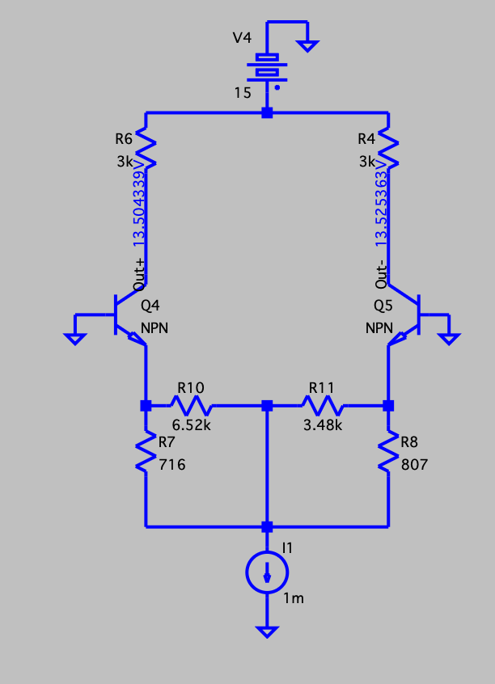

\figscalenormal
\nopagebreak[4]

\figcap{Figure 6: Output offset with $R_{10}=6.52\,\mathrm{k}\Omega$, $R_{11}=3.48\,\mathrm{k}\Omega$, $V_{out+}=13.504\,\mathrm{V}$, $V_{out-}=13.525\,\mathrm{V}$.}

**Extracted offset.** From the prints, the branches now carry $I_{E4}=503.54\,\mu\mathrm{A}$ (Q4) and $I_{E5}=496.46\,\mu\mathrm{A}$ (Q5), giving $V_{out+}=13.504\,\mathrm{V}$ and $V_{out-}=13.525\,\mathrm{V}$, i.e. an output offset

$$\Delta V = V_{out+} - V_{out-} = 13.504 - 13.525 \approx -21.0\,\mathrm{mV}$$

**Match to theory.** With the perturbed ratio, the effective emitter resistances are $R_{10}\|R_7 \approx 645\,\Omega$ and $R_{11}\|R_8 \approx 655\,\Omega$. Since the branch currents split inversely with these resistances ($I_{E4}/I_{E5}=R_{11}\|R_8 \,/\, R_{10}\|R_7$) and sum to $I_1=1\,\mathrm{mA}$, theory predicts $I_{E4}\approx 504\,\mu\mathrm{A}$ and $I_{E5}\approx 496\,\mu\mathrm{A}$ — matching the simulated $503.5/496.5\,\mu\mathrm{A}$. The resulting offset is

$$\Delta V = (I_{E5}-I_{E4})\times R = -7.1\,\mu\mathrm{A}\times 3\,\mathrm{k}\Omega \approx -21\,\mathrm{mV}$$

in good agreement with the simulated $-21.0\,\mathrm{mV}$ (the small residual is due to finite base currents, which the $I_C\approx I_E$ model neglects).

\newpage

## 5. CMRR

### 5.1 Definition of CMRR and Differential Gain $A_d$

$$\mathrm{CMRR} = \left|\frac{A_d}{A_{cm}}\right| \quad \text{(dimensionless)}, \qquad \mathrm{CMRR_{dB}} = 20\log_{10}\!\left|\frac{A_d}{A_{cm}}\right| \quad \text{(dB)}$$

where $A_d = V_{out}/V_{diff}$ is the differential gain and $A_{cm} = V_{out}/V_{cm}$ is the common-mode gain.

Given $\mathrm{CMRR} = 60 + \mathrm{AB} = 60 + 21 = 81\,\mathrm{dB}$ and $A_{cm} = \dfrac{\mathrm{DEF}}{1000} = \dfrac{307}{1000} = 0.307$:

$$A_d = A_{cm}\times 10^{\mathrm{CMRR_{dB}}/20} = 0.307\times 10^{81/20} = 0.307\times 10^{4.05} \approx 0.307\times 11{,}220 \approx 3.44\times 10^{3}$$

### 5.2 Transfer Functions $A_4$ and $A_5$ ($=V_{out}/V_{in}$) for Figures 4 and 5

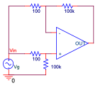
\nopagebreak[4]

\figcap{Figure 7: Common-mode circuit for measuring $A_{cm}$ (ideal output $V_{out}=0$).}

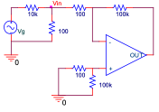
\nopagebreak[4]

\figcap{Figure 8: Differential (inverting) amplifier for measuring $A_d$ ($A_5=-R_f/R_{in}=-1000$).}

**Figure 4** (common-mode circuit): both inputs are driven by the same common-mode input $V_{in}$. For an ideal op-amp with matched resistors, the common-mode signal is rejected, so

$$V_{-}=V_{in}\frac{1000}{1001} = (V{in}-V{out})\frac{1000}{1001}=(V{in}-V{out})\frac{R_f}{R_f+Rin}\rightarrow V_{out}=0 $$
thus:
$$A_4 = \frac{V_{out}}{V_{in}} = 0 \quad $$

A real op-amp produces a small nonzero output, so this circuit is used to measure the common-mode gain $A_{cm}$.

**Figure 5** (differential / inverting amplifier): with the signal applied differentially,

$$A_5 = \frac{V_{out}}{V_{in}} = -\frac{R_f}{R_{in}} = -\frac{100\,\mathrm{k}\Omega}{100\,\Omega} = -1000$$

This circuit measures the differential gain $A_d$.

**Circuit assignment and CMRR expression:** Figure 5 (differential, $A_5=-1000$) measures $A_d$; Figure 4 (common-mode, ideal $V_{out}=0$) measures $A_{cm}$. Hence $A_d = A_5$ and $A_{cm} = A_4$ (the small, real common-mode gain), and

$$\mathrm{CMRR} = \left|\frac{A_d}{A_{cm}}\right| = \left|\frac{A_5}{A_4}\right|\rightarrow \infty$$

### 5.3 
Because the ideal common-mode output is zero, the real common-mode output $A_{cm}V_{in}$ is tiny; a large input is needed to lift it above the noise floor, so the 2–4 VRMS range (rather than 50 m–300 mVRMS) is the correct choice.

### 5.4 

Without the series input resistors the closed-loop gain would be determined by the op-amp's own (uncontrolled) input impedance rather than a known resistor ratio. The resistors define the gain precisely; without them the measurement of $A_d$ or $A_{cm}$ would be unreliable. Additionally, mismatched resistors are the dominant source of finite CMRR in a real difference amplifier; specifying exact values is essential for a quantitative CMRR measurement.

Alongside the resistor choice, the input amplitude must also be set appropriately for the differential measurement: for the differential amplification (Figure 5, $|A_5| = R_f/R_{in} = 1000$) we use an input amplitude of **50 m–300 mVRMS** (see §5.3). This keeps the amplified output $V_{out} = A_5 V_{in}$ within the $\pm 15\,\mathrm{V}$ supply rails and the op-amp in its linear region, so that the gain — and hence the extracted CMRR — is measured accurately rather than from a clipped (distorted) waveform.

\newpage

## 6. Slew-Rate and Full-Power Bandwidth

### 6.1 Formulas and Definitions

**Slew rate (SR)** is the maximum rate of change the output can sustain:

$$\mathrm{SR} = \left.\frac{\mathrm{d}V_{out}}{\mathrm{d}t}\right|_{\max} \quad [\mathrm{V/us}]$$

**Full-Power Bandwidth (FPBW).** Consider a sinusoidal output whose peak amplitude equals the maximum rated output voltage of the op-amp, $V_{om}$:

$$V_{out}(t) = V_{om}\sin(2\pi\,\mathrm{FPBW}\,t)$$

Differentiating gives the maximum slope, which occurs at the zero-crossing:

$$\left.\frac{\mathrm{d}V_{out}(t)}{\mathrm{d}t}\right|_{\max} = 2\pi\,\mathrm{FPBW}\;V_{om}$$

**The relationship:** the op-amp can reproduce this full-amplitude sine without slew distortion only while its peak slope does not exceed the slew rate. Setting the two equal,

$$\mathrm{SR} = 2\pi\,\mathrm{FPBW}\;V_{om}$$

and rearranging for the full-power bandwidth:

$$\mathrm{FPBW} = \frac{\mathrm{SR}}{2\pi\,V_{om}} \quad [\mathrm{Hz}]$$

where $V_{om}$ is the maximum undistorted output amplitude (typically $V_{CC}-2\,\mathrm{V}$). FPBW is therefore the highest frequency at which the op-amp can deliver a full-swing sinusoidal output without slew-rate distortion.

### 6.2 SR vs. Finite Bandwidth

| | Slew-rate limiting | Finite (closed-loop) bandwidth |
|:---|:---|:---|
| **Effect on output** | Output ramp at constant slope $\pm$SR; triangular rather than sinusoidal | Output sinusoidal but attenuated at $f > f_{-3\mathrm{dB}}$ |
| **Depends on** | Signal amplitude and frequency | Signal frequency only (not amplitude) |
| **Electronic origin** | A compensation capacitor inside the op-amp can only charge/discharge at a finite current ($I_{bias}$); $\mathrm{SR}=I_{bias}/C$ | The single dominant pole formed by the compensation capacitor limits high-frequency open-loop gain, reducing closed-loop BW |

SR is a **large-signal** (nonlinear) phenomenon; finite BW is a **small-signal** (linear) limitation.

### 6.3 Slew-Rate–Limited Operation (Figure 6)

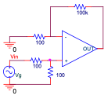
\nopagebreak[4]

\figcap{Figure 9: Circuit used for slew-rate measurement ($R_{in}=100\,\Omega$, $R_f=100\,\mathrm{k}\Omega$, $|A_v|=500$).}

Our assigned parameters for this op-amp are:

$$\mathrm{SR} = \frac{\mathrm{ABC}}{100} = \frac{216}{100} = 2.16\,\mathrm{V/us}, \qquad \mathrm{BW} = 1 + \frac{\mathrm{DEF}}{100} = 1 + \frac{307}{100} = 4.07\,\mathrm{MHz}$$

#### 6.3.1 Maximum Input Amplitude (SR the Only Limiting Effect)

For an input $V_g = a\sin(2\pi f t)$ with $f = 1\,\mathrm{kHz}$, the output is $V_{out} = |A_v|\,a\sin(2\pi f t)$ and its peak rate of change is $|A_v|\,a\,(2\pi f)$. The output can still follow the input only while this peak slope does not exceed the slew rate:

$$\left.\frac{\mathrm{d}V_{out}}{\mathrm{d}t}\right|_{\max} = 2\pi f\,|A_v|\,a \le \mathrm{SR} \;\Rightarrow\; a_{\max} = \frac{\mathrm{SR}}{2\pi f\,|A_v|}$$

With $|A_v| = 500$ and $f = 1\,\mathrm{kHz}$:

$$a_{\max} = \frac{2.16\times10^6}{2\pi\times10^3\times500} \approx 688\,\mathrm{mV_{pk}} \approx 486\,\mathrm{mVRMS}$$

#### 6.3.2 Full-Power Bandwidth for $\pm 2\,\mathrm{V}$ and $\pm 5\,\mathrm{V}$ Supplies

Using the FPBW relation from §6.1 with the assigned $\mathrm{SR}=2.16\,\mathrm{V/us}$ and $V_{om}=V_{CC}-2\,\mathrm{V}$ (where $V_{om}>0$; for $\pm 2\,\mathrm{V}$ the headroom model gives $V_{om}=0$, so we take $V_{om}=V_{CC}=2\,\mathrm{V}$ as the maximum swing):

$$\mathrm{FPBW} = \frac{\mathrm{SR}}{2\pi\,V_{om}}$$

| Supply $V_{CC}$ | $V_{om}$ | FPBW |
|:---:|:---:|:---:|
| $\pm 2\,\mathrm{V}$ | $2\,\mathrm{V}$ | $\dfrac{2.16\times10^6}{2\pi\times2}\approx 172\,\mathrm{kHz}$ |
| $\pm 5\,\mathrm{V}$ | $3\,\mathrm{V}$ ($=V_{CC}-2$) | $\dfrac{2.16\times10^6}{2\pi\times3}\approx 115\,\mathrm{kHz}$ |

A larger undistorted swing $V_{om}$ lowers FPBW at the same SR (the op-amp must slew over a larger voltage). Unlike §6.3.1, FPBW does not depend on $|A_v|=500$ — it is set solely by SR and the maximum output amplitude.

### 6.4 Output for Step-Function Input with Load Capacitor

With a capacitor $C_L$ at the output and an ideal step input $V_{in}=a\,u(t)$, the output $V_{out}(t)$ depends on whether the demanded initial rate of rise exceeds the op-amp's slew rate. The following simulation compares the response for four step amplitudes ($a=3,\,5,\,7,\,9\,\mathrm{mV}$) with time constant $\tau=1\,\mu\mathrm{s}$ and assigned $\mathrm{SR}=2\,\mathrm{V/us}$.

\figscalexlarge

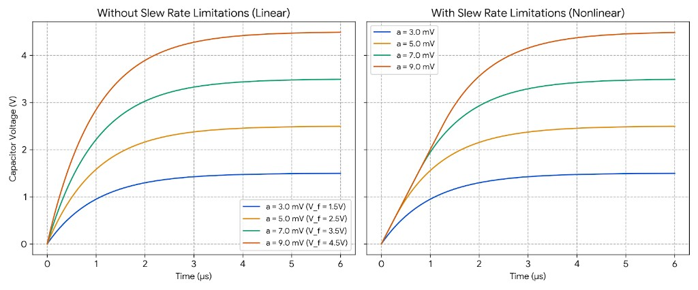

\figscalenormal
\nopagebreak[4]

\figcap{Figure 10: Step response with and without slew-rate limiting ($\tau=1\,\mu\mathrm{s}$, $\mathrm{SR}=2\,\mathrm{V/us}$).}

#### Without Slew-Rate Limitations (Linear Response)

In the ideal (linear) case, every curve is a pure exponential charging toward its final value $V_{\mathrm{final}}=|A_v|\,a$:

$$V_{out}(t)=V_{\mathrm{final}}\left(1-e^{-t/\tau}\right)$$

Each curve scales perfectly with amplitude and reaches approximately $63.2\%$ of its respective final value at $t=\tau=1\,\mu\mathrm{s}$. The initial slope demanded at $t=0$ is $V_{\mathrm{final}}/\tau$:

| Input $a$ | $V_{\mathrm{final}}$ | Demanded slope $V_{\mathrm{final}}/\tau$ |
|:---:|:---:|:---:|
| $3\,\mathrm{mV}$ | $1.5\,\mathrm{V}$ | $1.5\,\mathrm{V/us}$ |
| $5\,\mathrm{mV}$ | $2.5\,\mathrm{V}$ | $2.5\,\mathrm{V/us}$ |
| $7\,\mathrm{mV}$ | $3.5\,\mathrm{V}$ | $3.5\,\mathrm{V/us}$ |
| $9\,\mathrm{mV}$ | $4.5\,\mathrm{V}$ | $4.5\,\mathrm{V/us}$ |

#### With Slew-Rate Limitations (Nonlinear Response)

When the $\mathrm{SR}=2\,\mathrm{V/us}$ restriction is introduced, the behavior splits depending on whether the demanded initial slope exceeds this threshold:

**$a=3\,\mathrm{mV}$ (small-signal, linear):** The demanded initial slope is $1.5\,\mathrm{V}/1\,\mu\mathrm{s}=1.5\,\mathrm{V/us}$, which is below the $2\,\mathrm{V/us}$ ceiling. The op-amp never saturates internally; the response remains entirely exponential and matches the linear model exactly.

**$a=5,\,7,\,9\,\mathrm{mV}$ (large-signal, slew-limited):** The ideal demanded slopes are $2.5,\,3.5,$ and $4.5\,\mathrm{V/us}$ respectively — all exceed $2\,\mathrm{V/us}$, so the internal input stage saturates at $t=0$:

- **The overlap:** For all three inputs, $V_{out}$ initially climbs along the same linear ramp with constant slope $\mathrm{SR}=2\,\mathrm{V/us}$.
- **The separation:** Each curve eventually breaks away from the ramp at a different point and finishes with an exponential tail as it nears its target:
  - $a=5\,\mathrm{mV}$: slews to $\approx 0.5\,\mathrm{V}$ ($t\approx 0.25\,\mu\mathrm{s}$) before entering the exponential phase toward $2.5\,\mathrm{V}$.
  - $a=7\,\mathrm{mV}$: remains on the ramp longer, tracking straight up to $\approx 1.5\,\mathrm{V}$ ($t\approx 0.75\,\mu\mathrm{s}$) before bending.
  - $a=9\,\mathrm{mV}$: stays in the linear slewing region longest, following the ramp to $\approx 2.5\,\mathrm{V}$ ($t\approx 1.25\,\mu\mathrm{s}$) before tapering exponentially toward $4.5\,\mathrm{V}$.

Compared to the linear plot, the slew-limited curves (except $a=3\,\mathrm{mV}$) are pushed to the right — delayed in reaching their final values because the output cannot rise faster than SR permits.

### 6.5 Scope Scale for SR Observation

The LM741 SR $\approx 0.5\,\mathrm{V/us}$. A 10–15 V output swing (full-scale) takes:

$$t_{slew} = \frac{\Delta V}{\mathrm{SR}} = \frac{15}{0.5} = 30\,\mu\mathrm{s}$$

To see this comfortably in 10 cm (10 divisions) across the screen:

$$\text{Scale} = \frac{30\,\mu\mathrm{s}}{3\text{ div}} \approx 10\,\mu\mathrm{s/div}$$

Recommended: **10 μs/div**, allowing the rising edge to span 3–4 divisions.

### 6.6 Measuring SR in the Lab

1. Build Figure 6 with the appropriate gain.
2. Apply a **square wave** input at low frequency (e.g., 100 Hz), amplitude small enough that the output is SR-limited on the edges (check: output ramps linearly, not exponentially).
3. Set horizontal scale to ~10 μs/div so the rising/falling edges span several divisions.
4. Use the cursors to measure $\Delta V$ (vertical) and $\Delta t$ (horizontal) on the linear portion of the rising edge.
5. $\mathrm{SR} = \Delta V / \Delta t$.

\newpage

## 7. Gain-Bandwidth Product

### 7.1 Single-Pole Transfer Function and Bode Plot

$$A(j\omega) = \frac{A_0}{1 + j\omega/\omega_p} \quad\Rightarrow\quad |A(f)| = \frac{A_0}{\sqrt{1+(f/f_p)^2}}$$

Qualitative semi-log Bode magnitude:

- Flat at $A_0$ (in dB) for $f \ll f_p$
- Decreases at $-20\,\mathrm{dB/decade}$ for $f \gg f_p$
- Crosses 0 dB at $f_t = A_0 f_p$ (unity-gain frequency)

### 7.2 Unity-Gain BW Equals GBW in Single-Pole Model

For a single-pole model, $f_t \approx A_0 f_p$ (since $f_t \gg f_p$). The GBW product of the first pole is defined as $A_0\times f_p$. Thus:

$$f_t = A_0 f_p = \mathrm{GBW}$$

For a **multi-pole** op-amp, the gain falls faster above the first pole (the second pole adds additional phase and gain roll-off), so $f_t < A_0 f_p$. Hence equality holds **if and only if** the single-pole approximation is valid.

### 7.3 Numerical Example: $A_0 = 10^5$, $f_p = 10\,\mathrm{Hz}$

- **Bode slope:** $-20\,\mathrm{dB/decade}$ above $f_p = 10\,\mathrm{Hz}$
- **Open-loop bandwidth** (−3 dB): $f_p = 10\,\mathrm{Hz}$
- **Unity-gain bandwidth:** $f_t = A_0 f_p = 10^5\times 10 = 1\,\mathrm{MHz}$
- **GBW** $= f_t = 1\,\mathrm{MHz}$

### 7.4 Gain at $f = 10\,\mathrm{kHz}$ and Frequency for $|A| = 10$

At $f \gg f_p$: $|A(f)| \approx A_0 f_p/f$

$$|A(10\,\mathrm{kHz})| \approx \frac{10^5\times 10}{10^4} = 100 \quad(40\,\mathrm{dB})$$

$$|A(f)| = 10 \;\Rightarrow\; f = \frac{A_0 f_p}{10} = \frac{10^5\times 10}{10} = 100\,\mathrm{kHz}$$

### 7.5 Closed-Loop Transfer Functions (Figures 7 and 8)

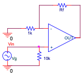
\nopagebreak[4]

\figcap{Figure 11: Inverting amplifier for GBW measurement ($R_1=1\,\mathrm{k}\Omega$, $R_f$ variable).}

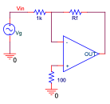
\nopagebreak[4]

\figcap{Figure 12: Non-inverting amplifier for GBW measurement ($R_1=1\,\mathrm{k}\Omega$, $R_f$ variable, $100\,\Omega$ at $+$ input).}

For a single-pole open-loop gain $A(s) = A_0\omega_p/(s+\omega_p)$, the closed-loop TFs are:

**Figure 7** (inverting, $R_1$ fixed, $R_f$ variable):

$$H_7(j\omega) = -\frac{R_f}{R_1}\cdot\frac{1}{1+j\omega/\omega_{3\mathrm{dB}}}, \quad \omega_{3\mathrm{dB}} = \frac{\omega_t}{1+R_f/R_1}$$

**Figure 8** (non-inverting, $R_1$ fixed, $R_f$ variable):

$$H_8(j\omega) = \left(1+\frac{R_f}{R_1}\right)\cdot\frac{1}{1+j\omega/\omega_{3\mathrm{dB}}}, \quad \omega_{3\mathrm{dB}} = \frac{\omega_t}{1+R_f/R_1}$$

Both share the same $\omega_{3\mathrm{dB}}$ expression with $\omega_t = 2\pi f_t = 2\pi\,\mathrm{GBW}$.

### 7.6 GBW Product and Condition for Equality

$$\mathrm{GBW}_7 = \frac{R_f}{R_1}\cdot\frac{f_t}{1+R_f/R_1} = f_t\cdot\frac{R_f/R_1}{1+R_f/R_1}$$

$$\mathrm{GBW}_8 = \left(1+\frac{R_f}{R_1}\right)\cdot\frac{f_t}{1+R_f/R_1} = f_t$$

For large $A_0$ ($A_0 \gg 1+R_f/R_1$), GBW$_8 = f_t$ exactly, while GBW$_7 \to f_t$ only when $R_f/R_1 \gg 1$.

**Condition for approximate equality:** $R_f \gg R_1$, i.e., high closed-loop gain ($|A_{CL}| \gg 1$).

\newpage

## 8. Open-Loop Gain

### 8.1 $V_y/V_g$ and $V_o/V_g$ for Ideal Op-Amp (Figure 9)

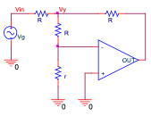
\nopagebreak[4]

\figcap{Figure 13: Circuit for open-loop gain measurement ($R\gg r$; $V_y$ is the node between the two $R$ resistors).}

For an **ideal** op-amp with virtual ground at $V^- = V^+ = 0$:

Node $V_y$ connects to $V^-$ through $r$; with virtual ground $V^- = 0$ and negligible current into the ideal input: $V_y = 0$.

By KCL at $V_y$:
$$\frac{V_g - V_y}{R} + \frac{V_o - V_y}{R} = \frac{V_y}{r} \;\Rightarrow\; V_g + V_o = 0$$

$$\boxed{\frac{V_y}{V_g} = 0, \quad \frac{V_o}{V_g} = -1}$$

### 8.2 Non-Ideal Case: Which Voltages to Measure for $A_{OL}$

For a non-ideal op-amp with finite $A_{OL}$:

$$V_y \approx \frac{V_g}{A_{OL}}\quad (\text{small but non-zero}),\quad V_o \approx -V_g$$

Measure **$V_y$** and **$V_o$**:

$$A_{OL} \approx \left|\frac{V_o}{V_y}\right|$$

This works because $V_y \approx V^-$ (the op-amp's differential input), and $A_{OL} = V_o/(V^+ - V^-) = -V_o/V_y$ for $V^+=0$.

### 8.3 Required Input Signal

- **Shape:** Sine wave (to measure RMS values unambiguously; square wave would introduce harmonics)
- **Frequency:** Low — $f < 100\,\mathrm{Hz}$ — to remain in the flat $A_{OL}$ region before the dominant pole rolls off the gain
- **Amplitude:** $V_g \sim 100\,\mathrm{mV}$–$1\,\mathrm{V_{RMS}}$, so that $V_o = A_v\,V_g \approx V_g$ remains within $\pm 15\,\mathrm{V}$ (not clipping), and $V_y \approx V_g/A_{OL}$ is at the noise level

Expected signals: $V_o \approx -V_g$ (large, clean sine); $V_y \approx V_g/A_{OL}$ (very small, $\sim\mu\mathrm{V}$ range, noisy).

### 8.4 Scope Functions for Measuring the Small Signal $V_y$

- **Averaging:** The scope averages $N$ consecutive acquisitions; random noise decreases by $\sqrt{N}$ while the coherent (periodic) $V_y$ signal is preserved. Essential when $V_y$ is at the noise floor.
- **BW Limit:** Limits the oscilloscope's measurement bandwidth (e.g., to 20 kHz), cutting broadband noise that is irrelevant for a low-frequency measurement.
- **Fine:** Allows fine adjustment of the vertical scale (e.g., mV/div resolution), maximising the on-screen amplitude of $V_y$ for more precise cursor measurements.

\newpage

## 9. Op-Amp as an Integrator

### 9.1 Transfer Function (Figure 10)

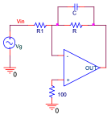
\nopagebreak[4]

\figcap{Figure 14: Integrator circuit with $R_1=10\,\mathrm{k}\Omega$, $R_f=20\,\mathrm{k}\Omega$ (parallel with $C=10\,\mathrm{nF}$) and $100\,\Omega$ on the $+$ input.}

The feedback impedance is $Z_f = R_f \,\|\, \frac{1}{j\omega C}$:

$$H(j\omega) = -\frac{Z_f}{R_1} = -\frac{R_f}{R_1}\cdot\frac{1}{1+j\omega R_f C}$$

### 9.2 Poles, Zeros, and Canonical Form

$$H(j\omega) = -\frac{R_f/R_1}{1 + j\omega/\omega_p}, \quad \omega_p = \frac{1}{R_f C}$$

- **1 pole**, **0 finite zeros**
- Canonical form: $H(jf) = \dfrac{-R_f/R_1}{1 + jf/f_p}$ with $R_f/R_1 = 20\,\mathrm{k}/10\,\mathrm{k} = 2$, $f_p\approx 796\,\mathrm{Hz}$

### 9.3 Dominant Pole

$$f_p = \frac{1}{2\pi R_f C} = \frac{1}{2\pi\times 20\times10^3\times 10\times10^{-9}} \approx 796\,\mathrm{Hz}$$

### 9.4 Approximations for $f \ll f_p$ and $f \gg f_p$

$$H_\text{low}(j\omega)\big|_{f\ll f_p} \approx -\frac{R_f}{R_1} = -2 \quad\text{(inverting amplifier)}$$

$$H_\text{high}(j\omega)\big|_{f\gg f_p} \approx -\frac{1}{j\omega R_1 C} \quad\text{(ideal integrator)}$$

### 9.5 Square-Wave Input at $f \ll f_p$

The circuit acts as an **inverting amplifier** (gain $-2$). The output is a square wave, inverted and scaled by 2 relative to the input.

### 9.6 Square-Wave Input at $f \gg f_p$

The circuit acts as an **ideal integrator**. The integral of a square wave is a **triangular wave**; the output is a triangular wave 90° out of phase with the input, with amplitude inversely proportional to frequency.

### 9.7 Simulation: Bode Plot and $f_p$

> **[SIMULATION NEEDED — 9.7]**
> Simulate the AC Bode plot of Figure 10 in PSpice. From the flat low-frequency gain and the −3 dB rolloff point, extract $f_{-3\mathrm{dB}}$.
> Theoretical prediction: $f_p \approx 796\,\mathrm{Hz}$.

\newpage

## 10. Op-Amp as a Summation Circuit

### 10.1 Output of the Example Circuit (Figure 11)

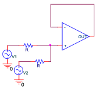
\nopagebreak[4]

\figcap{Figure 15: Inverting summing amplifier example ($R_1=R_2=R_f=R$).}

For the inverting summing amplifier with $R_1 = R_2 = R_f = R$:

$$V_{out} = -\frac{R_f}{R_1}V_1 - \frac{R_f}{R_2}V_2 = -(V_1 + V_2)$$

### 10.2 Mathematical Operation

The circuit performs a **negated sum**: $V_{out} = -(V_1 + V_2)$. Up to a sign inversion, it adds the two inputs.

### 10.3 Calculation of $F$ and $L$

- $F$ = **first digit** of Shai Livshits' student ID: $208632216 \Rightarrow F = 2$ (even)
- $L$ = **last digit** of Shai Livshits' student ID: $208632216 \Rightarrow L = 6$ (even)

### 10.4 Function Selection

From the table, **F-even / L-even** assigns the function:

$$\boxed{V_{out} = -2V_1 + 2V_2}$$

### 10.5 Circuit Design from the Master Circuit (Figure 12)

The assigned function $V_{out} = -2V_1 + 2V_2$ has a $-2$ coefficient on $V_1$ (inverting) and a $+2$ coefficient on $V_2$ (non-inverting), with **equal magnitudes**. This is exactly the form produced by a **standard difference amplifier**, so there is no need to brute-force the general master circuit — by inspection the topology is a one-op-amp difference amplifier with gain 2.

For a balanced difference amplifier with $R_1$ from $V_1$ to the $(-)$ input, $R_f$ in feedback, $R_2$ from $V_2$ to the $(+)$ input, and $R_3$ from $(+)$ to ground, with the matching condition $R_1=R_2$ and $R_f=R_3$:

$$V_{out} = \frac{R_f}{R_1}\,(V_2 - V_1) = \frac{R_f}{R_1}\,V_2 - \frac{R_f}{R_1}\,V_1$$

Setting $\dfrac{R_f}{R_1} = 2$ gives $V_{out} = -2V_1 + 2V_2$, as required. Choosing standard board values:

$$R_1 = R_2 = 10\,\mathrm{k}\Omega, \qquad R_f = R_3 = 20\,\mathrm{k}\Omega \quad (4\ \text{resistors total})$$

In terms of the master circuit (Figure 12): connect $V_1$ through $10\,\mathrm{k}\Omega$ to the $(-)$ input, $V_2$ through $10\,\mathrm{k}\Omega$ to the $(+)$ input, place a $20\,\mathrm{k}\Omega$ feedback resistor from output to $(-)$, tie the $(+)$ input to ground through $20\,\mathrm{k}\Omega$, and leave any remaining free nodes/resistors disconnected. This satisfies the "$\leq 4$ resistors" hint and uses only the matched-ratio symmetry rather than the general solution.

### 10.6 Simulation of the Designed Circuit

> **[SIMULATION NEEDED — 10.6]**
> Simulate the difference amplifier above in PSpice with $V_{g1}$ a square wave and $V_{g2}$ at **equal amplitude** to $V_{g1}$. Attach: (i) $V_g$ with $V_{in1}, V_{in2}$, (ii) both inputs $V_{in1}, V_{in2}$ together with the output $V_{out}$. Annotate the prints with key amplitudes to confirm $V_{out} = -2V_{in1} + 2V_{in2}$ (i.e. $V_{out}=2(V_{in2}-V_{in1})$).

\newpage

## 11. 3 dB Frequency Measurement (Self-Quiz)

### 11.1 Horizontal Scale for 3 dB Frequency Measurement (SWEEP Mode)

In SWEEP mode, the function generator sweeps from $f_\text{start}$ to $f_\text{end}$ in $T_\text{sweep}$ seconds. The horizontal scale must be set so that the entire frequency range of interest (flat region to well past the 3 dB frequency) fits within the 10-division screen.

A sweep time of **1 second** is standard. The horizontal scale is then $T_\text{sweep}/10 = \mathbf{100\,\mathrm{ms/div}}$.

### 11.2 Relationship Between $V_{pp}$ at Low Frequency and Amplitude at 3 dB (LPF)

In the flat (low-frequency) region of an LPF, the output peak-to-peak amplitude is $V_{pp} = 2A_\text{flat}$.

At the $-3\,\mathrm{dB}$ frequency, the amplitude drops by $1/\sqrt{2}$:

$$V_{-3\mathrm{dB}} = \frac{A_\text{flat}}{\sqrt{2}} = \frac{V_{pp}}{2\sqrt{2}} = \frac{V_{pp}}{\sqrt{2}\cdot 2} \approx 0.354\, V_{pp}$$

Equivalently, $V_{pp}$ at 3 dB equals $V_{pp,\text{flat}}/\sqrt{2}$.

### 11.3 Measuring the 3 dB Frequency of an HPF

1. **Perform an AC sweep.** Confirm the response resembles an HPF (low amplitude at low $f$, flat at high $f$).
2. **Identify the flat high-frequency region.** Measure $V_{out,\text{RMS}}$ and $V_{in,\text{RMS}}$ at a frequency where the gain is flat; compute $A_\text{flat} = V_{out}/V_{in}$.
3. **Compute the −3 dB level:** $A_{-3\mathrm{dB}} = A_\text{flat}/\sqrt{2}$.
4. **Decrease frequency from the flat region** while continuously monitoring $V_{out,\text{RMS}}/V_{in,\text{RMS}}$. Keep the signal on screen (several cycles, good resolution).
5. When the ratio falls to $A_{-3\mathrm{dB}}$, record the frequency — this is $f_{-3\mathrm{dB}}$.
6. **Caution:** at very low frequencies, one period may exceed the scope's useful time window; ensure at least 5 full cycles are visible. Do not go below $\sim$10 Hz unless the expected 3 dB frequency is there. Also verify the output is a clean sinusoid (not distorted) before recording.

\newpage

## 12. Table Measurement — Frequency Dependence (Self-Quiz)

When filling the quantitative measurement tables in the lab, keep the following rules:

- **Always measure the input as well**, since it does not necessarily stay constant across frequency; gain is the ratio of the *transfer-function* output to input (not always the circuit's terminals).
- **Prefer RMS over $V_{pp}$**: electrical noise can create spurious peaks that corrupt a $V_{pp}$ reading, whereas RMS averages them out.
- **Sign convention:** if a V/V (gain) column is requested, include the sign when it is definitive (e.g. negative for an inverting stage). If a dB column is requested instead, compute $A_\mathrm{dB} = 20\log_{10}|A|$.
- **Phase:** when measuring phase, take the phase of $V_o/V_i$ (not $V_i/V_o$) and add $180^\circ$ whenever the sign flips.
- **Linearity:** the transfer-function concept assumes a linear system, so both input and output must be **undistorted sine waves**. If the output is distorted, reduce the input amplitude until the circuit operates linearly before recording.

## References

- Sedra, A. S., & Smith, K. C. *Microelectronic Circuits*, 6th ed. Oxford University Press. Chapters 2, 12.
- Millman, J., & Halkias, C. *Integrated Electronics*. Chapters 15–16.
- TL071M, TL061M, LM741 Datasheets (Texas Instruments / National Semiconductor).
- "How to read an op-amp data sheet" — course Moodle resource.
